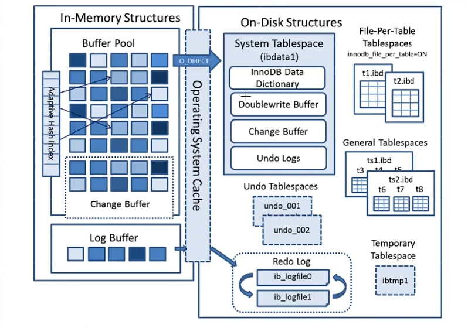
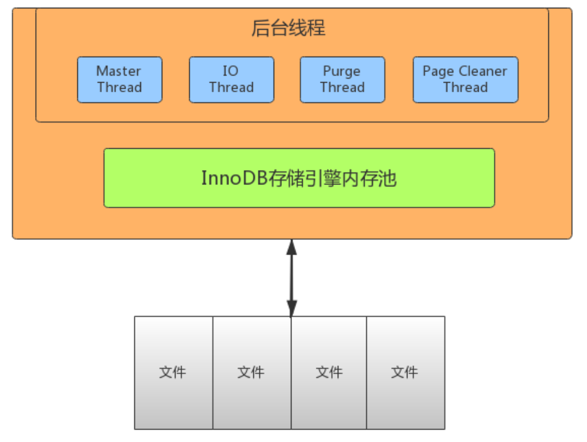
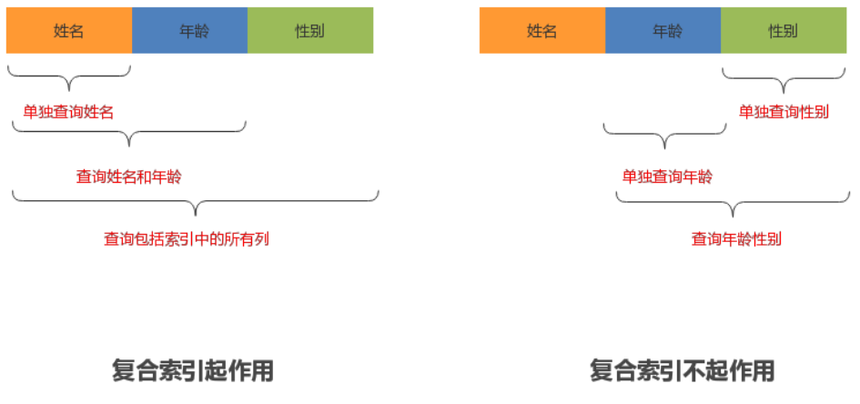
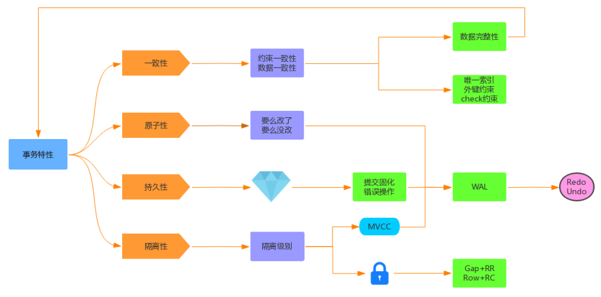
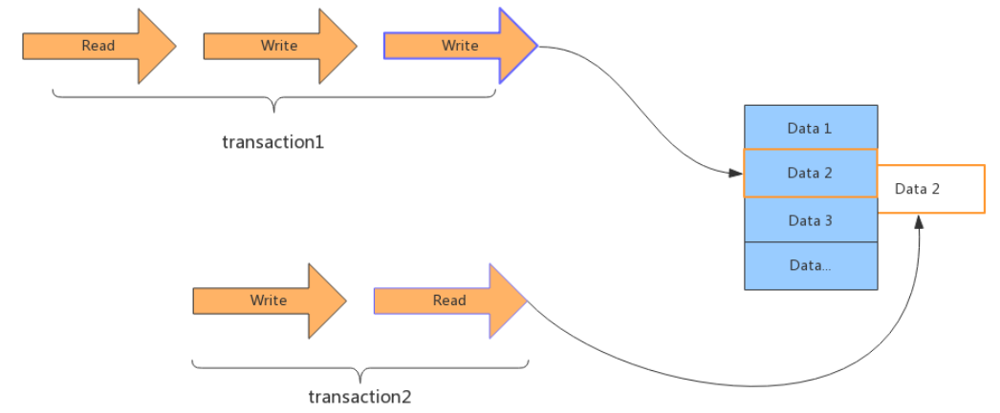
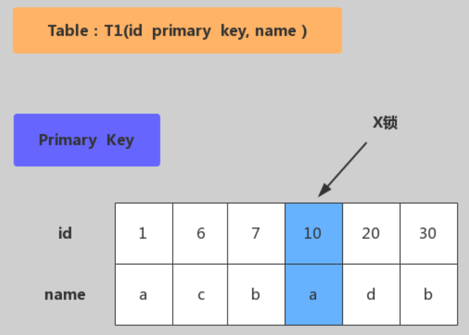
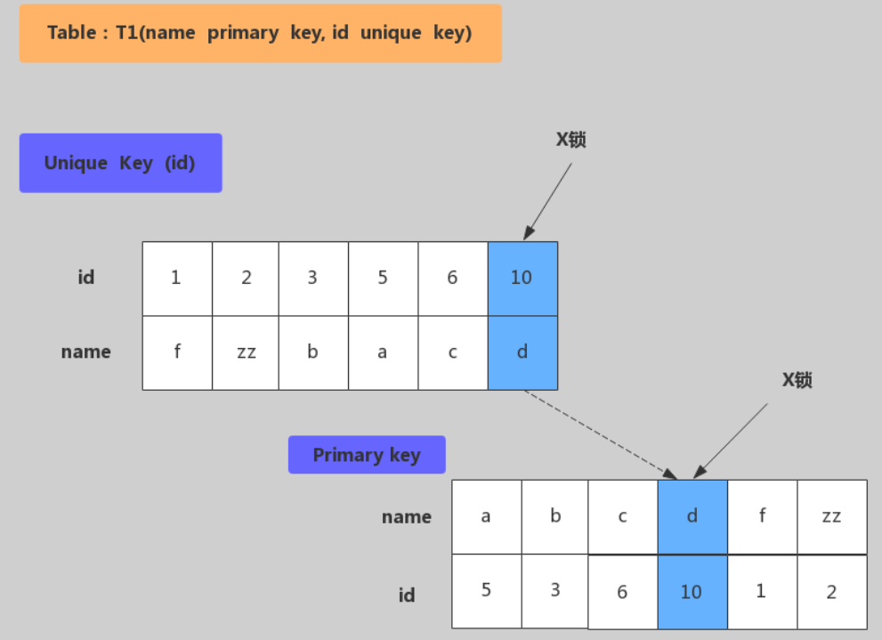
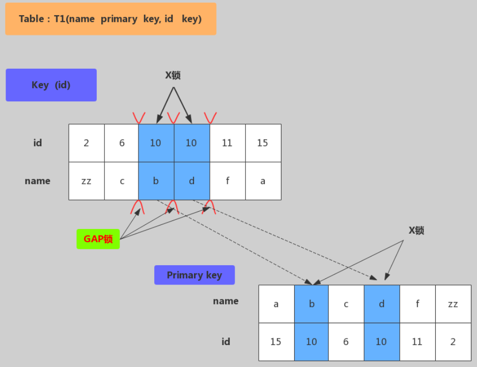
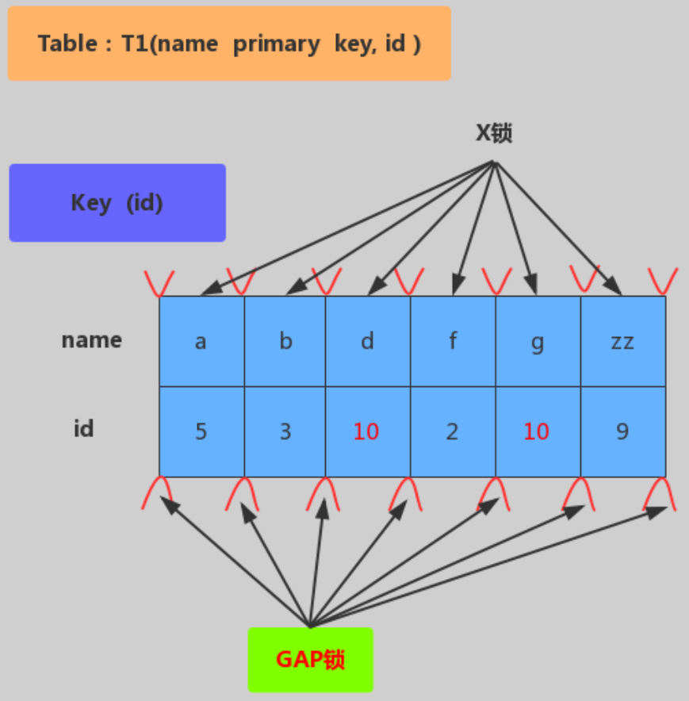

# 

## 1. 底层原理

### 1.1 MySQL Server 架构

<div align="center" width="80%"></div>

自顶向下大致可以分为`网络连接层，服务层，存储引擎层，系统文件层`

- 网络连接层
    - 客户端连接器
- 服务层
    - 连接池 (Connection Pool)
    - 系统管理和控制工具 (Management Service & Utilities)
    - SQL接口 (SQL Interface)
    - 解析器 (Parser)
    - 查询优化器 (Optimizer)
        - <font color="red">选择 -> 投影 -> 连接 策略</font>
        ```sql
        select uid, name from user where gender=1;
        ```
    - 缓存 (Cache & Buffer)
        - 缓存机制是由一系列小缓存组成的。可以直接从缓存中取数据
- 存储引擎层
    - `作用: `负责数据的存储与提取，与底层系统文件进行交互。
- 系统文件层
    - `作用: `存储数据和日志，完成与存储引擎的交互
    - 日志文件
        - 错误日志 (Error log)
            - 默认开启
            ```sql
            show VARIABLES like "%log_err%";
            ```
        - 通用查询日志 (General query log)
            - 记录一般查询语句
            ```sql
            show VARIABLES like "%general%";
            ```
        - 二进制日志 (binary log)
            - 记录对MySQL数据库执行的更改操作，并且记录了语句的发生时间、执行时长；但是不记录select、show等不修改数据库的SQL。主要用于数据库恢复和主从复制
            ```sql
            show VARIABLES like "%log_bin%";  
            show VARIABLES like "%binlog%";  
            show binary logs;
            ```
        - 慢查询日志 (Slow query log)
            - 记录所有执行时间超时的查询SQL，默认是10s
            ```sql
            show VARIABLES like "%slow_query%";
            show VARIABLES like "%long_query_time%";
            ```
    - 配置文件
        - `作用: `用于存放MySQL所有的配置信息文件，如 `my.cnf`, `my.ini` 等
    - 数据文件
        - `db.opt: `记录这个库的默认使用的字符集和校验规则
        - `frm: `存储与表相关的元数据(meta)信息，包括表结构的定义信息等，每一张表都会有一个frm文件
        - `MYD: `MyISAM存储引擎专用，存放MyISAM表的数据，没一张表都会有一个MYD文件
        - `MYI: `MyISAM存储引擎专用，存放MyISAM表的索引相关信息，每一张MyISAM表对应一个MYI文件
        - `ibd`和`IBDATA: `存放 `InnoDB` 的数据文件（包括索引）。`InnoDB` 存储引擎有两种表空间方式: 独享表空间和共享表空间。独享表空间用 `.ibd` 来存放，共享表空间用 `.ibdata`，所有表共同使用一个（或多个，自行配置）`.ibdata` 文件
        ```sql
        show VARIABLES like "%datadir%";
        ```


### 1.2 SQL 运行机制

- 建立连接 (Connectors&Connection Pool)，通过客户端/服务器通信协议与MySQL建立连接。通信方式是 "半双工"。对于每一个MySQL的连接，时刻都有一个线程状态来标识这个连接在做什么。
    - 通讯机制
        - 全双工: 能同时发送和接收数据
        - 半双工: 指在某一时刻，只能接收或发送数据，不能同时
        - 单工: 只能发送或接收数据
    - 线程状态 `show processlist`
- 查询缓存 (Cache&Buffer) 
    ```sql
    show VARIABLES like "%query_cache%"; 
    show VARIABLES like "%Qcache%";
    ```
    - MySQL的一个可查询优化的地方，如果开启且在查询缓存过程中查询到完全相同的SQL语句，则将查询结果直接返回给客户端；如果没有开启查询缓存或没有查询到完全相同的SQL语句，则会由解析器进行语法语义解析，并生成"解析树"
    - 缓存select查询的结果和SQL语句
    - 执行select查询时，先查询缓存，判断是否存在可用的记录集，要求完全相同（包括参数值），这样才会匹配缓存数据中。
    - 即使开启查询缓存，以下SQL也不能缓存 
        - 查询语句使用 `SQL_NO_CACHE`
        - 查询的结果大于 `query_cache_limit` 设置
        - 查询中有一些不确定的参数，如now()
- 解析器，将客户端发送的SQL进行语法解析，生成"解析树"。预处理器根据MySQL规则进一步检查"解析树是否合法"
- 查询优化器，根据"解析树"生成最优的执行计划。MySQL使用很多优化策略生成最优的执行计划，可以分为两类: `静态优化（编译时优化）、动态优化（运行时优化）`
    - 等价变换策略
    - 优化count、min、max等函数
    - 提前终止查询
- 查询执行引擎，负责执行SQL语句，此时查询执行引擎会根据SQL语句中表的存储引擎类型以及对应的API接口与底层存储引擎缓存或物理文件的交互，得到查询结果并返回给客户端。若开启查询引擎，这时会将SQL语句和结果完整的保存到查询缓存中
    - 如果开启了查询缓存，先将查询结果做缓存操作
    - 返回结果过多，采用增量模式返回

### 1.3 MySQL 存储引擎

`show engines`

- InnoDB: 支持事务，具有提交，回滚和崩溃恢复能力，事务安全
- MyISAM: 不支持事务和外键，访问速度快
- Memory: 利用内存创建表，访问速度非常快，因为数据在内存，而且默认使用Hash索引，但是一旦关闭，数据就会丢失
- Archive: 归档类型引擎，仅能支持insert和select语句
- Csv: 以CSV文件进行数据存储，由于文件限制，所有列必须强制指定not null，另外csv引擎也不支持索引和分区，适合做数据交换的中间表
- BlackHole: 黑洞，只进不出，进来小时，所有插入数据都不会保存
- Federated: 可以访问远端MySQL数据库中的表，一个本地表，不保存数据，访问远程表内容


#### 1.3.1 InnoDB 和 MyISAM 对比

- 事务和外键
    - `InnoDB` 支持事务和外键，具有安全性和完整性，适合大量insert和update操作
    - `MyISAM` 不支持事务和外键，提供高速存储和检索，适合大量的select查询操作
- 锁机制
    - `InnoDB` 支持行级锁，锁定指定记录。基于索引来加锁实现
    - `MyISAM` 支持表级锁，锁定整张表
- 索引结构
    - `InnoDB` 使用聚集索引，索引和记录在一起存储，既缓存索引，也缓存记录
    - `MyISAM` 使用非聚集索引，索引和记录分开
- 并发处理能力
    - `InnoDB` 读写阻塞，可以通过隔离级别有关，可以采用多版本并发控制(MVCC)来支持高并发
    - `MyISAM` 使用表级锁，会导致写操作并发率低，读之间并不阻塞
- 存储文件
    - `InnoDB` 表对应两个文件，一个 `.frm` 表结构文件，一个 `.ibd` 数据文件
    - `MyISAM` 表对应三个文件，一个 `.frm` 表结构文件，一个 `MYD` 表数据文件，一个 `.MYI` 索引文件
- 适用场景
    **InnoDB**
    - 需要事务支持（具有较好的事务特性）
    - 行级锁定对高并发有很好的适应能力
    - 数据更新较为频繁的场景
    - 数据一致性要求较高
    - 硬件设备内存较大，可以利用InnoDB较好的缓存能力来提高内存利用率，减少磁盘IO

    **MyISAM**
    - 不需要事务支持（不支持）
    - 并发相对较低（锁定机制问题）
    - 数据修改相对较少，以读为主
    - 数据一致性要求不高

#### 1.3.2 InnoDB 底层原理（不是很全面）

<div align="center" width="80%"></div>

##### 1. InnoDB 内存结构

内存结构主要包括 `Buffer Pool、Change Buffer、Adaptive Hash Index、Log Buffer`

- `Buffer Pool:` 缓冲池，简称BP。BP以Page为单位，默认大小为16K，BP的底层采用链表数据结构管理Page。在InnoDB访问表记录和索引时会在Page页中缓存，以后使用可以减少磁盘IO操作，提升效率。
    - `Page 管理机制`，Page 根据状态可以分为三种类型
        - `free page:` 空闲page，未被使用
        - `clean page:` 被使用page，数据没有被修改过
        - `dirty page:` 脏页，被使用page，数据被修改过，页中数据和磁盘的数据产生了不一致
        - `free list:` 表示空闲缓存区，管理free page
        - `flush list:` 表示需要刷新到磁盘的缓冲区，管理`dirty page`，内部page按修改时间排序，脏页即存在flush链表，也在LRU链表中，但是两种互不影响，LRU链表负责管理page的可用性和释放，而flush链表负责管理脏页的刷盘操作
        - `lru_list:` 表示正在使用的缓冲区，管理 `clean page` 和 `dirty page`，缓冲区以 `midpoint` 为基点，前面链表称为new列表区，存放经常访问的数据，占63%，后面的链表称为old区，存放使用较少的数据，占37%
    - 改进型LRU算法维护
        - 普通LRU: 末尾淘汰法，新数据从链表头部加入，释放空间时从末尾淘汰
        - 新型LRU: 链表分为new和old两部分，加入元素时并不是从表头加入，而是从中间midpoint位置加入，如果数据很快被访问，那么page就会向new列表头部移动，如果数据没有被访问，会逐步向old尾部移动，等待淘汰
        每当有新的page数据读到buffer pool时，InnoDB引擎会判断是否有空闲页，是否足够，如果有将free page 从free list 列表删除，放入到LRU列表中。没有空闲页，就会根据LRU算法淘汰LRU链表默认的页，将内存空间释放分配给新的页。
    - Buffer Pool配置参数
        ```sql
        show variables like "%innodb_page_size%"; // 查看 page 页大小
        show variables like "%innodb_old%"; // 查看 lru list 中 old 列表参数
        show variables like "%innodb_buffer%"; // 查看 buffer poll 参数
        ```
- `Change Buffer:` 写缓冲区，简称CB。在进行DML操作时，如果没有其相应的Page数据，并不会立刻将磁盘页加载到缓冲池，而是在CB记录缓冲变更，等未来数据被读取时，再将数据合并恢复到BP中
- `Adaptive Hash Index:` 自适应哈希索引，用于优化对BP数据的查询，InnoDB存储引擎会监控对表索引的查找，如果观察到建立哈希索引可以带来速度的提升，则建立哈希索引，所以称之为自适应。InnoDB存储引擎会自动根据访问的频率和模式来为某些页建立哈希索引
- `Log Buffer:` 日志缓冲区，用于保存要写入磁盘上log文件（Redo/Undo）的数据，日志缓冲区的内容定期刷新到磁盘log文件中，日志缓冲区满时会自动将其刷新到磁盘，当遇到BLOB或多行更新的大事务操作时，增加日志缓冲区可以节省磁盘I/O
    - Log Buffe空间满了，会自动写入磁盘
    - `inoodb_flush_log_at_trx_commit` 参数控制日志刷新行为，默认为1
        - `0:` 每隔1s写日志文件和刷盘操作（写日志文件 LogBuffer-->OS cache，刷盘 OS cache-->磁盘文件）
        - `1:` 事务提交，立刻写日志文件和刷盘，数据不丢失，但是会频繁IO操作
        - `2:` 事务提交，立刻写日志文件，每隔1s进行刷盘操作

##### 2. InnoDB 磁盘结构
##### 3. InnoDB 后台线程

<div align="center" width="80%"></div>

##### 4. InnoDB 数据存储结构

分为一个ibd数据文件 -> Segment (段) —> Exent (区) -> Page (页) -> Row (行)

- TableSpace 表空间，用于存储多个ibd数据文件，用于存储表的记录和索引。一个文件包含多个段
- Segment 用于管理多个Extent，分为数据段、索引段、回滚段。一个表至少会有两个Segment，一个管理数据，一个管理索引。每多创建一个索引，会多两个Segment
- Extent 一个区固定包含64个连续的页，大小为1M。当表空间不足，需要分配新的页资源，不会一页一页分，直接分配一个区
- Page 用于存储多个Row行记录，大小为16K

##### 5. Undo Log

**Undo Log 介绍**

数据库事务开始之前，会将要修改的记录存放到Undo日志里，当事务回滚时或者数据库崩溃时可以利用Undo日志，撤销未提交事务对数据库产生的影响

**Undo Log 产生和销毁**

Undo Log 在事务开始前产生；事务在提交时，并不会立刻删除undo log，innodb 会将该事务对应的undo log放入到删除列表中，后面会通过后台线程purge thread进行回收处理，Undo Log属于逻辑日志

**Undo Log 存储**

undo log采用段的方式管理和记录。在innodb数据文件中包含一种rollback segment回滚段，内部包含1024个undo log segment

**Undo Log 作用**
- 实现事物的原子性
- 实现多版本并发控制（MVCC）

##### 5. Redo Log 和 Binlog


**Redo Log 介绍**

指事务中修改的任何数据，将最新的数据备份存储的位置（Redo Log），被称为重做日志

**Redo Log 工作原理**

为了实现事物的持久性而出现的产物

```sql
show variables like '%innodb_log%';
```
**Binlog**

Redo Log属于InnoDB引擎所特有的日志，而MySQL Server也有自己的日志，即Binary Log（二进制日志），简称Binlog。Binlog时记录所有数据库表结构变更以及表数据修改的二进制日志，不会记录SELECT和SHOW这类操作。Binlog日志是以时事件形式记录，还包含语句所执行的消耗时间。开启Binlog日志有以下两个最重要的使用场景。
- 主从复制: 在主库中开启Binlog功能，这样主库就可以把Binlog传递给从库，从库拿到Binlog后实现数据恢复达到主从数据一致性
- 数据恢复: 通过mysqlbinlog工具来恢复数据


- Binlog写入机制

    - 根据记录模式和操作触发 event 事件生成 Log event（事件触发执行机制）
    - 将事务执行过程中产生 Log event 写入缓冲区，每个事务线程都有一个缓冲区
    - Log Event 保存在一个 binlog_cache_mngr 数据结构中，在该结构中有两个缓冲区，一个是 stmt_cache，用于存放不支持事务的信息；另一个是 trx_cache，用于存放支持事务的信息。
    - 事务在提交阶段会将产生的 Log event 写入到外部 Binlog 文件中。
    - 不同事务以串行方式将 Log event 写入 Binlog 文件中，所以一个事务包含的 Log event 信息在 Binlog 文件中是连续的，中间不会插入其他事务的 Log event。

```sql
show variables like 'log_bin';
```

```sql
-- 开启 Binlog 功能
mysql> set global log_bin=mysqllogbin;
ERROR 1238 (HY000): Variable 'log_bin' is a read only variable
```

**Redo Log 和 Binlog 区别**
- Redo Log 属于InnoDB引擎功能，Binlog属于MySQL Server自带功能并且以二进制文件记录
- Redo Log 属于物理日志，记录该数据页更新状态内容，Binlog是逻辑日志，记录更新过程
- Redo Log 日志是循环写，日志空间大小是固定， Binlog 是追加写入，写完一个写下一个，不会覆盖使用。
- Redo Log 作为服务器异常宕机后事务数据自动恢复使用， Binlog 可以作为主从复制和数据恢复使用。 Binlog 没有自动 crash-safe 能力

# 2. 优化

## 2.1 索引

### 2.1.1 索引类型

索引可以提升查询速度，会影响 where 查询，以及 order by 排序。MySQL 索引类型如下: 

- 从索引存储结构划分: `B Tree 索引、Hash 索引、FULLTEXT 全文索引、R Tree 索引`
- 从应用层次划分: `普通索引、唯一索引、主键索引、复合索引`
- 从索引键值类型划分: `主键索引、辅助索引（二级索引）`
- 从数据存储和索引键值逻辑关系划分: `聚集索引（聚簇索引）、非聚集索引（非聚簇索引）`

**普通索引**
这是最基本的索引类型，基于普通字段建立的索引，没有任何限制。

```sql
CREATE INDEX <索引的名字> ON tablename (字段名);
ALTER TABLE tablename ADD INDEX [索引的名字] (字段名);
CREATE TABLE tablename ( [...], INDEX [索引的名字] (字段名) );  
```

**唯一索引**
与"普通索引"类似，不同的就是: 索引字段的值必须唯一，但允许有空值。在创建或修改表时追加唯一约束，就会自动创建对应的唯一索引。

```sql
CREATE UNIQUE INDEX <索引的名字> ON tablename (字段名);
ALTER TABLE tablename ADD UNIQUE INDEX [索引的名字] (字段名);
CREATE TABLE tablename ( [...], UNIQUE [索引的名字] (字段名) ;  
```

**主键索引**
它是一种特殊的唯一索引，不允许有空值。在创建或修改表时追加主键约束即可，每个表只能有一个主键。
```sql
CREATE TABLE tablename ( [...], PRIMARY KEY (字段名) );
ALTER TABLE tablename ADD PRIMARY KEY (字段名);  
```

**复合索引**
单一索引是指索引列为一列的情况，即新建索引的语句只实施在一列上；用户可以在多个列上建立索引，这种索引叫做组复合索引（组合索引）。复合索引可以代替多个单一索引，相比多个单一索引复合索引所需的开销更小。

索引同时有两个概念叫做窄索引和宽索引，窄索引是指索引列为1-2列的索引，宽索引也就是索引列超过2列的索引，设计索引的一个重要原则就是能用窄索引不用宽索引，因为窄索引往往比组合索引更有效。
```sql
CREATE INDEX <索引的名字> ON tablename (字段名1，字段名2...);
ALTER TABLE tablename ADD INDEX [索引的名字] (字段名1，字段名2...);
CREATE TABLE tablename ( [...], INDEX [索引的名字] (字段名1，字段名2...) );
```

**全文索引**
查询操作在数据量比较少时，可以使用 like 模糊查询，但是对于大量的文本数据检索，效率很低。如果使用全文索引，查询速度会比 like 快很多倍。在MySQL 5.6 以前的版本，只有 MyISAM 存储引擎支持全文索引，从 MySQL 5.6 开始 MyISAM 和 InnoDB 存储引擎均支持。

```sql
CREATE FULLTEXT INDEX <索引的名字> ON tablename (字段名);
ALTER TABLE tablename ADD FULLTEXT [索引的名字] (字段名);
CREATE TABLE tablename ( [...], FULLTEXT KEY [索引的名字] (字段名) ;
```
和常用的 like 模糊查询不同，全文索引有自己的语法格式，使用 match 和 against 关键字，比如: 

```sql
select * from user where match(name) against('aaa');
```
全文索引使用注意事项: 
- 全文索引必须在字符串、文本字段上建立。
- 全文索引字段值必须在最小字符和最大字符之间的才会有效。（innodb: 3-84；myisam: 4-84）
- 全文索引字段值要进行切词处理，按 syntax 字符进行切割（参数 ft_boolean_syntax，默认 + -><()~*:""&|），例如 b+aaa，切分成 b 和 aaa
- 全文索引匹配查询，默认使用的是等值匹配，例如 a 匹配 a，不会匹配 ab, ac。如果想匹配可以在布
尔模式下搜索 a*

### 2.1.2 索引原理

MySQL官方对索引定义: 是存储引擎用于快速查找记录的一种数据结构。需要额外开辟空间和数据维护工作。

- 索引是物理数据页存储，在数据文件中（InnoDB，ibd文件），利用数据页（page）存储。
- 索引可以加快检索速度，但是同时也会降低增删改操作速度，索引维护需要代价。
索引涉及的理论知识: 二分查找法、Hash 和 B+Tree

**Hash 结构**
Hash 底层实现是由 Hash 表来实现的，是根据键值 <key,value> 存储数据的结构。非常适合根据 key 查找 value 值，也就是单个 key 查询，或者说等值查询。

InnoDB 自适应哈希索引是为了提升查询效率， InnoDB 存储引擎会监控表上各个索引页的查询，当 InnoDB 注意到某些索引值访问非常频繁时，会在内存中基于 B+Tree 索引再创建一个哈希索引，使得内存中的 B+Tree 索引具备哈希索引的功能，即能够快速定值访问频繁访问的索引页。

InnoDB 自适应哈希索引: 在使用 Hash 索引访问时，一次性查找就能定位数据，等值查询效率要优于 B+Tree 。

自适应哈希索引的建立使得 InnoDB 存储引擎能自动根据索引页访问的频率和模式自动地为某些热点页建立哈希索引来加速访问。另外 InnoDB 自适应哈希索引的功能，用户只能选择开启或关闭功能，无法进行人工干涉

```sql
show engine innodb status \G;
show variables like '%innodb_adaptive%';
```

**B+Tree 结构**

- B-Tree 结构
    - 索引值和 data 数据分布在整棵树结构中
    - 每个节点可以存放多个索引值及对应的 data 数据
    - 树节点中的多个索引值从左到右升序排列
    - B树的搜索: 从根节点开始，对节点内的索引值序列采用二分法查找，如果命中就结束查找。没有命中会进入子节点重复查找过程，直到所对应的的节点指针为空，或已经是叶子节点了才结束。
- B+Tree结构

    - 非叶子节点不存储 data 数据，只存储索引值，这样便于存储更多的索引值
    - 叶子节点包含了所有的索引值和 data 数据
    - 叶子节点用指针连接，提高区间的访问性能
    - 相比 B 树，B+ 树进行范围查找时，只需要查找定位两个节点的索引值，然后利用叶子节点的指针进行遍历即可。而 B 树需要遍历范围内所有的节点和数据，显然 B+Tree 效率高。


**聚簇索引和辅助索引**

- `聚簇索引和非聚簇索引:` B+Tree 的叶子节点存放主键索引值和行记录就属于聚簇索引；如果索引值和行记录分开存放就属于非聚簇索引。
- `主键索引和辅助索引:` B+Tree 的叶子节点存放的是主键字段值就属于主键索引；如果存放的是非主键值就属于辅助索引（二级索引）。

在 InnoDB 引擎中，主键索引采用的就是`聚簇索引结构存储`

- 聚簇索引（聚集索引）
    - 聚簇索引是一种数据存储方式， InnoDB 的聚簇索引就是按照主键顺序构建 `B+Tree` 结构。` B+Tree` 的叶子节点就是行记录，行记录和主键值紧凑地存储在一起。 这也意味着 InnoDB 的主键索引就是数据表本身，它按主键顺序存放了整张表的数据，占用的空间就是整个表数据量的大小。通常说的主键索引就是聚集索引。
    - InnoDB 的表要求必须要有聚簇索引: 
        - 如果表定义了主键，则主键索引就是聚簇索引
        - 如果表没有定义主键，则第一个非空 unique 列作为聚簇索引
        - 否则 InnoDB 会建一个隐藏的 row-id 作为聚簇索引
- 辅助索引
    - InnoDB 辅助索引，也叫作二级索引，是根据索引列构建 B+Tree 结构。但在 B+Tree 的叶子节点中只存了索引列和主键的信息。二级索引占用的空间会比聚簇索引小很多， 通常创建辅助索引就是为了提升查询效率。一个表 InnoDB 只能创建一个聚簇索引，但可以创建多个辅助索引。
- 非聚簇索引
    - 与 InnoDB 表存储不同，MyISAM 数据表的索引文件和数据文件是分开的，被称为非聚簇索引结构

### 2.1.3 索引分析与优化

MySQL 提供了一个 `EXPLAIN` 命令，它可以对 SELECT 语句进行分析，并输出 SELECT 执行的详细信息，供开发人员有针对性的优化

```sql
EXPLAIN SELECT * from user\G;
```
> *************************** 1. row ***************************
           id: 1
  select_type: SIMPLE
        table: user
   partitions: NULL
         type: ALL
possible_keys: NULL
          key: NULL
      key_len: NULL
          ref: NULL
         rows: 3
     filtered: 100.00
        Extra: NULL
1 row in set, 1 warning (0.00 sec) 

**回表查询**

在之前介绍过， InnoDB 索引有聚簇索引和辅助索引。聚簇索引的叶子节点存储行记录， InnoDB 必须要有，且只有一个。辅助索引的叶子节点存储的是主键值和索引字段值，通过辅助索引无法直接定位行记录，通常情况下，需要扫码两遍索引树。先通过辅助索引定位主键值，然后再通过聚簇索引定位行记录，这就叫做回表查询，它的性能比扫一遍索引树低。

**总结: 通过索引查询主键值，然后再去聚簇索引查询记录信息**

**覆盖索引**
- 在 MySQL 官网，类似的说法出现在 `explain` 查询计划优化章节，即 `explain` 的输出结果 `Extra` 字段为 `Using index` 时，能够触发索引覆盖
- 只需要在一棵索引树上就能获取 SQL 所需的所有列数据，无需回表，速度更快，这就叫做索引覆盖
- 实现索引覆盖最常见的方法就是: 将被查询的字段，建立到组合索引

**最左前缀原则**

复合索引使用时遵循最左前缀原则，最左前缀顾名思义，就是最左优先，即查询中使用到最左边的列，那么查询就会使用到索引，如果从索引的第二列开始查找，索引将失效


<div align="center" width="80%"></div>

**LIKE 查询**

MySQL在使用Like模糊查询时，索引是可以被使用的，**只有把 % 字符写在后面才会使用到索引**

```sql
select * from user where name like '%o%'; 	//不起作用
select * from user where name like 'o%'; 	//起作用
select * from user where name like '%o'; 	//不起作用  
```

**NULL 查询**

如果 MySQL 表的某一列含有 NULL 值，那么包含该列的索引是否有效？

对 MySQL 来说， NULL 是一个特殊的值，从概念上讲， NULL 意味着“一个未知值”，它的处理方式与其他值有些不同。比如: 不能使用 =，<，> 这样的运算符，对 NULL 做算术运算的结果都是 NULL ， count 时不会包括 NULL 行等， **NULL 比空字符串需要更多的存储空间等**

NULL 列需要增加额外空间来记录其值是否为 NULL 。对于 MyISAM 表，每一个空列额外占用一位，四舍五入到最接近的字节

虽然 MySQL 可以在含有 NULL 的列上使用索引，但 NULL 和其他数据还是有区别的，不建议列上允许为 NULL 。最好设置 NOT NULL ，并给一个默认值，比如 0 或空字符串等，如果是 datetime 类型，也可以设置系统当前时间或某个固定的特殊值，例如 '1970-01-01 00:00:00' 

**索引与排序**

MySQL 查询支持 `filesort` 和 `index` 两种方式的排序， `filesort` 是先把结果查出，然后在缓存或磁盘进行排序操作，效率较低。使用 `index` 是指利用索引自动实现排序，不需另做排序操作，效率会比较高。

`filesort` 有两种排序算法: `双路排序和单路排序`

- `双路排序:` 需要两次磁盘扫描读取，最终得到用户数据。第一次将排序字段读取出来，然后排序；第二次去读取其他字段数据
- `单路排序:` 从磁盘查询所需的所有列数据，然后在内存排序将结果返回。如果查询数据超出缓存 sort_buffer，会导致多次磁盘读取操作，并创建临时表，最后产生了多次 IO，反而会增加负担
    - `解决方案:` 少使用 `select *`；增加 `sort_buffer_size` 容量和 `max_length_for_sort_data` 容量。如果我们 Explain 分析 SQL ，结果中 `Extra` 属性显示 `Using filesort` ，表示使用了 `filesort` 排序方式，需要优化。如果 `Extra` 属性显示 `Using index` 时，表示覆盖索引，也表示所有操作在索引上完成，也可以使用 `index` 排序方式，建议大家尽可能采用覆盖索引。
- 以下几种情况，会使用 `index` 方式的排序: 
    - `ORDER BY` 子句索引列组合满足索引最左前列
    ```sql
    explain select id from user order by id; 	//对应(id)、(id,name)索引有效
    ```
    - `WHERE` 子句 + `ORDER BY` 子句索引列组合满足索引最左前列
    ```sql
    explain select id from user where age=18 order by name; 
    ```
- 以下几种情况，会使用 `filesort` 方式的排序。
    - 对索引列同时使用了 ASC 和 DESC
    ```sql 
    explain select id from user order by age asc,name desc; 	//对应(age,name)索引
    ```
    - `WHERE` 子句和 `ORDER BY` 子句满足最左前缀，但 `WHERE` 子句使用了范围查询（例如 >、<、in 等）
    ```sql 
    explain select id from user where age>10 order by name; 	//对应(age,name)索引
    ```
    - `ORDER BY` 或者 `WHERE+ORDER BY` 索引列没有满足索引最左前列
    ```sql 
    explain select id from user order by name; 		//对应(age,name)索引
    ```
    - 使用了不同的索引，MySQL 每次只采用一个索引，`ORDER BY` 涉及了两个索引
    ```sql 
    explain select id from user order by name,age; 		//对应(name)、(age)两个索引
    ```
    - `WHERE` 子句与 `ORDER BY` 子句，使用了不同的索引
    ```sql 
    explain select id from user where name='tom' order by age; //对应(name)、(age)索引
    ```
    - `WHERE` 子句或者 `ORDER BY` 子句中索引列使用了表达式，包括函数表达式
    ```sql 
    explain select id from user order by abs(age); 		//对应(age)索引
    ```

## 2.2 查询优化

### 2.2.1 慢查询定位

- 开启慢查询日志
    查看 MySQL 数据库是否开启了慢查询日志和慢查询日志文件的存储位置的命令如下
    ```sql
    SHOW VARIABLES LIKE 'slow_query_log%';
    ```
    通过如下命令开启慢查询日志
    ```sql
    SET global slow_query_log = ON;
    SET global slow_query_log_file = 'OAK-slow.log';
    SET global log_queries_not_using_indexes = ON;
    SET long_query_time = 10;
    ```
    - `long_query_time:` 指定慢查询的阀值，单位秒。如果 SQL 执行时间超过阀值，就属于慢查询记录到日志文件中
    - `log_queries_not_using_indexes:` 表示会记录没有使用索引的查询 SQL。前提是 `slow_query_log` 的值为 `ON`，否则不会奏效。
- 查看慢查询日志
    - 文本方式查看，直接使用文本编辑器打开 `OAK-slow.log` 日志即可
        - `time:` 日志记录的时间
        - `User@Host:` 执行的用户及主机
        - `Query_time:` 执行的时间
        - `Lock_time:` 锁表时间
        - `Rows_sent:` 发送给请求方的记录数，结果数量
        - `Rows_examined:` 语句扫描的记录条数
        - `SET timestamp:` 语句执行的时间点
        - `select....:` 执行的具体的SQL语句
    - 使用 `mysqldumpslow` 查看
        - MySQL 提供了一个慢查询日志分析工具 mysqldumpslow，可以通过该工具分析慢查询日志内容
        - 在 MySQL bin 目录下执行下面命令可以查看该使用格式
        ```sql
        perl mysqldumpslow.pl --help
        ```
        - 运行如下命令查看慢查询日志信息
        ```sql
        perl mysqldumpslow.pl -t 5 -s at C:\ProgramData\MySQL\Data\OAK-slow.log
        ```
        - 除了使用 mysqldumpslow 工具，也可以使用第三方分析工具，比如 pt-query-digest、mysqlsla 等

### 2.2.2 慢查询优化

- 索引和慢查询
    - 如何判断是否为慢查询？
        - MySQL 判断一条语句是否为慢查询语句，主要依据 SQL 语句的执行时间，它把当前语句的执行时间跟 long_query_time 参数做比较，如果语句的执行时间 > long_query_time，就会把这条执行语句记录到慢查询日志里面。long_query_time 参数的默认值是 10s，该参数值可以根据自己的业务需要进行调整

    - 如何判断是否应用了索引
        - SQL 语句是否使用了索引，可根据 SQL 语句执行过程中有没有用到表的索引，可通过 explain 命令分析查看，检查结果中的 key 值，是否为 NULL
    - 应用了索引是否一定快
        - 下面我们来看看下面语句的 explain 的结果，你觉得这条语句有用上索引吗？比如: 
            ```sql
            select * from user where id>0;
            ```
            - 虽然使用了索引，但是还是从主键索引的最左边的叶节点开始向右扫描整个索引树，进行了全表扫描，此时索引就失去了意义

            - 而像 `select * from user where id = 2`; 这样的语句，才是我们平时说的使用了索引。它表示的意思是，我们使用了索引的快速搜索功能，并且有效地减少了扫描行数。

**查询是否使用索引，只是表示一个 SQL 语句的执行过程；而是否为慢查询，是由它执行的时间决定的，也就是说是否使用了索引和是否是慢查询两者之间没有必然的联系。**


**我们在使用索引时，不要只关注是否起作用，应该关心索引是否减少了查询扫描的数据行数，如果扫描行数减少了，效率才会得到提升。** 对于一个大表，不止要创建索引，还要考虑索引过滤性，过滤性好，执行速度才会快。

- 提高索引过滤性

    假如有一个 5000 万记录的用户表，通过 `sex='男'` 索引过滤后，还需要定位 3000 万，SQL 执行速度也不会很快。其实这个问题涉及到索引的过滤性，比如 1 万条记录利用索引过滤后定位 10 条、100 条、1000 条，那他们过滤性是不同的。索引过滤性与`索引字段、表的数据量、表设计结构`都有关系

    ```sql
    表: student
    字段: id,name,sex,age
    造数据: insert into student (name,sex,age) select name,sex,age from student;
    SQL案例: select * from student where age=18 and name like '张%';（全表扫描）
    ```
    ```sql
    alter table student add index(name); 	// 追加name索引
    alter table student add index(age,name); 	// 追加age,name索引
    ```
    ```sql
    // 为user表添加first_name虚拟列，以及联合索引(first_name,age)
    alter table student add first_name varchar(2) generated always as (left(name, 1)), add index(first_name, age);
    explain select * from student where first_name='张' and age=18;
    ```
- 慢查询原因总结
    - 全表扫描: `explain` 分析 `type` 属性 `all`
    - 全索引扫描: `explain` 分析 `type` 属性 `index`
    - 索引过滤性不好: 靠索引字段选型、数据量和状态、表设计
    - 频繁的回表查询开销: 尽量少用 `select *`，使用覆盖索引

### 2.2.3 分页查询优化

- 一般性分页
    一般的分页查询使用简单的 limit 子句就可以实现。limit 格式如下: 
    ```sql
    SELECT * FROM 表名 LIMIT [offset,] rows
    ```
    - 第一个参数指定第一个返回记录行的偏移量，注意从 0 开始；
    - 第二个参数指定返回记录行的最大数目；
    - 如果只给定一个参数，它表示返回最大的记录行数目；

    **如果偏移量固定，返回记录量对执行时间有什么影响？**

    ```sql
    select * from user limit 10000,1;
    select * from user limit 10000,10;
    select * from user limit 10000,100;
    select * from user limit 10000,1000;
    select * from user limit 10000,10000;
    ```

    `结果: `在查询记录时，如果查询记录量相同，偏移量超过 100 后就开始随着偏移量增大，查询时间急剧的增加。（这种分页查询机制，每次都会从数据库第一条记录开始扫描，越往后查询越慢，而且查询的数据越多，也会拖慢总查询速度。）

- 分页优化方案
    - 利用覆盖索引优化
        ```sql
        select * from user limit 10000,100;
        select id from user limit 10000,100;
        ```
    - 利用子查询优化
        ```sql
        select * from user limit 10000,100;
        select * from user where id >= (select id from user limit 10000,1) limit 100;
        ```
        使用了 id 做主键比较 (`id>=`)，并且子查询使用了覆盖索引进行优化


# 3. MySQL 事务和锁

## 3.1 ACID 特性

### 3.1.1 原子性

**原子性:** 事务是一个原子操作单元，其对数据的修改，要么全都执行，要么全都不执行。

`修改 -> Buffer Pool修改 -> 刷盘`，可能会有下面两种情况: 
- 事务提交了，如果此时 Buffer Pool 的脏页没有刷盘，如何保证修改的数据生效？ Redo
- 如果事务没提交，但是 Buffer Pool 的脏页刷盘了，如何保证不该存在的数据撤销？Undo

每一个写事务，都会修改 Buffer Pool，从而产生相应的 Redo/Undo 日志，在 Buffer Pool 中的页被刷到磁盘之前，这些日志信息都会先写入到日志文件中，如果 Buffer Pool 中的脏页没有刷成功，此时数据库挂了，那在数据库再次启动之后，可以通过 Redo 日志将其恢复出来，以保证脏页写的数据不会丢失。如果脏页刷新成功，此时数据库挂了，就需要通过Undo来实现了。

### 3.1.2 持久性

**持久性:** 指的是一个事务一旦提交，它对数据库中数据的改变就应该是永久性的，后续的操作或故障不应该对其有任何影响，不会丢失。

如下图所示，一个“提交”动作触发的操作有: `Binlog 落地、发送 Binlog 、存储引擎提交、flush_logs，check_point、事务提交标记`等。这些都是数据库保证其数据完整性、持久性的手段。

<div align="center" width="80%"></div>

MySQL 的持久性也与 WAL 技术相关， redo log 在系统 Crash 重启之类的情况时，可以修复数据，从而保障事务的持久性。通过原子性可以保证逻辑上的持久性，通过存储引擎的数据刷盘可以保证物理上的持久性。

### 3.1.3 隔离性

**隔离性:** 指的是一个事务的执行不能被其他事务干扰，即一个事务内部的操作及使用的数据对其他的并发事务是隔离的。

InnoDB 支持的隔离性有 4 种，隔离性从低到高分别为: `读未提交、读提交、可重复读、可串行化`。锁和多版本控制（MVCC）技术就是用于保障隔离性的。

### 3.1.4 一致性
**一致性:** 指的是事务开始之前和事务结束之后，数据库的完整性限制未被破坏。一致性包括两方面的内容，分别是约束一致性和数据一致性。

- 约束一致性: 创建表结构时所指定的外键、Check、唯一索引等约束，可惜在 MySQL 中不支持 Check 。
- 数据一致性: 是一个综合性的规定，因为它是由原子性、持久性、隔离性共同保证的结果，而不是单单依赖于某一种技术。

一致性也可以理解为数据的完整性。数据的完整性是通过原子性、隔离性、持久性来保证的，而这 3 个特性又是通过 Redo/Undo 来保证的。逻辑上的一致性，包括唯一索引、外键约束、check 约束，这属于业务逻辑范畴。

ACID 及它们之间的关系如下图所示，4 个特性中有 3 个与 WAL 有关系，都需要通过 Redo、Undo 日志来保证等。

**WAL 的全称为 Write-Ahead Logging，先写日志，再写磁盘**

<div align="center" width="80%"></div>

## 3.2 事务控制的演进

### 3.2.1 并发事务

事务并发处理可能会带来一些问题，比如: 更新丢失、脏读、不可重复读、幻读等。

- 更新丢失
    当两个或多个事务更新同一行记录，会产生更新丢失现象。可以分为回滚覆盖和提交覆盖。
    - 回滚覆盖: 一个事务回滚操作，把其他事务已提交的数据给覆盖了。
    - 提交覆盖: 一个事务提交操作，把其他事务已提交的数据给覆盖了。
- 脏读
    - 一个事务读取到了另一个事务修改但未提交的数据。
- 不可重复读
    - 一个事务中多次读取同一行记录不一致，后面读取的跟前面读取的不一致。
- 幻读
    - 一个事务中多次按相同条件查询，结果不一致。后续查询的结果和面前查询结果不同，多了或少了几行记录。

**排队**

最简单的方法，就是完全顺序执行所有事务的数据库操作，不需要加锁，简单的说就是全局排队。序列化执行所有的事务单元，数据库某个时刻只处理一个事务操作，特点是强一致性，处理性能低

**排他锁**

引入锁之后就可以支持并发处理事务，如果事务之间涉及到相同的数据项时，会使用排他锁，或叫 `互斥锁`，先进入的事务独占数据项以后，其他事务被阻塞，等待前面的事务释放锁

**读写锁**

读和写操作: 读读、写写、读写、写读。

读写锁就是进一步细化锁的颗粒度，区分读操作和写操作，让读和读之间不加锁

### 3.2.2 MVCC

多版本控制 MVCC，也就是 `Copy on Write` 的思想。`MVCC 除了支持读和读并行，还支持读和写、写和读的并行`，但为了保证一致性，写和写是无法并行的。

<div align="center" width="80%"></div>

在事务 1 开始写操作的时候会 copy 一个记录的副本，其他事务读操作会读取这个记录副本，因此不会影响其他事务对此记录的读取，实现写和读并行

**MVCC 概念**

MVCC（Multi Version Concurrency Control）被称为多版本控制，是指在数据库中为了实现高并发的数据访问，对数据进行多版本处理，并通过事务的可见性来保证事务能看到自己应该看到的数据版本。多版本控制很巧妙地将稀缺资源的独占互斥转换为并发，大大提高了数据库的吞吐量及读写性能。

如何生成的多版本？每次事务修改操作之前，都会在 Undo 日志中记录修改之前的数据状态和事务号，该备份记录可以用于其他事务的读取，也可以进行必要时的数据回滚。

**MVCC 实现原理**

MVCC 最大的好处是读不加锁，读写不冲突。在读多写少的系统应用中，读写不冲突是非常重要的，极大的提升系统的并发性能，这也是为什么现阶段几乎所有的关系型数据库都支持 MVCC 的原因，不过`目前 MVCC 只在 Read Commited 和 Repeatable Read 两种隔离级别下工作`。

在 MVCC 并发控制中，读操作可以分为两类: `快照读（Snapshot Read）` 与 `当前读 （Current Read）`: 

- 快照读: 读取的是记录的快照版本（有可能是历史版本），不用加锁。（`select`）
- 当前读: 读取的是记录的最新版本，并且当前读返回的记录，都会加锁，保证其他事务不会再并发修改这条记录。（`select... for update` 或 `lock in share mode`，`insert/delete/update`）
举一个记录更新的案例来讲解 MVCC 中多版本的实现: 

假设 F1～F6 是表中字段的名字，1～6 是其对应的数据。后面三个隐含字段分别对应该行的隐含 ID、事务号和回滚指针，如下图所示: 
<font color="red"> 暂时略过</font>


## 3.3 事务隔离级别

### 3.3.1 隔离级别类型

前面提到的更新丢失、脏读、不可重复读、幻读等并发事务问题，其实都是数据库一致性问题，为了解决这些问题，MySQL 数据库是通过事务隔离级别来解决的，数据库系统提供了以下 4 种事务隔离级别供用户选择: 

<div class="center">

| 事务隔离级别 | 回滚覆盖 | 脏读 | 不可重复读 | 提交覆盖 | 幻读 |
|:--------:|:--------:|:--------:|:--------:|:--------:|:--------:|
| 读未提交 | × | √ | √ | √ | √ |
| 读已提交 | × | × | √ | √ | √ |
| 可重复读 | × | × | × | × | √ |
| 串行化 | × | × | × | × | × |

</div>

- 读未提交
    `Read Uncommitted` 读未提交: 解决了回滚覆盖类型的更新丢失，但可能发生脏读现象，也就是
可能读取到其他会话中未提交事务修改的数据。
- 读已提交
    `Read Committed` 读已提交: 只能读取到其他会话中已经提交的数据，解决了脏读。但可能发生不可重复读现象，也就是可能在一个事务中两次查询结果不一致。
- 可重复读
    `Repeatable Read` 可重复读: 解决了不可重复读，它确保同一事务的多个实例在并发读取数据时，会看到同样的数据行。不过理论上会出现幻读，简单的说幻读指的的当用户读取某一范围的数据行时，另一个事务又在该范围插入了新行，当用户在读取该范围的数据时会发现有新的幻影行。
- 可串行化
    `Serializable` 串行化: 所有的增删改查串行执行。它通过强制事务排序，解决相互冲突，从而解决幻度的问题。这个级别可能导致大量的超时现象的和锁竞争，效率低下

数据库的事务隔离级别越高，并发问题就越小，但是并发处理能力越差（代价）。读未提交隔离级别最低，并发问题多，但是并发处理能力好。以后使用时，可以根据系统特点来选择一个合适的隔离级别，比如对不可重复读和幻读并不敏感，更多关心数据库并发处理能力，此时可以使用 Read Commited 隔离级别。

事务隔离级别，针对 InnoDB 引擎，支持事务的功能。和 MyISAM 引擎没有关系

**事务隔离级别和锁的关系:** 

1. **事务隔离级别是 SQL92 定制的标准，相当于事务并发控制的整体解决方案，本质上是对锁和 MVCC 使用的封装，隐藏了底层细节。**
2. 锁是数据库实现并发控制的基础，**事务隔离性是采用锁来实现**，对相应操作加不同的锁，就可以防止其他事务同时对数据进行读写操作。
3. 对用户来讲，首先选择使用隔离级别，当选用的隔离级别不能解决并发问题或需求时，才有必要在开发中手动的设置锁。


- MySQL 默认隔离级别: `可重复读`
- Oracle、SQL Server 默认隔离级别: `读已提交`

一般使用时，建议采用默认隔离级别，然后存在的一些并发问题，可以通过悲观锁、乐观锁等实现处理。

### 3.3.2 MySQL 隔离级别控制

MySQL 默认的事务隔离级别是 Repeatable Read，查看 MySQL 当前数据库的事务隔离级别命令如下

```sql
show variables like 'tx_isolation';
select @@tx_isolation;
```
设置事务隔离级别可以如下命令

```sql
set tx_isolation='READ-UNCOMMITTED';
set tx_isolation='READ-COMMITTED';
set tx_isolation='REPEATABLE-READ';
set tx_isolation='SERIALIZABLE';
```

## 3.4 锁机制和实战

### 3.4.1 锁分类

在 MySQL 中锁有很多不同的分类: 
- 从操作的粒度可分为 `表级锁`、`行级锁` 和 `页级锁`
    - `表级锁`: 每次操作锁住整张表。锁定粒度大，发生锁冲突的概率最高，并发度最低。应用在 MyISAM、InnoDB、BDB 等存储引擎中。
    - `行级锁`: 每次操作锁住一行数据。锁定粒度最小，发生锁冲突的概率最低，并发度最高。应用在 InnoDB 存储引擎中。
    - `页级锁`: 每次锁定相邻的一组记录，锁定粒度界于表锁和行锁之间，开销和加锁时间界于表锁和行锁之间，并发度一般。应用在 BDB 存储引擎中。

<div class="center">

|  | 行锁 | 表锁 | 页锁 |
|:--------:|:--------:|:--------:|:--------:|
| MyISAM |  | √ |  |
| InnoDB | √ | √ |  |
| BDB |  | √ | √ |

</div>

- 从操作的类型可分为`读锁`和`写锁`: 

    - `读锁（S 锁）`: 共享锁，针对同一份数据，多个读操作可以同时进行而不会互相影响。
    - `写锁（X 锁）`: 排他锁，当前写操作没有完成前，它会阻断其他写锁和读锁。
    - `IS 锁, IX 锁`: 意向读锁、意向写锁，属于表级锁， S 和 X 主要针对行级锁。在对表记录添加 S 或 X 锁之前，会先对表添加 IS 或 IX 锁。
        - `S 锁`: 事务 A 对记录添加了 S 锁，可以对记录进行读操作，不能做修改，其他事务可以对该记录追加 S 锁，但是不能追加 X 锁，如果要追加 X 锁，需要等记录的 S 锁全部释放。
        - `X 锁`: 事务 A 对记录添加了 X 锁，可以对记录进行读和修改操作，其他事务不能对记录做读和修改操作。

- 从操作的性能可分为乐观锁和悲观锁: 
    - 乐观锁: 一般的实现方式是对记录数据版本进行比对，在数据更新提交的时候才会进行冲突检测，如果发现冲突了，则提示错误信息。
    - 悲观锁: 在对一条数据修改的时候，为了避免同时被其他人修改，在修改数据之前先锁定，再修改的控制方式。**共享锁和排他锁是悲观锁的不同实现，但都属于悲观锁范畴。**

### 3.4.2 行锁原理

在 InnoDB 引擎中，我们可以使用行锁和表锁，其中行锁又分为共享锁和排他锁。 `InnoDB 行锁是通过对索引数据页上的记录加锁实现的`，主要实现算法有 3 种:  `Record Lock 、 Gap Lock 和 Next-key Lock`
- `Record Lock 锁`: 锁定单个行记录的锁。（记录锁，RC、RR隔离级别都支持）
- `Gap Lock 锁`: 间隙锁，锁定索引记录间隙，确保索引记录的间隙不变。（范围锁，RR隔离级别支持）
- `Next-key Lock 锁`: 记录锁和间隙锁组合，同时锁住数据，并且锁住数据前后范围。（记录锁+范围锁，RR隔离级别支持）
    - 在 RR 隔离级别，InnoDB 对于记录加锁行为都是先采用 Next-Key Lock，但是当 SQL 操作含有唯一索引时，InnoDB 会对 Next-Key Lock 进行优化，降级为 Record Lock，仅锁住索引本身而非范围。

- `select ... from` 语句: InnoDB 引擎采用 MVCC 机制实现非阻塞读，所以对于普通的 select 语句，InnoDB不加锁
- `select ... from lock in share mode` 语句: 追加了共享锁，InnoDB 会使用 Next-Key Lock 锁进行处理，如果扫描发现唯一索引，可以降级为 Record Lock 锁。
- `select ... from for update` 语句: 追加了排他锁，InnoDB 会使用 Next-Key Lock 锁进行处理，如果扫描发现唯一索引，可以降级为 Record Lock 锁。
- `update ... where` 语句: InnoDB 会使用 Next-Key Lock 锁进行处理，如果扫描发现唯一索引，可以降级为 Record Lock 锁。
- `delete ... where` 语句: InnoDB 会使用 Next-Key Lock 锁进行处理，如果扫描发现唯一索引，可以降级为 Record Lock 锁。
- `insert` 语句: InnoDB 会在将要插入的那一行设置一个排他的 Record Lock 锁。

**下面以 update t1 set name='XX' where id=10 操作为例，举例子分析下 InnoDB 对不同索引的加锁行为，以 RR 隔离级别为例**

- 主键加锁

<div align="center" width="80%"></div>

加锁行为: 仅在 id=10 的主键索引记录上加 X 锁

- 唯一键加锁

<div align="center" width="80%"></div>

加锁行为: 先在唯一索引 id 上加 X 锁，然后在 id=10 的主键索引记录上加 X 锁

- 非唯一键加锁

<div align="center" width="80%"></div>

加锁行为: 对满足 id=10 条件的记录和主键分别加X锁，然后在 (6,c)-(10,b)、(10,b)-(10,d)、(10,d)-(11,f) 范围分别加 Gap Lock

- 无索引加锁

<div align="center" width="80%"></div>

加锁行为: 表里所有行和间隙都会加X锁。（当没有索引时，会导致全表锁定，因为 InnoDB 引擎锁机制是基于索引实现的记录锁定）

### 3.4.3 悲观锁

`悲观锁（Pessimistic Locking）`，是指在数据处理过程，将数据处于锁定状态，一般使用数据库的锁机制实现。从广义上来讲，前面提到的行锁、表锁、读锁、写锁、共享锁、排他锁等，这些都属于悲观锁范畴。

- 表级锁
    表级锁每次操作都锁住整张表，并发度最低。常用命令如下: 
    ```sql
    #	手动增加表锁
    lock table 表名称 read|write,表名称2 read|write;
    #	查看表上加过的锁
    show open tables;
    #	删除表锁
    unlock tables;
    ```
    - 表级读锁: 当前表追加 read 锁，当前连接和其他的连接都可以读操作；但是当前连接增删改操作会报错，其他连接增删改会被阻塞。
    - 表级写锁: 当前表追加 write 锁，当前连接可以对表做增删改查操作，其他连接对该表所有操作都被阻塞（包括查询）。

    **总结: 表级读锁会阻塞写操作，但是不会阻塞读操作。而写锁则会把读和写操作都阻塞**
    </br>

- 共享锁（行级锁-读锁）
    共享锁又称为读锁，简称 S 锁。共享锁就是多个事务对于同一数据可以共享一把锁，都能访问到数据，但是只能读不能修改。使用共享锁的方法是在 `select ... lock in share mode`，只适用查询语句。

    **总结: 事务使用了共享锁（读锁），只能读取，不能修改，修改操作被阻塞** 
    </br>

- 排他锁（行级锁-写锁）

    排他锁又称为写锁，简称 X 锁。排他锁就是不能与其他锁并存，如一个事务获取了一个数据行的排他锁，其他事务就不能对该行记录做其他操作，也不能获取该行的锁。

    使用排他锁的方法是在 SQL 末尾加上 `for update`，InnoDB 引擎默认会在 `update`，`delete` 语句加上 `for update`。行级锁的实现其实是依靠其对应的索引，所以如果操作没用到索引的查询，那么会锁住全表记录。

    **总结: 事务使用了排他锁（写锁），当前事务可以读取和修改，其他事务不能修改，也不能获取记录锁（`select... for update`）。如果查询没有使用到索引，将会锁住整个表记录**


### 3.4.4 乐观锁
### 3.4.5 死锁与解决方案

- 死锁排查
    MySQL提供了几个与锁有关的参数和命令，可以辅助我们优化锁操作，减少死锁发生。

    - 查看死锁日志

        - 通过 `show engine innodb status\G`; 命令查看近期死锁日志信息。
        - 使用方法：1、查看近期死锁日志信息；2、使用 `explain` 查看下SQL执行计划查看锁状态变量

    - 通过 `show status like 'innodb_row_lock%';` 命令检查状态变量，分析系统中的行锁的争夺情况
        - Innodb_row_lock_current_waits：当前正在等待锁的数量
        - Innodb_row_lock_time：从系统启动到现在锁定总时间长度
        - Innodb_row_lock_time_avg： 每次等待锁的平均时间
        - Innodb_row_lock_time_max：从系统启动到现在等待最长的一次锁的时间
        - Innodb_row_lock_waits：系统启动后到现在总共等待的次数
        
        如果等待次数高，而且每次等待时间长，需要分析系统中为什么会有如此多的等待，然后着手定制优化