## SDS

**SDS 的定义**

```c++
struct sdshdr {
    int len;	// 记录 buf 中已使用字节长度
    int free;	// 记录 buf 中未使用字节长度
    char buf[];	// 字节数组，保存字符串
};
```

SDS 遵循 C 字符串以空字符结尾的惯例，保存空字符的 1 字节空间不计算在 SDS 的 len 属性里面，并且为空字符分配额外的一字节空间、以及添加空字符到字符串末尾等操作，都是由 SDS 函数自动完成。

**SDS 与 C 字符串的区别**

常数时间获取字符串长度，因为 SDS 在 len 属性里面记录了 SDS 的长度。

杜绝缓冲区溢出。C 字符串在使用 strcat 等函数的时候假定目标字符串还有足够空间，不会发生溢出。但是这个假定一旦不成立，就会发生缓冲区溢出。但是 SDS 在执行这类操作之前，会先检查 SDS 的空间是否满足修改所需的要求，如果不满足的话， API 会自动将 SDS 的空间拓展至执行修改所需的大小，然后才执行修改。

减少修改字符串时带来的内存重分配次数。

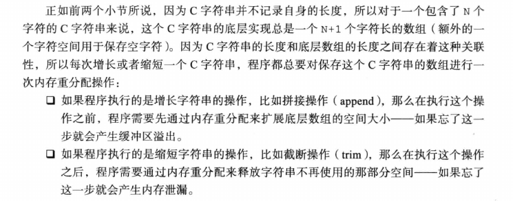

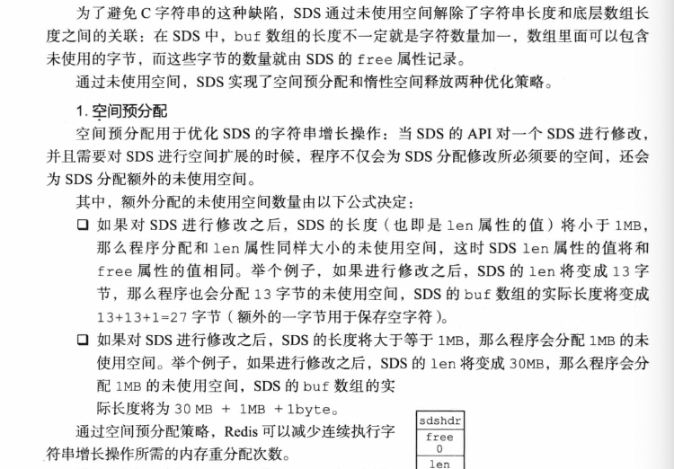

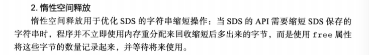

二进制安全。

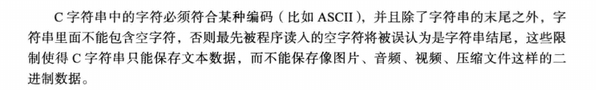

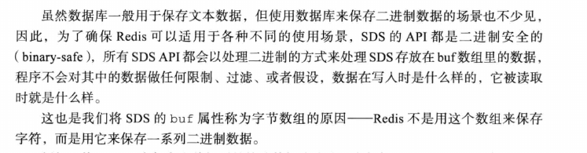

兼容部分 C 字符串函数。

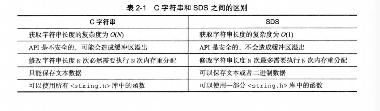

**SDS API**

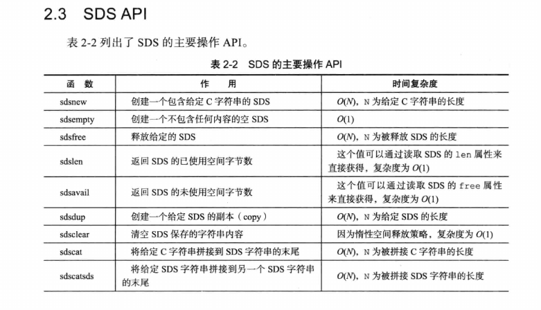

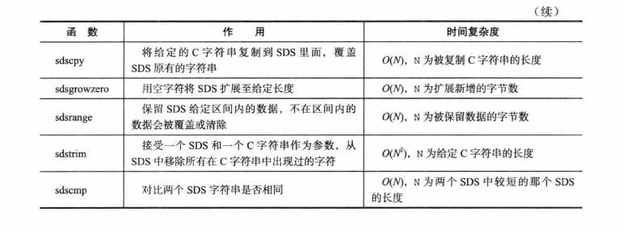


## 链表

链表节点的实现

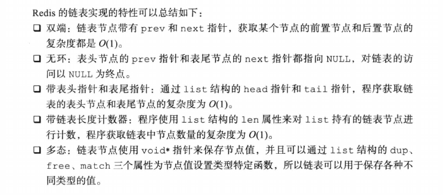

**链表和链表节点 API**

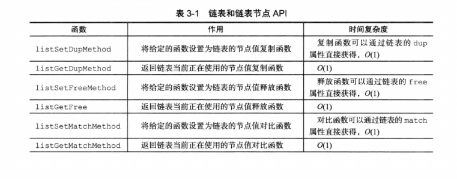

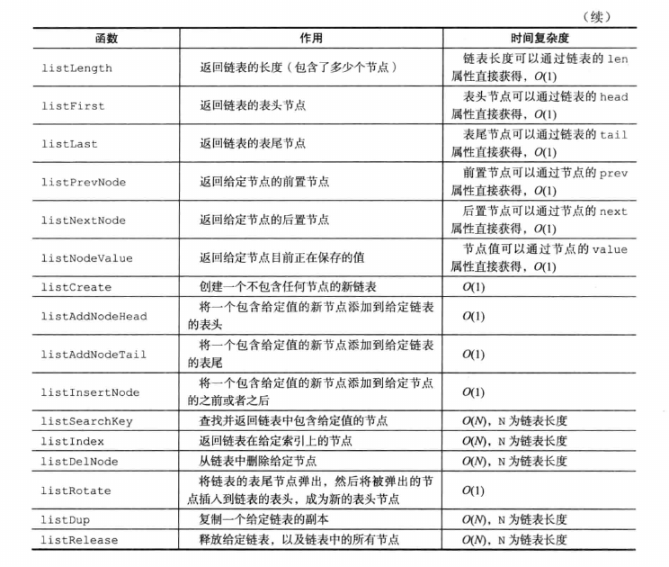

## 字典

**哈希表**

```c
#include <dict.h>

typedef struct dictht {
    dictEntry **table;		// 哈希表数组
    unsigned long size;		// 哈希表大小
    unsigned long sizemask;	// 哈希表大小掩码，用于计算索引值，总是等于 size - 1
    unsigned long used;		// 该哈希表已有节点的数量
} dictht;
```

table 属性是一个数组，数组中的每个元素都是一个指向 dict.h/dictEntry 结构的指针，每个 dictEntry 结构保存着一个键值对。

**哈希表节点**

```c
typedef struct dictEntry {
    void *key;	// 键
    union {		// 值
        void *val;
        uint64_ttu64;
        int64_ts64;
    } v;
    struct dictEntry *next;	// 指向下个哈希表节点、形成链表
} dictEntry;
```

next 属性是指向另一个哈希表节点的指针，这个指针可以将多个哈希值相同的键值对连接在一起，以此来解决键冲突的问题。

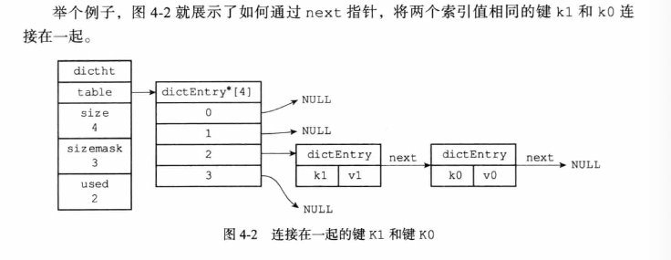

**字典**

```c
#include <dict.h>

typedef struct dict {
    dictType *type;	// 类型特定函数
    void *privdata;	// 私有数据
    dictht ht[2];	// 哈希表
    in trehashidx; 	// rehash 索引，当 rehash 不在进行时，值为-1
} dict;
```

type 属性和 privdata 属性是针对不同类型的键值对，为创建多态字典而设置的。

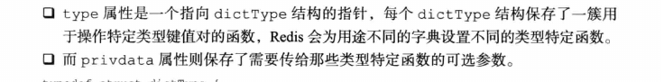

```c
typedef struct dictType {
    unsigned int (*hashFunction)(const void *key);
    void *(*keyDup)(void *privdata, const void *key);
    void *(*valDup)(void *priv)
} dictType;
```

