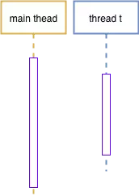

**转载**

> [C++11多线程-线程局部存储(thread_local)](https://www.jianshu.com/p/8df45004bbcb)

# 线程局部变量

​		线程局部存储在其它语言中都是以库的形式提供的(库函数或类)。但在 C++11中以关键字的形式，做为一种存储类型出现，由此可见 C++11 对线程局部存储的重视。C++11 中有如下几种存储类型:

| 序号 | 类型             | 备注                                                         |
| :--: | ---------------- | ------------------------------------------------------------ |
|  1   | **auto**         | 该关键字用于两种情况： 1. 声明变量时： 根据初始化表达式自动推断变量类型。 2. 声明函数作为函数返回值的占位符。 |
|  2   | **static**       | static 变量只初始化一次，除此之外它还有可见性的属性： 1. static 修饰函数内的“局部”变量时，表明它不需要在进入或离开函数时创建或销毁。且仅在函数内可见。 2. static 修饰全局变量时，表明该变量仅在当前(声明它的)文件内可见。 3. static 修饰类的成员变量时，则该变量被该类的所有实例共享。 |
|  3   | **register**     | 寄存器变量。该变量存储在 CPU 寄存器中，而不是 RAM (栈或堆)中。该变量的最大尺寸等于寄存器的大小。由于是存储于寄存器中，因此不能对该变量进行取地址操作。 |
|  4   | **extern**       | 引用一个全局变量。当在一个文件中定义了一个全局变量时，就可以在其它文件中使用 extern 来声明并引用该变量。 |
|  5   | **mutable**      | 仅适用于类成员变量。以 mutable 修饰的成员变量可以在 const 成员函数中修改。 |
|  6   | **thread_local** | 线程周期                                                     |

​		thread_local 修饰的变量具有如下特性:

- 变量在线程创建时生成(不同编译器实现略有差异，但在线程内变量第一次使用前必然已构造完毕)。
- 线程结束时被销毁(析构，利用析构特性，thread_local 变量可以感知线程销毁事件)。
- 每个线程都拥有其自己的变量副本。
- thread_local 可以和 static 或 extern 联合使用，这将会影响变量的链接属性。

​		下面代码演示了 thread_local 变量在线程中的生命周期。

```c++
#include <iostream>
#include <thread>
using namespace std;

class A {
public:
    A()
    {
        cout << this_thread::get_id()
             << " " << __FUNCTION__ << "(" << (void*)this << ")"
             << endl;
    }
    ~A()
    {
        cout << this_thread::get_id()
             << " " << __FUNCTION__ << "(" << (void*)this << ")"
             << endl;
    }
    void do_something()
    {
    }
};

thread_local A a;

int main()
{
    a.do_something();
    std::thread t([]() {
        cout << "thread: " 
        << this_thread::get_id() 
        << " entered" << endl;
        a.do_something();
    });
    t.join();
    return 0;
}
// output
139641419020096 A(0x7f00cd2d373e)
thread: 139641419015936 entered
139641419015936 A(0x7f00cd2d26fe)
139641419015936 ~A(0x7f00cd2d26fe)
139641419020096 ~A(0x7f00cd2d373e)
```

​		变量 a 在 main 线程和t线程中分别保留了一份副本，以下时序图表明了两份副本的生命周期。

