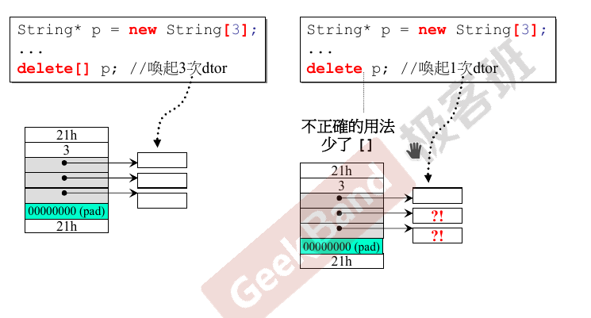

# 内存管理

## 背景知识

C++ 分配内存常用的两种方式是 *从栈内分配* 和 *从堆内分配*。每个程序都有一个栈区，一般大小与操作系统有关，离开程序块时自动释放。堆内存每次需要向操作系统申请。

C++ 中的 new 操作的理解：

```c++
MyClas* pc = new MyClass();
```

编译器会转化为

```c++
MyClass* pc;
void* mem = operator new(sizeof(MyClass)); // 分配内存
pc = static_cast<MyClass*>(mem);  // 转型
pc->MyClass::MyClass();  // 构造函数
```

`new()` 内部调用 `malloc()`

delete 操作：

```c++
delete pc;
```

编译器会转化为

```cpp
MyClass::~MyClass(pc);  // 调用析构函数
operator delete(pc);  // 释放内存
```

`delete(pc)` 内部调用 `free(pc)`

## 问题

C++ 中释放堆内存时 delete 与 delete[] 的区别？

## 解答

假设现在我们有如下代码

```c++
String* p = new String[3];
......
delete[] p;
```

我们使用 `delete[] p` 而不使用 `delete p` 的原因是第一行代码实际上在内存中创建了3个指针，指向3个 String 类。如果只调用 `delete p` 的话只会释放3个指针所占用的空间以及第一个 String 指针指向的空间，剩余两个String指针指向的内存不会被释放，造成了内存泄漏。具体点的说法就是 [] 符号和调用析构函数的次数有关。



总而言之，**需要记住 array new 一定要搭配 array delete 使用**。

## 拓展阅读

[栈大小和内存分布问题](https://www.cnblogs.com/zmlctt/p/3987181.html)

# 模板特化

## 什么是模板特化

在某些情况下，通用模板的定义对特定类型是不合适的：通用定义可能编译失败或者做的不正确，这个时候就需要模板特化。总而言之就是让模板在特定的情况下执行特定的一段代码，而非通用代码。

## 定义函数模板特例化

当我们特例化一个函数模板时，必须为原模板中的每个模板参数都提供实参。为了指出我们正在特例化一个模板，应使用关键字 `template` 后跟一对尖括号。尖括号指出我们将为原模板的所有模板参数提供实参。

```c++
template<>
int func(int arg) {
	return 10;
}
```

# 模板偏特化（局部特化）

## 1 模板个数上的偏特化

```c++
template<typename T, typename Alloc=...>
class vector {
	...
};

template<typename Alloc=...>
class vector<bool, Alloc> {...}
```

上面代码中，只将模板参数 T 进行了特化。

## 2 范围上的偏特化

模板参数为某些特定类型的时候进行特化。

```c++
template<typename T>
class C {
    // 代码1
    ...
};

template<typename T>
class C<T*> {
    // 代码2
    ...
};

// 使用
C<string> obj1;
C<string*> obj2;
```

在上面的代码中，对指针类型进行了特化，在使用中，`obj1` 的创建过程会使用到代码 1, `obj2` 的创建过程会使用到代码 2, 原因就是`obj2` 的模板参数是指针。

# template template parameter，模板模板参数

```c++
template <typename T, template <typename T> class Container>
class XCls {
private:
	Container<T> c;
public:
	...
};

template<typename T>
using Lst = List<T, allocator<T>>

XCls<string, list> mylist1;  // 错误写法
XCls<string, Lst> mylist;  // 正确写法
```

# variadic templates(c++11), 数量不定的模板参数


```c++
// 这个函数存在的原因是下面的模板函数要求最少有一个参数 firstArg, 如果递归到最后没有参数时（参数不匹配）会运行出错，编写这个函数的目的就是通过多态解决这个问题 
void print() { };

template <typename T, typename... Types>
void print(const T& firstArg, const Types&... args) {
	cout << firstArg << endl;
	print(arg...); // 递归
}

print(7.5, "hello", bitset<16>(377), 42);
```

