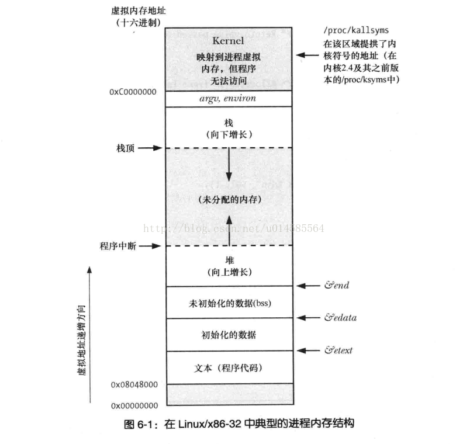
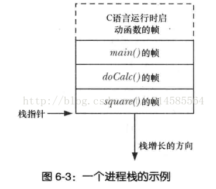

**参考**

> [C语言函数调用栈(一)](https://www.cnblogs.com/clover-toeic/p/3755401.html)
>
> [GDB观察栈的内存布局](https://blog.csdn.net/u014585564/article/details/68063187)

​		进程的内存布局如下图所示，栈是其中一块向下（低地址处）增长的内存。



​		栈由栈帧组成。当一个函数调用时，栈会为这个函数分配一个栈帧，用于存储函数的实参、局部变量、返回值，以及函数内调用函数时，当前函数的一些寄存器的相关信息（比如用于指向下一条指令的程序计数器）。可以认为，一个栈帧存储一个函数。当该函数调用结束后，栈帧会自动从栈上移去（这解释了局部变量的生存期问题）。

​		由于函数的嵌套，栈中可能有多个栈帧，此时，最后分配的栈帧称为栈顶，如下图所示。栈指针寄存器用于存储栈顶的地址，以跟踪栈顶。

```c
#include <stdio.h>

int square(int a, int b)
{
    int ret = a * a + b * b;
    return ret;
}

int doCalc(int num1, int num2)
{
    int ret = square(num1, num2);
    return ret;
}

int main()
{
    int param1 = 1;
    int param2 = 2;
    int result = doCalc(param1, param2);
    printf("result is%d\n", result);
}
```



