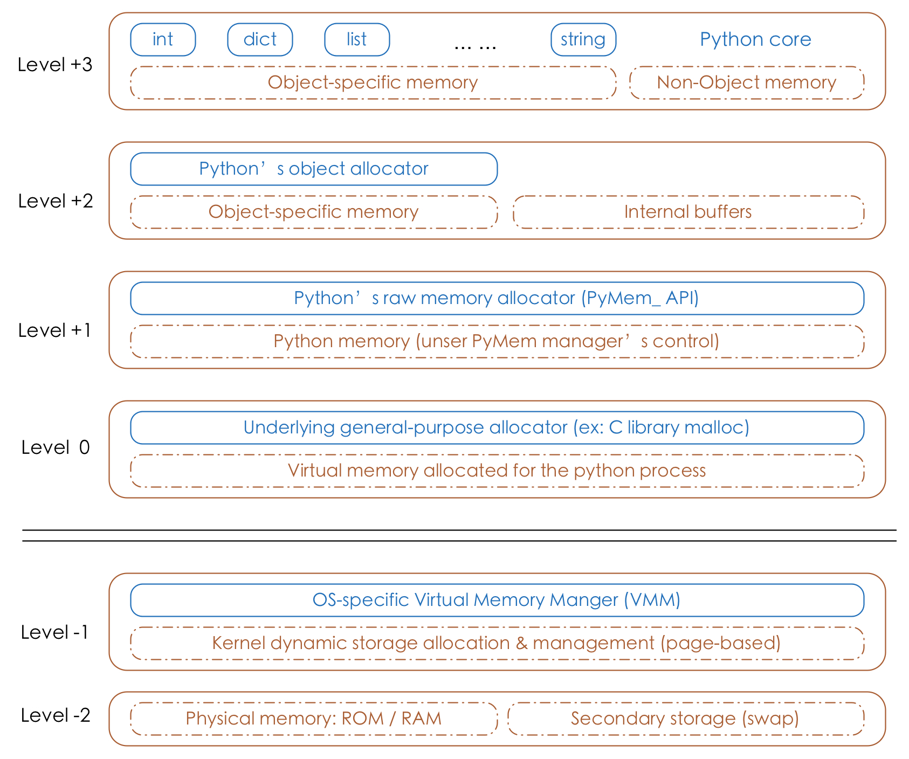

# Python

## 1. [Python内存管理机制](https://zhuanlan.zhihu.com/p/164627977)

### 1.1 内存池
首先是引入**内存池**，预先在内存中申请一定数量的，大小相等的内存块留作备用，当有新的内存需求时，就先从内存池中分配内存给这个需求，不够之后再申请新的内存。这样做最显著的优势就是能够减少内存碎片，提升效率。

> python中的内存管理机制为Pymalloc

 

python的对象管理主要位于Level+1~Level+3层
- `Level+3层:` 对于python内置的对象（比如int,dict等）都有独立的私有内存池，对象之间的内存池不共享，即int释放的内存，不会被分配给float使用
- `Level+2层:` 当申请的内存大小小于256KB时，内存分配主要由 Python 对象分配器（Python’s object allocator）实施
- `Level+1层:` 当申请的内存大小大于256KB时，由Python原生的内存分配器进行分配，本质上是调用C标准库中的malloc/realloc等函数

### 1.2 垃圾回收机制

Python的垃圾回收机制**采用引用计数机制为主，标记-清除和分代回收机制为辅的策略**。其中，标记-清除机制用来解决计数引用带来的循环引用而无法释放内存的问题，分代回收机制是为提升垃圾回收的效率。

Python通过引用计数来保存内存中的变量追踪，即记录该对象被其他使用的对象引用的次数。

标记-清除用来解决引用计数机制产生的循环引用，进而导致内存泄漏的问题 。 循环引用只有在容器对象才会产生，比如字典，元组，列表等。

- 标记阶段，遍历所有的对象，如果是可达的（reachable），也就是还有对象引用它，那么就标记该对象为可达
- 清除阶段，再次遍历对象，如果发现某个对象没有标记为可达（即为Unreachable），则就将其回收

为了减少应用程序暂停的时间，Python 通过“分代回收”(Generational Collection)以空间换时间的方法提高垃圾回收效率。

## 2. [python的内存分配](https://zhuanlan.zhihu.com/p/164627977)

# 操作系统

## 1. 进程和线程通信方式

- **进程间通信（IPC）:** 管道(Pipe)、命名管道(FIFO)、消息队列(Message Queue) 、信号量(Semaphore) 、共享内存（Shared Memory）；套接字（Socket）
- **线程:** 共享内存、消息传递和管道流
    - 共享内存: 线程之间共享程序的公共状态，线程之间通过读-写内存中的公共状态来隐式通信
    - 消息传递: 线程之间没有公共的状态，线程之间必须通过明确的发送信息来显示的进行通信
    - 管道流

# 计算机网络

## 1. TCP的可靠性传输是如何保证的

- [TCP协议如何保证可靠传输？](https://www.cnblogs.com/HuiH/p/11882096.html)

TCP主要提供了**检验和、序列号/确认应答、超时重传、最大消息长度、滑动窗口控制** 等方法实现了可靠性传输

- 检验和: TCP在计算检验和时，会在TCP首部加上一个12字节的伪首部。检验和总共计算3部分：TCP首部、TCP数据、TCP伪首部
- 序列号/确认应答: 发送端发送信息给接收端，接收端会回应一个应答包
- 超时重传: 超时重传是指发送出去的数据包到接收到确认包之间的时间，如果超过了这个时间会被认为是丢包了，需要重传
- 最大消息长度: 在建立TCP连接的时候，双方约定一个最大的长度（MSS）作为发送的单位，重传的时候也是以这个单位来进行重传。理想的情况下是该长度的数据刚好不被网络层分块
- 滑动窗口控制: 窗口的大小就是在无需等待确认包的情况下，发送端还能发送的最大数据量。这个机制的实现就是使用了大量的缓冲区，通过对多个段进行确认应答的功能。通过下一次的确认包可以判断接收端是否已经接收到了数据，如果已经接收了就从缓冲区里面删除数据
- [拥塞控制](https://blog.csdn.net/qq_41431406/article/details/97926927)
    - 慢开始
    - 拥塞控制
    - 快重传
    - 快恢复

## 2. [TCP/IP 协议体系结构四层分别是什么](https://www.php.cn/faq/466487.html)

1、数据链路层；实现网卡接口的网络驱动程序，以处理数据在物理媒介上的传输。2、网络层；实现数据包的选路和转发。3、传输层；为两台主机上的应用程序提供端到端的通信。4、应用层；负责处理应用程序的逻辑

# 其他

## 1. 设计模式