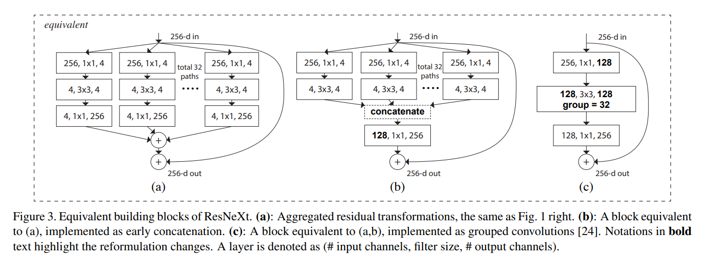

# 1. 理论基础

## 1.1 Depthwise Convolution (深度可分离卷积)

深度可分离卷积主要分为两个过程，分别为逐通道卷积（Depthwise Convolution）和逐点卷积（Pointwise Convolution）。


## 1.1.1 逐通道卷积（Depthwise Convolution）

Depthwise Convolution的一个卷积核负责一个通道，一个通道只被一个卷积核卷积，这个过程产生的feature map通道数和输入的通道数完全一样。

Depthwise Convolution完成后的Feature map数量与输入层的通道数相同，无法扩展Feature map。而且这种运算对输入层的每个通道独立进行卷积运算，没有有效的利用不同通道在相同空间位置上的feature信息。因此需要Pointwise Convolution来将这些Feature map进行组合生成新的Feature map。

## 1.1.2 逐点卷积（Pointwise Convolution）

Pointwise Convolution的运算与常规卷积运算非常相似，它的卷积核的尺寸为 1×1×M，M为上一层的通道数。所以这里的卷积运算会将上一步的map在深度方向上进行加权组合，生成新的Feature map。有几个卷积核就有几个输出Feature map。（卷积核的shape即为: **1 x 1 x 输入通道数 x 输出通道数**）

```py
class SeparableConv2d(nn.Module):
    def __init__(self,in_channels,out_channels,kernel_size=1,stride=1,padding=0,dilation=1,bias=False):
        super(SeparableConv2d,self).__init__()

        self.conv1 = nn.Conv2d(in_channels,in_channels,kernel_size,stride,padding,dilation,groups=in_channels,bias=bias)
        self.pointwise = nn.Conv2d(in_channels,out_channels,1,1,0,1,1,bias=bias)
    
    def forward(self,x):
        x = self.conv1(x)
        x = self.pointwise(x)
        return x
```

- 普通卷积
    - flops
        $$FLOPs=(2×C_0 × K^2 −1)×H×W×C_1 $$
    - 参数量
        $$K^2×C_0×C_1$$
- 分组卷积
    - flops
        $$[(2 × K^2 × C_0 / g + 1) ×H×W× C_0 / g] × g $$
    - 参数量
    $$ K × K × \frac{C_0}{g} × \frac{C_1}{g} × g $$

- 分组卷积
    - flops
        $$FLOPs= K × K × C_0 + C_0 × C_1 $$
    - 参数量
        $$ \frac{1}{C_1} + \frac{1}{K^2} $$

## 1.2 Focal Loss

- [focal loss 通俗讲解](https://zhuanlan.zhihu.com/p/266023273)

<!-- ### 1.2.1 交叉熵损失函数 -->

$$ CE(p,y) = -ylog(p) - (1-y)log(1-p) $$

$$ FL(p,y) = -y(1-p)^{\gamma}log(p) - (1-y)p^{\gamma}log(1-p) $$

将 $ \alpha-balance $ 技巧融合进Focal Loss

$$ FL(p,y) = - \alpha y(1-p)^{\gamma}log(p) - (1-\alpha)(1-y)p^{\gamma}log(1-p) $$

## 1.3 l1和l2正则的原理和区别

[机器学习中的范数规则化之（一）L0、L1与L2范数](https://blog.csdn.net/zouxy09/article/details/24971995)
[机器学习中正则化项L1和L2的直观理解](https://blog.csdn.net/jinping_shi/article/details/52433975)

- **原理**
    - L1范数来实现模型的稀疏性
    - L2范数也被称为“权重衰减”和“岭回归”，L2的主要作用是解决过拟合
- **区别**
    - **下降的速度:**  L1，L2都是规则化的方式，最小化目标函数，类似于一个下坡的过程，所以它们下降的坡不同，L1是按照绝对值函数下坡，L2是按照二次函数下坡，在0附近，L1的速度更快
    - **模型空间的限制:** L1会将模型限制一个正方形区域，L2将模型限制在一个圆的区域

总结就是L1会使得某些参数为0，具有稀疏性，而L2没有这个功能，使得参数的值比较小去降低过拟合

**正则化参数的选择**

正则化分别取 $ \lambda = 0.5 $ 和 $\lambda = 2 $，可以看到越大的 $ \lambda $ 越容易使 $F(x)$ 在 $x = 0$ 时取到最小值

<div align="center"> </div>

$ \lambda $ 越大，$ \theta _j $ 衰减得越快。$\lambda$ 越大，L2圆的半径越小，最后求得代价函数最值时各参数也会变得很小，同样是一个shrink to zero的过程，原理与L1正则化类似

## 1.4 轻量级网络

MobileNetV1、ShuffleNetv1-v2

MobileNetV1 中引入了深度可分离卷积
ShuffleNetv1 在组卷积的基础上进行通道打乱的方式

## 1.5 ResNet

[ResNet及其变种的结构梳理、有效性分析与代码解读](https://zhuanlan.zhihu.com/p/54289848)

- 问题
    - 加深网络深度但网络性能却下降的现象称为退化问题
- 解决方案
    - 构建恒等映射
    误差是衡量观测值和真实值之间的差距，残差是指预测值和观测值之间的差距。对于残差网络的命名原因，作者给出的解释是，网络的一层通常可以看做 $y=H(x)$，而残差网络的一个残差块可以表示为 $H(x)=F(x)+x$，也就是 $F(x)=H(x)-x$，在单位映射中， $y=x$ 便是观测值，而 $H(x)$ 是预测值，所以 $F(x)$ 便对应着残差，因此叫做残差网络。

**ResNeXT**
引入 [组卷积](#331-group-convolution)

<div align="center"> </div>

## 1.6 知识蒸馏

知识蒸馏（knowledge distillation），是迁移学习（transfer learning）的一种，简单来说就是训练一个大模型（teacher）和一个小模型（student），将庞大而复杂的大模型学习到的知识，通过一定技术手段迁移到精简的小模型上，从而使小模型能够获得与大模型相近的性能。

知道 `student` 模型最终的损失函数由两部分组成：
- 第一项是由小模型(student 模型)的预测结果与大模型的“软标签”所构成的交叉熵（cross entroy）;
- 第二项为小模型预测结果与普通类别标签的交叉熵。

这两个损失函数的重要程度可通过一定的权重进行调节，在实际应用中， T 的取值会影响最终的结果，一般而言，较大的 T 能够获得较高的准确度，T（蒸馏温度参数） 属于知识蒸馏模型训练超参数的一种。T 是一个可调节的超参数、T 值越大、概率分布越软（论文中的描述），曲线便越平滑，相当于在迁移学习的过程中添加了扰动，从而使得学生网络在借鉴学习的时候更有效、泛化能力更强，这其实就是一种抑制过拟合的策略。

# 2. 内部原理

## 2.1  DataLoader 原理

- \_\_init__() 和 \_\_iter__()
    - 数据的shuffle和batch处理
        - RandomSampler(dataset)
        - SequentialSampler(dataset)
        - BatchSampler(sampler, batch_size, drop_last)
    - 因为DataLoader只有 `__iter__()` 而没有实现 `__next__()`, 所以DataLoader是一个iterable而不是iterator。这个iterator的实现在 `_DataLoaderIter` 中


- **DataLoader本质上就是一个iterable（跟python的内置类型list等一样），并利用多进程来加速batch data的处理，使用yield来使用有限的内存**
​
- **Queue的特点**
    - 当队列里面没有数据时： queue.get() 会阻塞， 阻塞的时候，其它进程/线程如果有queue.put() 操作，本线程/进程会被通知，然后就可以 get 成功。
    - 当数据满了: queue.put() 会阻塞
- DataLoader是一个高效，简洁，直观的网络输入数据结构，便于使用和扩展


## 2.2 BN

[深度学习之Batch Normalization](https://www.cnblogs.com/Luv-GEM/p/10756382.html)

内部协变量偏移会导致梯度消失

- **作用**
    1. 通过标准归一化，使得输入值的均值为0，方差为1，而不是绝对值非常大的数，就可以大大提升训练速度，加快模型收敛；
    2. 带有轻微的正则化效果，与Dropout类似。Dropout通过给隐藏层的神经元以一定的概率乘以0或者1，而给隐藏层的激活值增加了噪音。相比之下，BN操作通过对输入值减去均值和进行缩放，也给隐藏层的神经元添加了轻微的噪音。
    3. 使得调参过程简单了不少。使用梯度下降法对参数进行优化学习时，非常关键的一个问题是如何合理地初始化参数值，为此提出了Xavier初始化和He初始化等方法，而使用BN操作后，对于参数初始化的要求就没那么高了。而且也可以使用大的学习率。
    4. 使用饱和型激活函数，比如sigmoid函数和tanh函数，也不怕出现梯度消失问题了。
- **流程**

<div align="center"> </div>

- **推断时的Batch Normalization**
    可以用整个数据集上的均值 $μ$ 和方差 $σ$ 来代替每次小批量样本的均值和方差，然后在推断阶段就使用这两个全局统计量来进行BN操作
