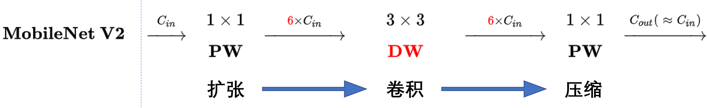
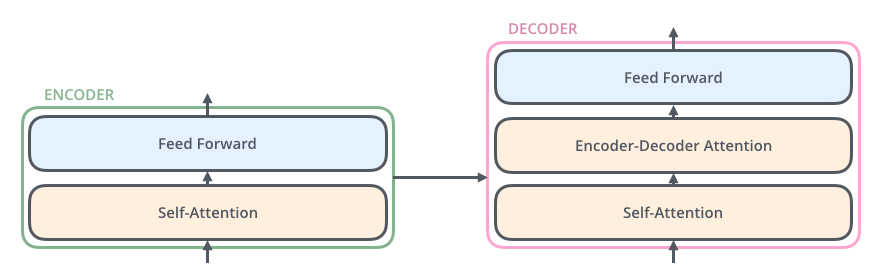

- [1. Intern](#1-intern)
    - [](#11-depthwise-convolution-深度可分离卷积)
    - [loss-and-lr](#12-loss-and-lr)
        - [focal-loss](#121-focal-loss)
        - [cosineannealingwarmrestarts](#122-cosineannealingwarmrestarts)
        - [数据增强](#123-data-aug)
    - [网络模型](#13-net)
        - [resnet](#131-resnet)
        - [resnext](#132-resnext)
        - [mobilenet](#133-mobilenet)
        - [densenet](#134-densenet)
        - [gan](#135-gan)
    - [朴素贝叶斯](#14-朴素贝叶斯)
    - [transformer](#15-transformer)
- [CBCT](#2-tmj-cbct-imr)
    - [自监督学习](#21-自监督学习)
    - [dsnt](#22-dsnt)
    - [mel-net](#23-mel-net)
    - [参数初始化](#24-参数初始化)
- [other](#3-other)
    - [知识蒸馏](#31-知识蒸馏)


# 1. Intern

## 1.1 Depthwise Convolution (深度可分离卷积)

深度可分离卷积主要分为两个过程，分别为逐通道卷积（Depthwise Convolution）和逐点卷积（Pointwise Convolution）。


## 1.1.1 逐通道卷积（Depthwise Convolution）

Depthwise Convolution的一个卷积核负责一个通道，一个通道只被一个卷积核卷积，这个过程产生的feature map通道数和输入的通道数完全一样。

Depthwise Convolution完成后的Feature map数量与输入层的通道数相同，无法扩展Feature map。而且这种运算对输入层的每个通道独立进行卷积运算，没有有效的利用不同通道在相同空间位置上的feature信息。因此需要Pointwise Convolution来将这些Feature map进行组合生成新的Feature map。

## 1.1.2 逐点卷积（Pointwise Convolution）

Pointwise Convolution的运算与常规卷积运算非常相似，它的卷积核的尺寸为 $1×1×M$ ，$M$ 为上一层的通道数。所以这里的卷积运算会将上一步的map在深度方向上进行加权组合，生成新的Feature map。有几个卷积核就有几个输出Feature map。（卷积核的shape即为: **1 x 1 x 输入通道数**）

```py
class SeparableConv2d(nn.Module):
    def __init__(self,in_channels,out_channels,kernel_size=1,stride=1,padding=0,dilation=1,bias=False):
        super(SeparableConv2d,self).__init__()

        self.conv1 = nn.Conv2d(in_channels,in_channels,kernel_size,stride,padding,dilation,groups=in_channels,bias=bias)
        self.pointwise = nn.Conv2d(in_channels,out_channels,1,1,0,1,1,bias=bias)
    
    def forward(self,x):
        x = self.conv1(x)
        x = self.pointwise(x)
        return x
```

## 1.2 Loss and LR

### 1.2.1 Focal Loss

- [损失函数：交叉熵详解](https://zhuanlan.zhihu.com/p/115277553)
- [focal loss 通俗讲解](https://zhuanlan.zhihu.com/p/266023273)

$$ CE(p,y) = -ylog(p) - (1-y)log(1-p) $$

$$ FL(p,y) = -y(1-p)^{\gamma}log(p) - (1-y)p^{\gamma}log(1-p) $$

将 $ \alpha-balance $ 技巧融合进Focal Loss

$$ FL(p,y) = - \alpha y(1-p)^{\gamma}log(p) - (1-\alpha)(1-y)p^{\gamma}log(1-p) $$

### 1.2.2 CosineAnnealingWarmRestarts

$$ \eta_t = \eta_{min} + \frac{1}{2}(\eta_{max} - \eta_{min})(1 + cos(\frac{T_{cur}}{T_i}\pi)) $$

```py
torch.optim.lr_scheduler.CosineAnnealingWarmRestarts(optimizer, T_0, T_mult=1, eta_min=0, last_epoch=-1, verbose=False)
```

$T_0$ 就是初始restart的epoch数目，$T_{mult}$ 就是重启之后因子，默认是1。我觉得可以这样理解，每个restart后，$ T_0 = T_0 * T_{mult}$。

### 1.2.3 data Aug

- 基于样本变换的数据增强，样本变换数据增强即采用预设的数据变换规则进行已有数据的扩增，包含单样本数据增强和多样本数据增强。
    - **单样本增强(主要用于图像)**: 主要有几何操作、颜色变换、随机擦除、添加噪声等方法产生新的样本，可参见imgaug开源库


## 1.3 Net

### 1.3.1 ResNet

[ResNet及其变种的结构梳理、有效性分析与代码解读](https://zhuanlan.zhihu.com/p/54289848)

- 问题
    - 加深网络深度但网络性能却下降的现象称为退化问题
- 解决方案
    - 构建恒等映射
    误差是衡量观测值和真实值之间的差距，残差是指预测值和观测值之间的差距。对于残差网络的命名原因，作者给出的解释是，网络的一层通常可以看做 $y=H(x)$，而残差网络的一个残差块可以表示为 $H(x)=F(x)+x$，也就是 $F(x)=H(x)-x$，在单位映射中， $y=x$ 便是观测值，而 $H(x)$ 是预测值，所以 $F(x)$ 便对应着残差，因此叫做残差网络。
- 优势
    - 残差网络中不会出现梯度消失的问题
    - $L$ 层的梯度可以直接传递到任何一个比它浅的 $l$ 层（ $L$ 层可以表示为任意一个比它浅的 $l$ 层和他们之间的残差部分之和）

### 1.3.2 ResNeXt

结合强大的残差网络，我们得到的便是完整的ResNeXt，也就是在简化Inception中添加一条short-cut

### 1.3.3 MobileNet

**V1**
引入 [深度可分离卷积](#332-depthwise-convolution)

**V2**
V2的新想法包括 `Linear Bottleneck` 和 `Inverted Residuals`

对低维度做ReLU运算，很容易造成信息的丢失。而在高维度进行ReLU运算的话，信息的丢失则会很少。这就解释了为什么深度卷积的卷积核有不少是空。发现了问题，我们就能更好地解决问题。针对这个问题，可以这样解决: 既然是ReLU导致的信息损耗，将ReLU替换成线性激活函数

深度卷积本身没有改变通道的能力，来的是多少通道输出就是多少通道。如果来的通道很少的话，DW深度卷积只能在低维度上工作，这样效果并不会很好，所以我们要“扩张”通道。既然我们已经知道PW逐点卷积也就是1×1卷积可以用来升维和降维，那就可以在DW深度卷积之前使用PW卷积进行升维（升维倍数为t，t=6），再在一个更高维的空间中进行卷积操作来提取特征: 

<div align="center"> </div>


### 1.3.4 DenseNet

1、减轻了vanishing-gradient（梯度消失）
2、加强了feature的传递
3、更有效地利用了feature
4、一定程度上减少了参数数量

```py
class Denseblock(nn.Module):
    def __init__(self, inc, growth_rate, num_layers):
        super(Denseblock, self).__init__()
        block = []
        for i in range(num_layers):
            block.append(conv_block(inc, growth_rate))
            inc += growth_rate
        self.net = nn.Sequential(*block)

    def forward(self, x):
        for layer in self.net:
            out = layer(x)
            x = torch.cat((out, x), dim=1)
        return x
```

## 1.3.5 GAN

我们要尽可能使两个分布接近，通过用极大似然的方式来求解参数

$$KL(P1||P2) = E_{x \in p1}log (\frac{p1}{p2}) = \int_{x} p1(x)log(\frac{p1(x)}{p2(x)}) $$

$$JS(P1||P2) = \frac{1}{2} KL(P1||\frac{P1+P2}{2}) + \frac{1}{2} KL(P2||\frac{P1+P2}{2})$$

a. 假设m个样本
b. 计算采样样本的似然函数（使其分布尽可能相似）
$$\theta^* = argmax_{\theta} L = arg max_{\theta} \prod_{i=1}^{m}P_G(x^i; \theta) = argmax_{\theta} \int_x P_{data}(x)log P_G(x; \theta)dx = argmin_{\theta} KL(P_{data}(x)||P_G(x;\theta)) $$


$$min_G max_D V(D, G) = E_{x\in p_{data}(x)}[logD(x)] + E_{z \in p_{z(z)}}[log(1- D(G(z)))]$$

## 1.4 朴素贝叶斯

$$ P(类别|特征) = \frac{p(特征|类别)p(类别)}{p(特征)}  $$

拉普拉斯平滑避免了因为训练集中样本不充分而导致概率估计值为0的问题


## 1.5 Transformer 


<div align="center"> </div>

<div align="center"> </div>

# 2. TMJ CBCT IMR

## 2.1 自监督学习

自监督学习的核心，在于**如何自动为数据产生标签**

## 2.2 DSNT

## 2.3 MEL-Net

## 2.4 参数初始化

PyTorch 中参数的默认初始化在各个层的 `reset_parameters()` 方法中。例如: `nn.Linear` 和 `nn.Conv2D`，都是在 `[-limit, limit]` 之间的均匀分布，其中 `limit` 是 `1./sqrt(fan_in)`

- 如果将所有的权重都设置为0，则每一层激活函数的输出都是0
- 用N(0,1）标准正态的方式去初始化参数，每层激活函数的输出集中为-1或者1，这也就意味着激活函数陷入了饱和状态，在这个状态下，激活函数的导数为0
- 采用均匀分布的方式去初始化参数，结果随着层数的增加，每层激活函数的输出逐渐往0靠拢

### 2.4.1 Xavier Initialization

Xavier初始化的基本思想是保持输入和输出的方差一致，这样就避免了所有输出值都趋向于0。这是通用的方法，适用于任何激活函数。

**为什么均值为0，标准差为1这么重要?**

考虑一个有100层的深度神经网络。在每一步，权重矩阵乘以来自前一层的激活。如果每一层的激活大于1，当它们被重复乘以100次时，它们就会不断变大，爆炸到无穷大。类似地，如果激活值小于1，它们将消失为零。这叫做渐变爆炸和渐变消失问题。


**xavier初始化方法中服从均匀分布 $U(-a, a)$**
$$a= gain × \sqrt\frac{6}{fan_{in} + fan_{out}}$$

其中 `fan_in` 是 $H×W×C_{in}$, `fan_out` 是$H×W×C_{out}$, 增益值`gain` 是一个比例值，来调控输入数量级和输出数量级之间的关系

**xavier初始化方法中服从正太分布 $N(0, std)$**
$$std= gain * \sqrt\frac{2}{fan_{in} + fan_{out}}$$

其中 `fan_in` 是 $H×W*C_{in}$, `fan_out` 是$H×W*C_{out}$, 增益值`gain` 是一个比例值，来调控输入数量级和输出数量级之间的关系

### 2.4.2 Kaiming Initialization

**kaiming初始化方法中服从均匀分布 $U(−bound,bound)$**
$$bound=  \sqrt\frac{6}{(1+a^2) × fan_{in}}$$

`a` 是激活函数的负斜率（对于`leaky_relu`来说），如果激活函数是`relu`的话，`a` 为 `0`。`mode` 默认为fan_in模式，可以设置为fan_out模式。fan_in可以保持前向传播的权重方差的数量级，fan_out可以保持反向传播的权重方差的数量级

**kaiming初始化方法中服从均匀分布 $N(0, std)$**
$$std=  \sqrt\frac{2}{(1+a^2) × fan_{in}}$$

其中 `fan_in` 是 $H×W*C_{in}$, `fan_out` 是$H×W*C_{out}$, 增益值`gain` 是一个比例值，来调控输入数量级和输出数量级之间的关系


# 3. Other

## 3.1 知识蒸馏

### 3.1.1 Teacher Model和Student Model

知识蒸馏使用的是Teacher—Student模型，其中teacher是“知识”的输出者，student是“知识”的接受者。知识蒸馏的过程分为2个阶段:

**原始模型训练:** 训练"Teacher模型", 简称为Net-T，它的特点是模型相对复杂，也可以由多个分别训练的模型集成而成。我们对"Teacher模型"不作任何关于模型架构、参数量、是否集成方面的限制，唯一的要求就是，对于输入X, 其都能输出Y，其中Y经过softmax的映射，输出值对应相应类别的概率值。

**精简模型训练:** 训练"Student模型", 简称为Net-S，它是参数量较小、模型结构相对简单的单模型。同样的，对于输入X，其都能输出Y，Y经过softmax映射后同样能输出对应相应类别的概率值。


### 3.1.2 知识蒸馏的关键点

如果回归机器学习最最基础的理论，我们可以很清楚地意识到一点(而这一点往往在我们深入研究机器学习之后被忽略): **机器学习最根本的目的** 在于训练出在某个问题上泛化能力强的模型。

泛化能力强: 在某问题的所有数据上都能很好地反应输入和输出之间的关系，无论是训练数据，还是测试数据，还是任何属于该问题的未知数据。

而现实中，由于我们不可能收集到某问题的所有数据来作为训练数据，并且新数据总是在源源不断的产生，因此我们只能退而求其次，训练目标变成在已有的训练数据集上建模输入和输出之间的关系。由于训练数据集是对真实数据分布情况的采样，训练数据集上的最优解往往会多少偏离真正的最优解(这里的讨论不考虑模型容量)。

而在知识蒸馏时，由于我们已经有了一个泛化能力较强的Net-T，我们在利用Net-T来蒸馏训练Net-S时，可以直接让Net-S去学习Net-T的泛化能力。

一个很直白且高效的迁移泛化能力的方法就是: 使用softmax层输出的类别的概率来作为“soft target”。

**KD的训练过程和传统的训练过程的对比**
- 传统training过程(`hard targets`): 对ground truth求极大似然
- KD的training过程(`soft targets`): 用large model的class probabilities作为soft targets

**KD的训练过程为什么更有效?**
- softmax层的输出，除了正例之外，**负标签也带有大量的信息**，比如某些负标签对应的概率远远大于其他负标签。而在传统的训练过程(hard target)中，所有负标签都被统一对待。也就是说，**KD的训练方式使得每个样本给Net-S带来的信息量大于传统的训练方式。**

通过蒸馏的方法训练出的Net-S相比使用完全相同的模型结构和训练数据只使用hard target的训练方法得到的模型，拥有更好的泛化能力。

### 3.1.3 softmax函数

$$q_i= \frac{exp(z_i)}{\sum_{j}exp(z_j)}$$

但要是直接使用softmax层的输出值作为soft target, 这又会带来一个问题: 当softmax输出的概率分布熵相对较小时，负标签的值都很接近0，对损失函数的贡献非常小，小到可以忽略不计。因此<b>"温度"</b>这个变量就派上了用场。

下面的公式时加了温度这个变量之后的softmax函数:

$$q_i= \frac{exp(z_i / T)}{\sum_{j}exp(z_j / T)}$$

- 这里的T就是温度。
- 原来的softmax函数是T = 1的特例。 T越高，softmax的output probability distribution越趋于平滑，其分布的熵越大，负标签携带的信息会被相对地放大，模型训练将更加关注负标签。

### 3.1.4 知识蒸馏的具体方法

#### 3.1.4.1 通用的知识蒸馏方法

第一步是训练Net-T；第二步是在高温T下，蒸馏Net-T的知识到Net-S