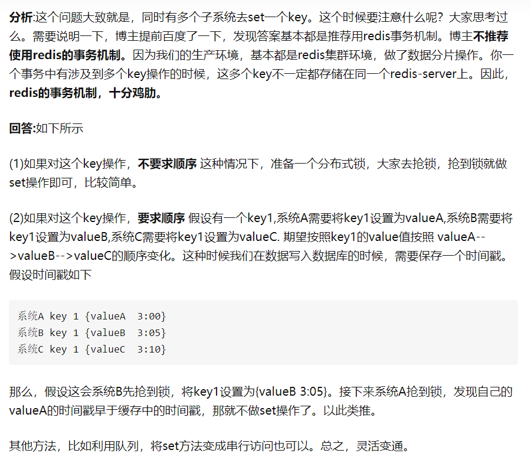

# MySQL

## 1. MySQL事务解析: ACID的原理及实现

### 1.1 什么是事务？

事务就是一个操作序列，这些操作要么都执行，要么都不执行，它是一个不可分割的工作单位。事务是数据库维护数据一致性的单位，在每个事务结束时，都能保持数据一致性。

### 1.2 事务是如何通过日志来实现的？

- Redo Log 保证事务的持久性
- Undo Log 保证事务的原子性

MySQL的存储引擎InnoDB使用重做日志(Redo Log)保证一致性与持久性，回滚日志(undo log)保证原子性，使用各种锁来保证隔离性。

`Redo Log: `
Redo Log在事务没有提交前，会记录每一个修改操作变更后的数据。主要是防止在发生故障的时间点，尚有脏页未写入磁盘。在重启mysql服务的时候，根据redo log进行重做，从而达到事务的持久性这一特性。在事务提交前，只要将 Redo Log 持久化即可，不需要将数据持久化。当系统崩溃时，系统可以根据Redo Log的内容，将所有数据恢复到最新的状态。（持久化: 先将重做日志写入缓存，再刷新(fsync)到磁盘）

`Undo Log: `
保存了事务发生之前的数据的一个版本，可以用于回滚，同时可以提供多版本并发控制下的读（MVCC），也即非锁定读。（作用）

事务发生异常需要回滚，这时就需要回滚日志。回滚日志不同于重做日志，它是逻辑日志，对数据库的修改都逻辑的取消了。当事务回滚时，它实际上做的是与先前相反的工作。对于每个INSERT，InnoDB存储引擎都会完成一个DELETE；对于每个UPDATE，InnoDB存储引擎都会执行一个相反的UPDATE。

### 1.3 ACID

`原子性Atomicity、一致性Consistency、隔离性Isolation、持久性Durability`

1. 原子性: 是指整个数据库事务是不可分割的单位。只有使事务中的所有数据库操作都成功，才算整个事务成功。如果事务中任何一个sql语句执行失败，那么已经执行的sql语句也必须撤销，事务状态退回到执行事务之前的状态。
2. 一致性: 一致性是指事务必须使数据库从一个一致性状态变换到另一个一致性状态。在事务开始之前和事务结束之后，事务的完整性约束没有被破坏。
3. 隔离性: 一个事务的影响在该事务提交前对其他事物都不可见。——这通过锁来实现
4. 持久性: 事务一旦提交，其结果就是永久性的。

### 1.4 事务的并发问题

1. `脏读: `事务A读取了事务B更新的数据，然后B回滚操作，那么A读取到的数据是脏数据

2. `不可重复读: `事务 A 多次读取同一数据，事务 B 在事务A多次读取的过程中，对数据作了更新并提交，导致事务A多次读取同一数据时，结果不一致。

3. `幻读: `系统管理员A将数据库中所有学生的成绩从具体分数改为ABCDE等级，但是系统管理员B就在这个时候插入了一条具体分数的记录，当系统管理员A改结束后发现还有一条记录没有改过来，就好像发生了幻觉一样，这就叫幻读。

`小结: `不可重复读的和幻读很容易混淆，不可重复读侧重于`修改`，幻读侧重于`新增或删除`。解决不可重复读的问题只需`锁住满足条件的行`，解决幻读需要`锁表`

### 1.5 事务的隔离级别
- `第一种隔离级别: Read uncommitted(读未提交)`
    - 如果一个事务已经开始写数据，则另外一个事务不允许同时进行写操作，但允许其他事务读此行数据，该隔离级别可以通过 `"排他写锁"`，但是不排斥读线程实现。这样就避免了更新丢失，却可能出现脏读，也就是说事务B读取到了事务A未提交的数据

    - `解决了更新丢失，但还是可能会出现脏读`

- `第二种隔离级别: Read committed(读提交)`
    - 如果是一个读事务(线程)，则允许其他事务读写，如果是写事务将会禁止其他事务访问该行数据，该隔离级别避免了脏读，但是可能出现不可重复读。事务A事先读取了数据，事务B紧接着更新了数据，并提交了事务，而事务A再次读取该数据时，数据已经发生了改变。

    - `解决了更新丢失和脏读问题`

- `第三种隔离级别: Repeatable read(可重复读取)`
    - 可重复读取是指在一个事务内，多次读同一个数据，在这个事务还没结束时，其他事务不能访问该数据(包括了读写)，这样就可以在同一个事务内两次读到的数据是一样的，因此称为是可重复读隔离级别，读取数据的事务将会禁止写事务(但允许读事务)，写事务则禁止任何其他事务(包括了读写)，这样避免了不可重复读和脏读，但是有时可能会出现幻读。(读取数据的事务)可以通过“共享读镜”和“排他写锁”实现。

    - `解决了更新丢失、脏读、不可重复读、但是还会出现幻读`

- `第四种隔离级别: Serializable(可序化)`
    - 提供严格的事务隔离，它要求事务序列化执行，事务只能一个接着一个地执行，但不能并发执行，如果仅仅通过“行级锁”是无法实现序列化的，必须通过其他机制保证新插入的数据不会被执行查询操作的事务访问到。序列化是最高的事务隔离级别，同时代价也是最高的，性能很低，一般很少使用，在该级别下，事务顺序执行，不仅可以避免脏读、不可重复读，还避免了幻读

### 1.6 （隔离级别为可重复读；数据x=1;事务A,B开始，A读数据x，B读数据x，A写数据x=2）分别问A在提交和未提交情况下，B再读x的结果是？

## 2. 底层原理: B+树

首先我们知道在数据库中索引可以使用hash算法，查询效率很高，但是不支持范围查询，因此我们考虑使用平衡二叉树，但是我们知道二叉树每个节点只有一个数据，如果数据变多的话，树就会越来越高，查询的成本也会增高，我们考虑使用B树，它可以在一个节点存储多个数据，B+树的优化是非叶子节点的数据会冗余一份在叶子节点，并且叶子节点之间使用指针相连，因此增高查询效率，而且支持范围查询，B+树里的元素也是有序的。

### 2.1 B树和B+树的区别？

B+树是一种平衡查找树。在B+树中，所有记录节点都是按键值的大小顺序存放在同一层的叶节点中，各叶结点指针进行连接。

（平衡二叉树AVL: 首先符合二叉查找树的定义（左结点的值比根节点小，右结点的值比根结点大），其次必须满足任何节点的左右两个子树的高度最大差为1。）

`B树:` 每个节点都存储key和data，所有节点组成这棵树，并且叶子节点指针为null，叶子结点不包含任何关键字信息。
`B+树:` 所有的叶子结点中包含了全部关键字的信息，及指向含有这些关键字记录的指针，且叶子结点本身依关键字的大小自小而大的顺序链接，所有的非终端结点可以看成是索引部分。

### 2.2 为什么说B+比B树更适合实际应用中操作系统的文件索引和数据库索引？
（1）B+的磁盘读写代价更低

　　B+的内部结点并没有指向关键字具体信息的指针。因此其内部结点相对B树更小。如果把所有同一内部结点的关键字存放在同一盘块中，那么盘块所能容纳的关键字数量也越多。一次性读入内存中的需要查找的关键字也就越多。相对来说IO读写次数也就降低了。

（2）B+tree的查询效率更加稳定

　　由于非终结点并不是最终指向文件内容的结点，而只是叶子结点中关键字的索引。所以任何关键字的查找必须走一条从根结点到叶子结点的路。所有关键字查询的路径长度相同，导致每一个数据的查询效率相当。

### 2.3 为什么B+树内部节点不存数据

存储索引

## 3. 数据库中的锁

### 3.1 乐观锁和悲观锁是什么？

- `悲观锁: `假定会发生并发冲突，屏蔽掉一切可能违反数据完整性的操作，在读取的时候就对数据进行加锁， 在该用户读取数据的期间，其他任何用户都不能来修改该数据，但是其他用户是可以读取该数据的， 只有当自己读取完毕才释放锁。在数据库中可以使用 `Repeatable Read` 的隔离级别（可重复读）来实现悲观锁
- `乐观锁: `假定不会发生并发冲突，只在提交的时候检查是否发生并发冲突。可以使用版本号机制和CAS算法实现。

### 3.2 mysql有哪些锁？
- 按锁粒度分类: `行级锁 & 表级锁 & 页级锁`
- 锁级别分类: `共享锁 & 排他锁 & 意向锁`

## 4. 基础概念

### 4.1 MySQL数据库几个基本的索引类型？

#### 4.1.1 普通索引、唯一索引、主键索引、联合索引、全文索引。

- `唯一索引: `索引列的值必须唯一，但允许有空值。如果是组合索引，则列值的组合必须唯一。
- `主键索引: `是一种特殊的唯一索引，一个表只能有一个主键，不允许有空值。 为表定义主键将自动创建主键索引。（数据库表某列或列组合，其值唯一标识表中的每一行。该列称为表的主键。）
- `联合索引: `指对表上的多个列做索引。只有在查询条件中使用了创建索引时的第一个字段，索引才会被使用。使用组合索引时遵循最左前缀原则。
- `全文索引: `主要用来查找文本中的关键字，而不是直接与索引中的值相比较。目前只有char、varchar，text 列上可以创建全文索引。

#### 4.1.2 聚集索引和非聚集索引的区别？

聚集索引一定是唯一索引。但唯一索引不一定是聚集索引。  

聚集索引，在索引页里`直接存放数据`，而非聚集索引在索引页里存放的是索引，这些索引`指向专门的数据页的数据(数据地址)`。

### 4.2 使用索引查询一定能提高查询的性能吗？为什么？

通常，通过索引查询数据比全表扫描要快。但是我们也必须注意到它的代价: 

索引需要空间来存储，也需要定期维护，每当有记录在表中增减或索引列被修改时，索引本身也会被修改。这意味着每条记录的INSERT、DELETE、UPDATE将为此多付出4,5 次的磁盘I/O。因为索引需要额外的存储空间和处理，那些不必要的索引反而会使查询反应时间变慢。使用索引查询不一定能提高查询性能，索引范围查询(INDEX RANGE SCAN)适用于两种情况: 

- 如果某个字段的取值范围很广，几乎没有重复，即高选择性，则此时使用B+树索引是最适合的，例如姓名。
- 基于一个范围的检索，一般查询返回结果集小于表中记录数的20%。（MySQL数据库的优化器会预估查询可能得到的行，如果大于某一个值，则B+树会选择全表的扫描。这个值一般在20%（即当取出的数据量超过表中数据的20%，优化器就不会使用索引））

### 4.3 数据库三大范式？

- `第一范式（1NF）: ` 在任何一个关系数据库中，第一范式（1NF）是对关系模式的基本要求，不满足第一范式（1NF）的数据库就不是关系数据库。所谓第一范式（1NF）是指数据库表的每一列都是不可分割的基本数据项，**第一范式就是无重复的列**。强调的是列的原子性，即列不能够再分成其他几列。
- `第二范式（2NF）: ` 满足第二范式（2NF）必须先满足第一范式（1NF）。另外包含两部分内容，一是表**必须有主键**；二是**没有包含在主键中的列必须完全依赖于主键，而不能只依赖于主键的一部分。**
- `第三范式（3NF）: ` 满足第三范式（3NF）必须先满足第二范式（2NF）。**第三范式就是属性不依赖于其它非主属性。非主键列必须直接依赖于主键，不能存在传递依赖。**

### 4.4 主键和外键是什么

1. 主键是能确定一条记录的唯一标识
2. 外键用于与另一张表的关联。

### 4.5 数据库中索引失效的原因是什么

- 应尽量避免在where子句中使用!=或者<>操作符，否则引擎将放弃使用索引而进行全表扫描。
- 尽量避免在where子句中使用or来链接条件，否则将导致引擎放弃使用索引而进行全表扫描，即使其中有条件带索引也不会使用，这也是为什么尽量少使用or的原因。
- 对于多列索引，应满足最左匹配原则
- 如果列类型是字符串，那一定要在条件中将数据使用引号引用起来，否则不会使用索引。
- link的模式查询以%开头，索引失效。
- 应尽量避免在wher子句中对字段进行表达式操作，这将导致引擎放弃使用索引而进行全表扫描
- 应尽量避免在where子句中对字段进行函数操作，这将导致引擎放弃使用索引
- 不适合键值较少的列

## 5. 存储引擎

### 5.1 MySQL有哪些存储引擎？

InnoDB、MyISAM、Memory、Merge、Archive、CSV、BLACKHOLE 等，不同的存储引擎提供不同的存储机制、索引技巧、锁定水平等功能，使用不同的存储引擎还可以获得特定的功能。

- `MyISAM存储引擎：(B+Tree)` MyISAM的优势在于占用空间小，处理速度快。缺点是不支持事务的完整性和并发性。
- `innoDB存储引擎: (B+Tree)` InnoDB的优势在于提供了良好的事务处理、崩溃修复能力和并发控制。缺点是读写效率较差，占用的数据空间相对较大。
- `MEMORY存储引擎: (哈希（HASH）索引)` 所有的数据都在内存中，数据的处理速度快，但是安全性不高。如果需要很快的读写速度，对数据的安全性要求较低，可以选择MEMOEY。它对表的大小有要求，不能建立太大的表。所以，这类数据库只使用在相对较小的数据库表。如果只是临时存放数据，数据量不大，并且不需要较高的数据安全性，可以选择将数据保存在内存中的Memory引擎，MySQL中使用该引擎作为临时表，存放查询的中间结果
- `ARCHIVE存储引擎: (不支持索引)` 该存储引擎非常适合存储大量独立的、作为历史记录的数据。区别于InnoDB和MyISAM这两种引擎，ARCHIVE提供了压缩功能，拥有高效的插入速度，但是这种引擎不支持索引，所以查询性能较差一些。
# 2. Redis

## 1. 非关系型数据库和关系型数据库区别，优势比较?

`非关系型数据库的优势`
性能: NOSQL是基于键值对的，可以想象成表中的主键和值的对应关系，而且不需要经过SQL层的解析，所以性能非常高。
可扩展性: 同样也是因为基于键值对，数据之间没有耦合性，所以非常容易水平扩展。

`关系型数据库的优势: `
复杂查询: 可以用SQL语句方便的在一个表以及多个表之间做非常复杂的数据查询。
事务支持: 使得对于安全性能很高的数据访问要求得以实现。

## 2. mongodb,mysql的区别？
　　（1）MongoDB 非关系型数据库，MySql是关系型数据库

　　（2）MongoDB存储方式: 虚拟内存+持久化； MySql在不同的引擎上有不同的存储方式。

　　（3）MongoDB查询语句: 是独特的Mongodb的查询方式； MySql查询语句是使用传统的sql语句，拥有较为成熟的体系，成熟度很高。

　　（4）mysql的每一次更新操作都会直接写入硬盘，但是mongo的数据操作会先写入内存，然后再会持久化到硬盘中去 。（MongoDB数据是存储在硬盘上的，只不过需要经常读取的数据会被加载到内存中，将数据存储在物理内存中，从而达到高速读写。）

　　（5）mysql缺点就是在海量数据处理的时候效率会显著变慢。在适量级的内存的Mongodb的性能是非常迅速的。

　　（6）MongoDB 不支持事务操作，mysql的innodb和bdb存储引擎支持事务。（注: myisam不支持事务）

## 3. redis缓存和mysql数据库如何保证数据一致性

1. 第一种方案：`采用延时双删策略` (先删除缓存；再写数据库；休眠500毫秒；再次删除缓存。)
- 在写库前后都进行redis.del(key)操作，并且设定合理的超时时间。
- 设置缓存过期时间

2、第二种方案：`异步更新缓存` (基于订阅binlog的同步机制)

- 读Redis：热数据基本都在Redis
- 写MySQL:增删改都是操作MySQL
- 更新Redis数据：MySQL的数据操作binlog，来更新到Redis

## 4. Redis 基础

## 4.1 Redis的整体存储结构

- String：字符串类型，一般做一些复杂的计数功能的缓存
- List：列表类型，做简单的消息队列的功能
- Set：无序集合类型，做全局去重的功能
- ZSet：有序集合类型，做排行榜应用，取TOP N操作，延时任务，范围查找
- Hash：哈希表类型，这里value存放的是结构化的对象，比较方便的就是操作其中的某个字段

### 4.2 使用redis有什么缺点
- 缓存和数据库双写一致性问题
- 缓存雪崩问题(即缓存同一时间大面积的失效，这个时候又来了一波请求，结果请求都怼到数据库上，从而导致数据库连接异常。)
- 缓存击穿问题(黑客故意去请求缓存中不存在的数据，导致所有的请求都怼到数据库上，从而数据库连接异常)
- 缓存的并发竞争问题

### 4.3 单线程的redis为什么这么快
- 纯内存操作 
- 单线程操作，避免了频繁的上下文切换 
- 采用了非阻塞I/O多路复用机制 (I/O多路复用。只有单个线程(一个快递员)，通过跟踪每个I/O流的状态(每个快递的送达地点)，来管理多个I/O流。)

## 6. zset
### 6.1 redis的zset的实现方式、跳表数据结构、跳表的时间复杂度

- ziplist实现zset
- skiplist跳表 + dict哈希实现zset
