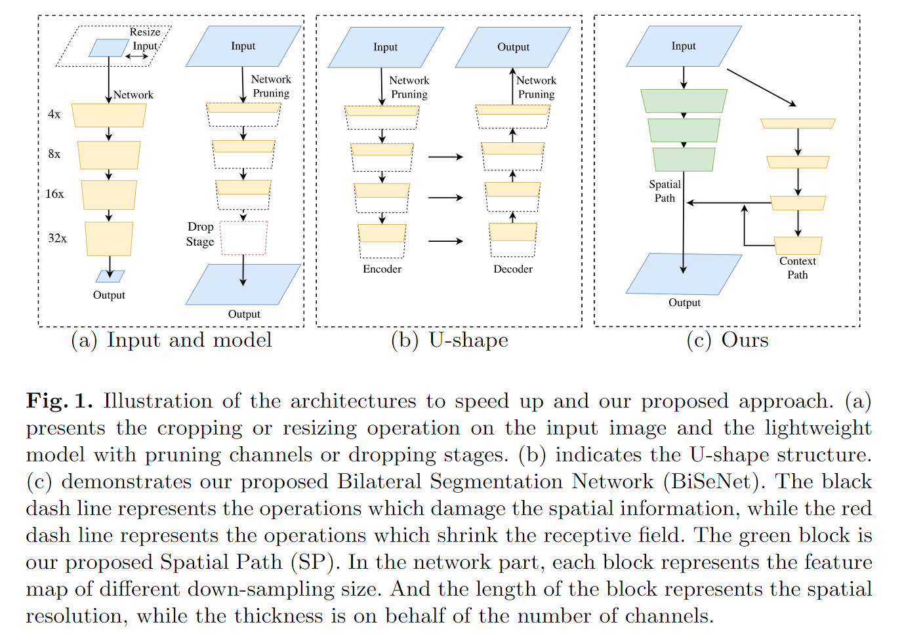
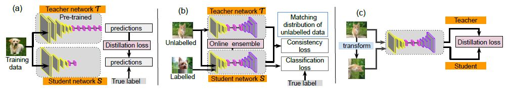
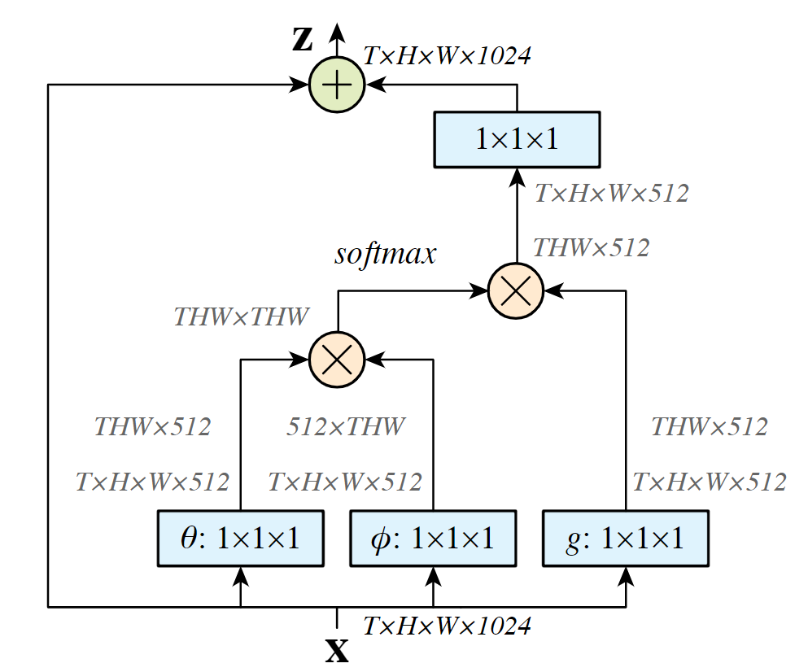
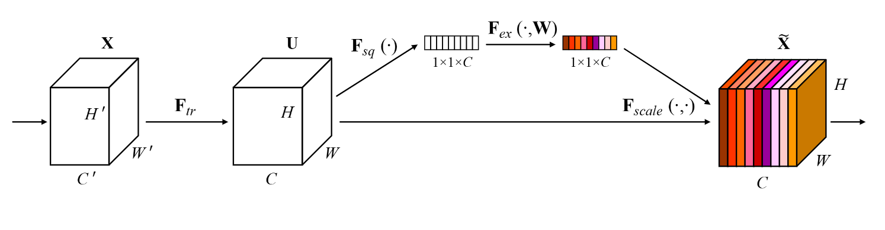
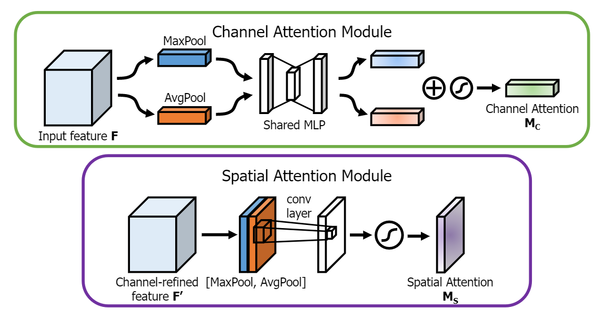
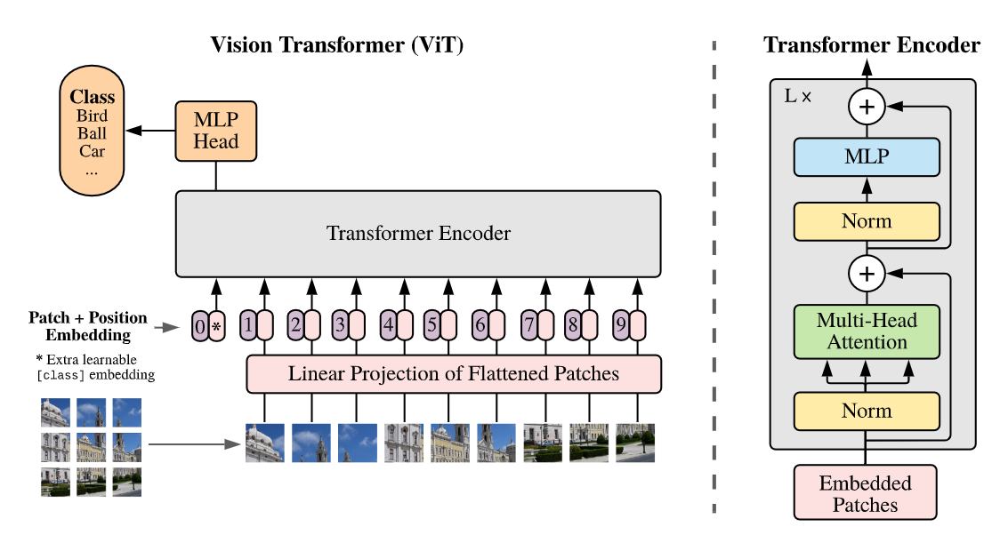
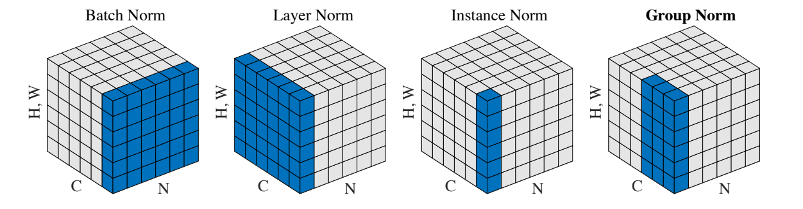
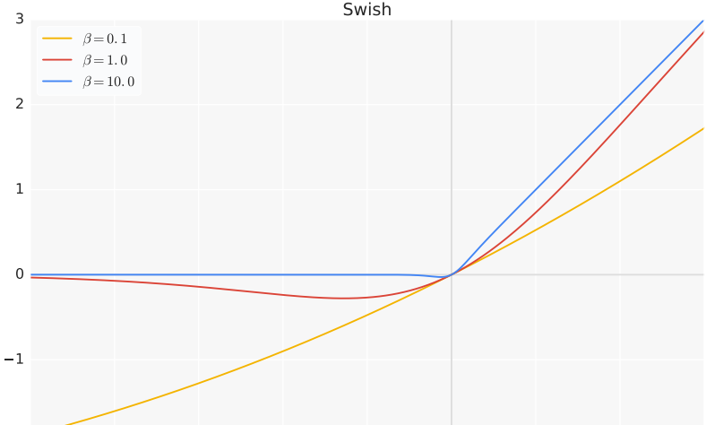
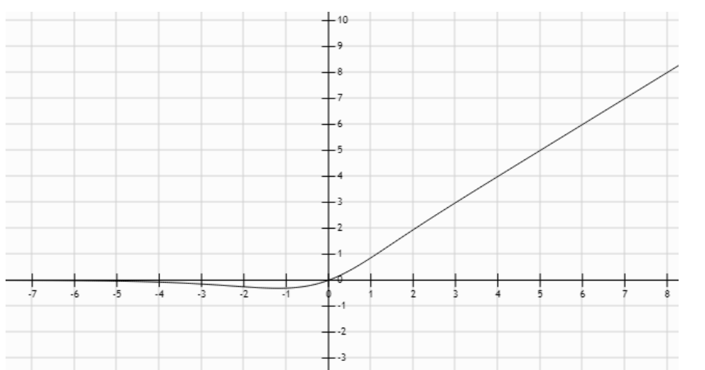
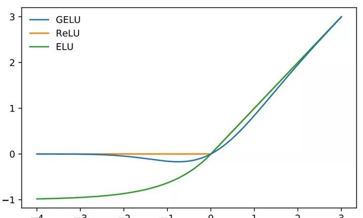

# 1. 常用领域


## 1.1 目标检测

[目标检测](https://blog.csdn.net/yegeli/article/details/109861867)

### 1.1.1 R-CNN

#### 1.1.1.1 R-CNN

- **定义**
    - R-CNN(全称Regions with CNN features) ，是R-CNN系列的第一代算法，其实没有过多的使用“深度学习”思想，而是将“深度学习”和传统的“计算机视觉”的知识相结合。比如R-CNN pipeline中的第二步和第四步其实就属于传统的“计算机视觉”技术。使用selective search提取region proposals，使用SVM实现分类。
- **流程**
    - `预训练模型`。选择一个预训练 (pre-trained)神经网络 (如AlexNet、VGG)。
    - `重新训练全连接层`。使用需要检测的目标重新训练 (re-train)最后全连接层 (connected layer)。
    - `提取 proposals并计算CNN 特征`。利用选择性搜索 (Selective Search)算法提取所有proposals (大约2000幅images)，调整 (resize/warp)它们成固定大小，以满足 CNN输入要求 (因为全连接层的限制)，然后将feature map 保存到本地磁盘。
    - `训练SVM`。利用feature map 训练SVM来对目标和背景进行分类 (每个类一个二进制SVM)
    - `边界框回归 (Bounding boxes Regression)`。训练将输出一些校正因子的线性回归分类器
- **缺点**
    - 重复计算，每个region proposal，都需要经过一个AlexNet特征提取，为所有的RoI（region of interest）提取特征大约花费47秒，占用空间
    - selective search方法生成region proposal，对一帧图像，需要花费2秒
    - 三个模块（提取、分类、回归）是分别训练的，并且在训练时候，对于存储空间消耗较大

#### 1.1.1.2 Fast R-CNN

- **定义**
    - Fast R-CNN是基于R-CNN和SPPnets进行的改进。SPPnets，其创新点在于只进行一次图像特征提取（而不是每个候选区域计算一次），然后根据算法，将候选区域特征图映射到整张图片特征图中
- **流程**
    - 使用selective search生成region proposal，大约2000个左右区域候选框
    - (joint training)缩放图片的scale得到图片金字塔，FP得到conv5的特征金字塔
    - (joint training)对于每个scale的每个ROI，求取映射关系，在conv5中剪裁出对应的patch。并用一个单层的SSP layer来统一到一样的尺度（对于AlexNet是6*6）
    - (joint training) 继续经过两个全连接得到特征，这特征又分别共享到两个新的全连接，连接上两个优化目标。第一个优化目标是分类，使用softmax，第二个优化目标是bbox regression，使用了一个平滑的L1-loss
    - 测试时需要加上NMS处理: 利用窗口得分分别对每一类物体进行非极大值抑制提出重叠建议框，最终得到每个类别中回归修正后的得分最高的窗口
- **改进**
    - 和RCNN相比，训练时间从84小时减少为9.5小时，测试时间从47秒减少为0.32秒。在VGG16上，Fast RCNN训练速度是RCNN的9倍，测试速度是RCNN的213倍；训练速度是SPP-net的3倍，测试速度是SPP-net的3倍
    - 加入RoI Pooling，采用一个神经网络对全图提取特征
    - 在网络中加入了多任务函数边框回归，实现了端到端的训练
- **缺点**
    - 依旧采用selective search提取region proposal（耗时2~3秒，特征提取耗时0.32秒）
    - 无法满足实时应用，没有真正实现端到端训练测试
    - 利用了GPU，但是region proposal方法是在CPU上实现的

#### 1.1.1.3 Faster RCNN

- **定义**
    - 经过R-CNN和Fast-RCNN的积淀，Ross B.Girshick在2016年提出了新的Faster RCNN，在结构上将特征抽取、region proposal提取， bbox regression，分类都整合到了一个网络中，使得综合性能有较大提高，在检测速度方面尤为明显。
- **整体流程**
    - `Conv Layers`。作为一种CNN网络目标检测方法，Faster RCNN首先使用一组基础的卷积/激活/池化层提取图像的特征，形成一个特征图，用于后续的RPN层和全连接层。
    - `Region Proposal Networks（RPN）`。RPN网络用于生成候选区域，该层通过softmax判断锚点（anchors）属于前景还是背景，在利用bounding box - regression（包围边框回归）获得精确的候选区域。
    - `RoI Pooling`。该层收集输入的特征图和候选区域，综合这些信息提取候选区特征图（proposal feature maps），送入后续全连接层判定目标的类别。
    - `Classification`。利用取候选区特征图计算所属类别，并再次使用边框回归算法获得边框最终的精确位置。
- **Anchors**
    Anchors（锚点）指由一组矩阵，每个矩阵对应不同的检测尺度大小。


### 1.1.2 YOLO系列

#### 1.1.2.1 YOLOv1（2016）

YOLO（You Only Look Once ）是继RCNN，fast-RCNN和faster-RCNN之后，Ross Girshick针对DL目标检测速度问题提出的另一种框架，其核心思想是生成RoI+目标检测两阶段（two-stage）算法用一套网络的一阶段（one-stage）算法替代，直接在输出层回归bounding box的位置和所属类别。

之前的物体检测方法首先需要产生大量可能包含待检测物体的先验框, 然后用分类器判断每个先验框对应的边界框里是否包含待检测物体，以及物体所属类别的概率或者置信度，同时需要后处理修正边界框，最后基于一些准则过滤掉置信度不高和重叠度较高的边界框，进而得到检测结果。这种基于先产生候选区再检测的方法虽然有相对较高的检测准确率，但运行速度较慢。

YOLO创造性的将物体检测任务直接当作回归问题（regression problem）来处理，将候选区和检测两个阶段合二为一。只需一眼就能知道每张图像中有哪些物体以及物体的位置。下图展示了各物体检测系统的流程图。

- **网络结构**
    - YOLOv1网络有24个卷积层，后面是2个全连接层。我们只使用1 × 1 1 \times 11×1降维层，后面是3 × 3 3 \times 33×3卷积层。
- **训练过程与细节**
    - 预训练。采用前20个卷积层、平均池化层、全连接层进行了大约一周的预训练；

    - 输入。输入数据为224*224和448*448大小的图像；

    - 采用相对坐标。通过图像宽度和高度来规范边界框的宽度和高度，使它们落在0和1之间；边界框x xx和y yy坐标参数化为特定网格单元位置的偏移量，边界也在0和1之间；

    - 损失函数
        - 损失函数由坐标预测、是否包含目标物体置信度、类别预测构成；
        - 如果目标存在于该网格单元中（前面讨论的条件类别概率），则损失函数仅惩罚分类错误；
        - 如果预测器“负责”实际边界框（即该网格单元中具有最高IOU的预测器），则它也仅惩罚边界框坐标错误
    - 学习率
    - 避免过拟合策略。使用dropout和数据增强来避免过拟合
- **优点与缺点**
    - 优点
        - YOLO检测物体速度非常快，其增强版GPU中能跑45fps（frame per second），简化版155fps
        - YOLO在训练和测试时都能看到一整张图的信息（而不像其它算法看到局部图片信息），因此YOLO在检测物体是能很好利用上下文信息，从而不容易在背景上预测出错误的物体信息
        - YOLO可以学到物体泛化特征
    - 缺点
        - 精度低于其它state-of-the-art的物体检测系统
        - 容易产生定位错误
        - 对小物体检测效果不好，尤其是密集的小物体，因为一个栅格只能检测2个物体
        - 由于损失函数的问题，定位误差是影响检测效果的主要原因，尤其是大小物体处理上还有待加强


#### 1.1.2.2 YOLOv2（2016）

Ross Girshick吸收fast-RCNN和SSD算法，设计了YOLOv2（论文原名《YOLO9000: Better, Faster, Stronger 》），在精度上利用一些列训练技巧，在速度上应用了新的网络模型DarkNet19，在分类任务上采用联合训练方法，结合wordtree等方法，使YOLOv2的检测种类扩充到了上千种，作者在论文中称可以检测超过9000个目标类别，所以也称YOLO9000. YOLOv2模型可以以不同的尺寸运行，从而在速度和准确性之间提供了一个简单的折衷，在67FPS时，YOLOv2在VOC 2007上获得了76.8 mAP。在40FPS时，YOLOv2获得了78.6 mAP，比使用ResNet的Faster R-CNN和SSD等先进方法表现更出色，同时仍然运行速度显著更快。

- **改进策略**
    - Batch Normalization（批量正则化）
    - High Resolution Classifier（高分辨率分类器）
    - Convolutional With Anchor Boxes（带Anchor Boxes的卷积）
    - Dimension Clusters（维度聚类）
    - New Network（新的网络）
    - 直接定位预测（Direct location Prediction）
    - 细粒度特征（Fine-Grained Features）
    - 多尺度训练（Multi-Scale Training）
-  **训练过程**
    - 第一阶段: 现在ImageNet分类数据集上训练Darknet-19,此时模型输入为224*224，共训练160轮
   - 第二阶段: 将网络输入调整为448*448，继续在ImageNet分类数据集上训练细调模型，共10轮，此时分类模型top-1准确率为76.5%，而top-5准确度为93.3%
    - 第三阶段: 修改Darknet-19分类模型为检测模型，并在检测数据集上继续细调网络

#### 1.1.2.3 YOLOv3（2018）

YOLOv3总结了自己在YOLOv2的基础上做的一些尝试性改进，有的尝试取得了成功，而有的尝试并没有提升模型性能。其中有两个值得一提的亮点，一个是使用残差模型，进一步加深了网络结构；另一个是使用FPN架构实现多尺度检测。

- **改进**
    - 新网络结构: DarkNet-53；
    - 用逻辑回归替代softmax作为分类器；
    - 融合FPN（特征金字塔网络），实现多尺度检测。

#### 1.1.2.4 YOLOv4
#### 1.1.2.5 YOLOv5
#### 1.1.2.6 YOLOv6
#### 1.1.2.7 YOLOv7

## 1.2 图像分割

### 1.2.1 BiseNet - 轻量级语义分割

<div align="center"> </div>


## 1.3 知识蒸馏

[Distilling the Knowledge in a Neural Network](https://arxiv.org/pdf/1503.02531.pdf)

知识蒸馏（knowledge distillation）是模型压缩的一种常用的方法，不同于模型压缩中的剪枝和量化，知识蒸馏是通过构建一个轻量化的小模型，利用性能更好的大模型的监督信息，来训练这个小模型，以期达到更好的性能和精度。最早是由Hinton在2015年首次提出并应用在分类任务上面，这个大模型我们称之为teacher（教师模型），小模型我们称之为Student（学生模型）。来自Teacher模型输出的监督信息称之为knowledge(知识)，而student学习迁移来自teacher的监督信息的过程称之为Distillation(蒸馏)。

<div align="center"> </div>


- 知识蒸馏的种类
    - 离线蒸馏
    - 半监督蒸馏
    - 自监督蒸馏
- 知识蒸馏的功能
    - 提升模型精度
    - 降低模型时延，压缩网络参数
    - 图片标签之间的域迁移
    - 降低标注量

在训练过程中，我们需要使用复杂的模型，大量的计算资源，以便从非常大、高度冗余的数据集中提取出信息。在实验中，效果最好的模型往往规模很大，甚至由多个模型集成得到。而大模型不方便部署到服务中去，常见的瓶颈如下:
- 推断速度慢
- 对部署资源要求高(内存，显存等)

一个模型的参数量基本决定了其所能捕获到的数据内蕴含的“知识”的量。

- 模型的参数量和其所能捕获的“知识“量之间并非稳定的线性关系，而是接近边际收益逐渐减少的一种增长曲线
- 完全相同的模型架构和模型参数量，使用完全相同的训练数据，能捕获的“知识”量并不一定完全相同，另一个关键因素是训练的方法。合适的训练方法可以使得在模型参数总量比较小时，尽可能地获取到更多的“知识”(下图中的3与2曲线的对比).

### 1.3.1 理论依据

#### 1.3.1.1 Teacher Model和Student Model

知识蒸馏使用的是Teacher—Student模型，其中teacher是“知识”的输出者，student是“知识”的接受者。知识蒸馏的过程分为2个阶段:

**原始模型训练:** 训练"Teacher模型", 简称为Net-T，它的特点是模型相对复杂，也可以由多个分别训练的模型集成而成。我们对"Teacher模型"不作任何关于模型架构、参数量、是否集成方面的限制，唯一的要求就是，对于输入X, 其都能输出Y，其中Y经过softmax的映射，输出值对应相应类别的概率值。

**精简模型训练:** 训练"Student模型", 简称为Net-S，它是参数量较小、模型结构相对简单的单模型。同样的，对于输入X，其都能输出Y，Y经过softmax映射后同样能输出对应相应类别的概率值。

#### 1.3.1.2 知识蒸馏的关键点

如果回归机器学习最最基础的理论，我们可以很清楚地意识到一点(而这一点往往在我们深入研究机器学习之后被忽略): **机器学习最根本的目的** 在于训练出在某个问题上泛化能力强的模型。

泛化能力强: 在某问题的所有数据上都能很好地反应输入和输出之间的关系，无论是训练数据，还是测试数据，还是任何属于该问题的未知数据。

而现实中，由于我们不可能收集到某问题的所有数据来作为训练数据，并且新数据总是在源源不断的产生，因此我们只能退而求其次，训练目标变成在已有的训练数据集上建模输入和输出之间的关系。由于训练数据集是对真实数据分布情况的采样，训练数据集上的最优解往往会多少偏离真正的最优解(这里的讨论不考虑模型容量)。

而在知识蒸馏时，由于我们已经有了一个泛化能力较强的Net-T，我们在利用Net-T来蒸馏训练Net-S时，可以直接让Net-S去学习Net-T的泛化能力。

一个很直白且高效的迁移泛化能力的方法就是：使用softmax层输出的类别的概率来作为“soft target”。

**KD的训练过程和传统的训练过程的对比**
- 传统training过程(`hard targets`): 对ground truth求极大似然
- KD的training过程(`soft targets`): 用large model的class probabilities作为soft targets

**KD的训练过程为什么更有效?**
- softmax层的输出，除了正例之外，**负标签也带有大量的信息**，比如某些负标签对应的概率远远大于其他负标签。而在传统的训练过程(hard target)中，所有负标签都被统一对待。也就是说，**KD的训练方式使得每个样本给Net-S带来的信息量大于传统的训练方式。**

通过蒸馏的方法训练出的Net-S相比使用完全相同的模型结构和训练数据只使用hard target的训练方法得到的模型，拥有更好的泛化能力。

#### 1.3.1.3 softmax函数

$$q_i= \frac{exp(z_i)}{\sum_{j}exp(z_j)}$$

但要是直接使用softmax层的输出值作为soft target, 这又会带来一个问题: 当softmax输出的概率分布熵相对较小时，负标签的值都很接近0，对损失函数的贡献非常小，小到可以忽略不计。因此<b>"温度"</b>这个变量就派上了用场。

下面的公式时加了温度这个变量之后的softmax函数:

$$q_i= \frac{exp(z_i / T)}{\sum_{j}exp(z_j / T)}$$

- 这里的T就是温度。
- 原来的softmax函数是T = 1的特例。 T越高，softmax的output probability distribution越趋于平滑，其分布的熵越大，负标签携带的信息会被相对地放大，模型训练将更加关注负标签。

#### 1.3.1.4 知识蒸馏的具体方法

##### 1.3.1.4.1 通用的知识蒸馏方法

第一步是训练Net-T；第二步是在高温T下，蒸馏Net-T的知识到Net-S


# 2. 常见网络

## 2.1 Resnet

- [详解残差网络](https://zhuanlan.zhihu.com/p/42706477)

**残差网络可以缓解层加深带来的网络退化问题**

在统计学中，残差和误差是非常容易混淆的两个概念。误差是衡量观测值和真实值之间的差距，残差是指预测值和观测值之间的差距。对于残差网络的命名原因，作者给出的解释是，网络的一层通常可以看做 $y=H(x)$，而残差网络的一个残差块可以表示为 $H(x)=F(x)+x$，也就是 $F(x)=H(x)-x$，在单位映射中， $y=x$ 便是观测值，而 $H(x)$ 是预测值，所以 $F(x)$ 便对应着残差，因此叫做残差网络。

## 2.1 ResNeXt

引入 [组卷积](#331-group-convolution)

<div align="center"> </div>


## 2.2 Unet


## 2.3 mobilenet

[base](https://zhuanlan.zhihu.com/p/70703846)

### 2.3.1 v1

引入 [深度可分离卷积](#332-depthwise-convolution)

### 2.3.1 v2

对低维度做ReLU运算，很容易造成信息的丢失。而在高维度进行ReLU运算的话，信息的丢失则会很少。这就解释了为什么深度卷积的卷积核有不少是空。发现了问题，我们就能更好地解决问题。针对这个问题，可以这样解决：既然是ReLU导致的信息损耗，将ReLU替换成线性激活函数。

深度卷积本身没有改变通道的能力，来的是多少通道输出就是多少通道。如果来的通道很少的话，DW深度卷积只能在低维度上工作，这样效果并不会很好，所以我们要“扩张”通道。既然我们已经知道PW逐点卷积也就是1×1卷积可以用来升维和降维，那就可以在DW深度卷积之前使用PW卷积进行升维（升维倍数为t，t=6），再在一个更高维的空间中进行卷积操作来提取特征：

<div align="center"> </div>

### 2.3.1 v3

基于NAS（不看）

## 2.4 Attention

### 2.4.1 空间域注意力方法

对于卷积神经网络，CNN每一层都会输出一个C x H x W的特征图，C就是通道，同时也代表卷积核的数量，亦为特征的数量，H 和W就是原始图片经过压缩后的图的高度和宽度，而空间注意力就是对于所有的通道，在二维平面上，对H x W尺寸的特征图学习到一个权重矩阵，对应每个像素都会学习到一个权重。而这些权重代表的就是某个空间位置信息的重要程度 ，将该空间注意力矩阵附加在原来的特征图上，增大有用的特征，弱化无用特征，从而起到特征筛选和增强的效果。代表的Self-Attention、Non-local Attention以及Spatial Transformer等。

#### 2.4.1.1 自注意力: Self-Attention

自注意力是目前应用最广泛的注意力机制之一，self-attention及其变体广泛应用与自然语言处理、图像处理及语音识别的各个领域，特别是NLP领域，基于self-attention的Transformer结构已经成为NLP技术的基石。CV领域的self-attention也来源于NLP，甚至在某些分割、识别任务上直接套用NLP的Transformer结构并且取得了非常好的结果。

自注意力的结构下图所示，它是从NLP中借鉴过来的思想，因此仍然保留了Query, Key和Value等名称。对应图中自上而下分的三个分支，计算时通常分为三步: 

(1) 第一步是将query和每个key进行相似度计算得到权重，常用的相似度函数有点积，拼接，感知机等；
(2) 第二步一般是使用一个softmax函数对这些权重进行归一化，转换为注意力；
(3) 第三步将权重和相应的键值value进行加权求和得到最后的attention。

自注意力是基于特征图本身的关注而提取的注意力。对于卷积而言，卷积核的设置限制了感受野的大小，导致网络往往需要多层的堆叠才能关注到整个特征图。而自注意的优势就是它的关注是全局的，它能通过简单的查询与赋值就能获取到特征图的全局空间信息。

#### 2.4.1.2 非局部注意力: Non-local Attention

Non-local Attention是研究self-attention在CV领域应用非常重要的文章。主要思想也很简单，CNN中的卷积单元每次只关注邻域kernel size 的区域，就算后期感受野越来越大，终究还是局部区域的运算，这样就忽略了全局其他片区（比如很远的像素）对当前区域的贡献。所以Non-local blocks 要做的是，捕获这种long-range 关系: 对于2D图像，就是图像中任何像素对当前像素的关系权值；对于3D视频，就是所有帧中的所有像素，对当前帧的像素的关系权值。

<div align="center"> </div>

### 2.4.2 通道域注意力方法

不同与空间注意力，通道域注意力类似于<font color="red">给每个通道上的特征图都施加一个权重</font>，来代表该通道与关键信息的相关度的话，这个权重越大，则表示相关度越高。在神经网络中，越高的维度特征图尺寸越小，通道数越多，通道就代表了整个图像的特征信息。如此多的通道信息，对于神经网络来说，要甄别筛选有用的通道信息是很难的，这时如果用一个通道注意力告诉该网络哪些是重要的，往往能起到很好的效果，这时CV领域做通道注意力往往比空间好的一个原因。代表的是SENet、SKNet、ECANet等。

#### 2.4.2.1 SENet

该注意力机制主要分为三个部分: 挤压(squeeze)，激励(excitation)，以及注意(scale)。

首先是 Squeeze 操作，从空间维度来进行特征压缩，将h*w*c的特征变成一个1*1*c的特征，得到向量某种程度上具有全域性的感受野，并且输出的通道数和输入的特征通道数相匹配，它表示在特征通道上响应的全域性分布。算法很简单，就是一个全局平均池化。

其次是 Excitation 操作，通过引入 w 参数来为每个特征通道生成权重，其中 w 就是一个多层感知器，是可学习的，中间经过一个降维，减少参数量。并通过一个 Sigmoid 函数获得 0~1 之间归一化的权重，完成显式地建模特征通道间的相关性。

最后是一个 Scale 的操作，将 Excitation 的输出的权重看做是经过选择后的每个特征通道的重要性，通过通道宽度相乘加权到先前的特征上，完成在通道维度上的对原始特征的重标定。

<div align="center"> </div>

```py
class SELayer(nn.Module):
    def __init__(self, channel, reduction=16):
        super(SELayer, self).__init__()
        self.avg_pool = nn.AdaptiveAvgPool2d(1)
        self.fc = nn.Sequential(
            nn.Linear(channel, channel // reduction, bias=False),
            nn.ReLU(inplace=True),
            nn.Linear(channel // reduction, channel, bias=False),
            nn.Sigmoid()
        )

    def forward(self, x):
        b, c, _, _ = x.size()
        y = self.avg_pool(x).view(b, c)
        y = self.fc(y).view(b, c, 1, 1)
        return x * y.expand_as(x)
```

#### 2.4.2.2 SKNet

设置了一组动态选择的卷积，分为三个部分操作`Split、Fuse、Select`。

<div align="center"> </div>

`Split`: 对输入向量X进行不同卷积核大小的完整卷积操作（组卷积），特别地，为了进一步提升效率，将5x5的传统卷积替代为dilation=2，卷积核为3x3的空洞卷积；

`Fuse`: 类似SE模块的处理，两个feature map相加后，进行全局平均池化操作，全连接先降维再升维的为两层全连接层，输出的两个注意力系数向量a和b，其中a+b=1；

`Select`: Select操作对应于SE模块中的Scale。Select使用a和b两个权重矩阵对之前的两个feature map进行加权操作，它们之间有一个类似于特征挑选的操作。

### 2.4.3 混合域注意力方法

#### 2.4.3.1 CBAM

给定一个中间特征图，CBAM模块会沿着两个独立的维度（通道和空间）依次推断注意力图，然后将注意力图与输入特征图相乘以进行自适应特征优化

<div align="center"> </div>

空间注意力模块设计也参考了SENet，它将全局平均池化用在了通道上，因此作用后就得到了一个二维的空间注意力系数矩阵。值得注意的是，CBAM在空间与通道上同时做全局平均和全局最大的混合pooling，能够提取到更多的有效信息。

```py
class ChannelAttentionModule(nn.Module):
    def __init__(self, channel, ratio=16):
        super(ChannelAttentionModule, self).__init__()
        self.avg_pool = nn.AdaptiveAvgPool2d(1)
        self.max_pool = nn.AdaptiveMaxPool2d(1)

        self.shared_MLP = nn.Sequential(
            nn.Conv2d(channel, channel // ratio, 1, bias=False),
            nn.ReLU(),
            nn.Conv2d(channel // ratio, channel, 1, bias=False)
        )
        self.sigmoid = nn.Sigmoid()

    def forward(self, x):
        avgout = self.shared_MLP(self.avg_pool(x))
        maxout = self.shared_MLP(self.max_pool(x))
        return self.sigmoid(avgout + maxout)


class SpatialAttentionModule(nn.Module):
    def __init__(self):
        super(SpatialAttentionModule, self).__init__()
        self.conv2d = nn.Conv2d(in_channels=2, out_channels=1, kernel_size=7, stride=1, padding=3)
        self.sigmoid = nn.Sigmoid()

    def forward(self, x):
        avgout = torch.mean(x, dim=1, keepdim=True)
        maxout, _ = torch.max(x, dim=1, keepdim=True)
        out = torch.cat([avgout, maxout], dim=1)
        out = self.sigmoid(self.conv2d(out))
        return out


class CBAM(nn.Module):
    def __init__(self, channel):
        super(CBAM, self).__init__()
        self.channel_attention = ChannelAttentionModule(channel)
        self.spatial_attention = SpatialAttentionModule()

    def forward(self, x):
        out = self.channel_attention(x) * x
        out = self.spatial_attention(out) * out
        return out
```

#### 2.4.3.2 DANet(未看)

主要包括Position Attention Module 和 Channel Attention Module。两个模块使用的方法都是self-attention，只是作用的位置不同，一个是空间域的self-attention，一个是通道域的self-attention。这样做的好处是: 在CBAM 分别进行空间和通道self-attention的思想上，直接使用了non-local 的自相关矩阵Matmul 的形式进行运算，避免了CBAM 手工设计pooling，多层感知器等复杂操作。同时，把Self-attention的思想用在图像分割，可通过long-range上下文关系更好地做到精准分割。

## 2.5 Transformer

[图解Transformer](https://cloud.tencent.com/developer/article/1745002)

<div align="center"> </div>


**Encoder**

encoder由6层相同的层组成，每一层分别由两部分组成: 

- `multi-head self-attention mechanism`
- `position-wise feed-forward network`

两个部分，都有一个**残差连接**(residual connection)，然后接着一个 **LN**

**Decoder**

encoder由6层相同的层组成，每一层分别由两部分组成: 

- `multi-head self-attention mechanism`
- `multi-head context-attention mechanism`
- `position-wise feed-forward network`

<div align="center"> </div>

context-attention 是 encoder 和 decoder 之间的 attention，也可以称之为`encoder-decoder attention!`

$$Attention(Q, K, V) = softmax(\frac{QK^T}{\sqrt{d_k}})V$$


<div align="center"> </div>

**Multi-head attention**

将Q、K、V通过一个线性映射之后，分成 h 份，对每一份进行scaled dot-product attention效果更好。然后，把各个部分的结果合并起来，再次经过线性映射，得到最终的输出

<div align="center"> </div>

## 2.6 GAN

### 2.6.1 StyleGAN

#### 2.6.1.1 Progressive GAN

#### 2.6.1.2 StyleGAN1

#### 2.6.1.3 StyleGAN2

## 2.7 VIT

[VIT code](https://github.com/lucidrains/vit-pytorch)

### 2.7.1 VIT

<div align="center"> </div>

(1) patch embedding：例如输入图片大小为224x224，将图片分为固定大小的patch，patch大小为16x16，则每张图像会生成224x224/16x16=196个patch，即输入序列长度为196，每个patch维度16x16x3=768，线性投射层的维度为768xN (N=768)，因此输入通过线性投射层之后的维度依然为196x768，即一共有196个token，每个token的维度是768。这里还需要加上一个特殊字符cls，因此最终的维度是197x768。到目前为止，已经通过patch embedding将一个视觉问题转化为了一个seq2seq问题

(2) positional encoding（standard learnable 1D position embeddings）：ViT同样需要加入位置编码，位置编码可以理解为一张表，表一共有N行，N的大小和输入序列长度相同，每一行代表一个向量，向量的维度和输入序列embedding的维度相同（768）。注意位置编码的操作是sum，而不是concat。加入位置编码信息之后，维度依然是197x768

(3) LN/multi-head attention/LN：LN输出维度依然是197x768。多头自注意力时，先将输入映射到q，k，v，如果只有一个头，qkv的维度都是197x768，如果有12个头（768/12=64），则qkv的维度是197x64，一共有12组qkv，最后再将12组qkv的输出拼接起来，输出维度是197x768，然后在过一层LN，维度依然是197x768

(4) MLP：将维度放大再缩小回去，197x768放大为197x3072，再缩小变为197x768

# 3. 常用方法

## 3.1 参数初始化

PyTorch 中参数的默认初始化在各个层的 `reset_parameters()` 方法中。例如: `nn.Linear` 和 `nn.Conv2D`，都是在 `[-limit, limit]` 之间的均匀分布，其中 `limit` 是 `1./sqrt(fan_in)`

- 如果将所有的权重都设置为0，则每一层激活函数的输出都是0
- 用N(0,1）标准正态的方式去初始化参数，每层激活函数的输出集中为-1或者1，这也就意味着激活函数陷入了饱和状态，在这个状态下，激活函数的导数为0
- 采用均匀分布的方式去初始化参数，结果随着层数的增加，每层激活函数的输出逐渐往0靠拢

### 3.1.1 Xavier Initialization

Xavier初始化的基本思想是保持输入和输出的方差一致，这样就避免了所有输出值都趋向于0。这是通用的方法，适用于任何激活函数。

**为什么均值为0，标准差为1这么重要?**

考虑一个有100层的深度神经网络。在每一步，权重矩阵乘以来自前一层的激活。如果每一层的激活大于1，当它们被重复乘以100次时，它们就会不断变大，爆炸到无穷大。类似地，如果激活值小于1，它们将消失为零。这叫做渐变爆炸和渐变消失问题。我们可以从下图中看到这一点。甚至比1稍大一点的值也会爆炸成非常大的数字，而比1稍小一点的值也会消失为零。


**xavier初始化方法中服从均匀分布 $U(-a, a)$**
$$a= gain * \sqrt\frac{6}{fan_{in} + fan_{out}}$$

其中 `fan_in` 是 $H×W*C_{in}$, `fan_out` 是$H×W*C_{out}$, 增益值`gain` 是一个比例值，来调控输入数量级和输出数量级之间的关系

**xavier初始化方法中服从均匀分布 $N(0, std)$**
$$std= gain * \sqrt\frac{2}{fan_{in} + fan_{out}}$$

其中 `fan_in` 是 $H×W*C_{in}$, `fan_out` 是$H×W*C_{out}$, 增益值`gain` 是一个比例值，来调控输入数量级和输出数量级之间的关系

### 3.1.2 Kaiming Initialization

**kaiming初始化方法中服从均匀分布 $U(−bound,bound)$**
$$bound=  \sqrt\frac{2}{(1+a^2) × fan_{in}}$$

`a` 是激活函数的负斜率（对于`leaky_relu`来说），如果激活函数是`relu`的话，`a` 为 `0`。`mode` 默认为fan_in模式，可以设置为fan_out模式。fan_in可以保持前向传播的权重方差的数量级，fan_out可以保持反向传播的权重方差的数量级

**kaiming初始化方法中服从均匀分布 $N(0, std)$**
$$std=  \sqrt\frac{2}{(1+a^2) × fan_{in}}$$

其中 `fan_in` 是 $H×W*C_{in}$, `fan_out` 是$H×W*C_{out}$, 增益值`gain` 是一个比例值，来调控输入数量级和输出数量级之间的关系


## 3.2 优化算法

- [Adam与SGD](https://www.cnblogs.com/jiangkejie/p/10561100.html)
- [Base](https://zhuanlan.zhihu.com/p/32230623)

定义: 待优化参数: $w$ ，目标函数: $ f(w)$，初始学习率 $\alpha$。而后，开始进行迭代优化。在每个epoch $t$: 

1. 计算目标函数关于当前参数的梯度:  $g_t = \nabla f(w_t)$
2. 根据历史梯度计算一阶动量和二阶动量: $m_t; V_t$
3. 计算当前时刻的下降梯度:  $\eta_t = \alpha 
\cdot m_t / \sqrt{V_t} $
4. 根据下降梯度进行更新: $w_{t+1} = w_t - \eta_t $  

### 3.2.1 SGD


#### 3.2.1.1 SGD
SGD没有动量的概念，因此
$$m_t = g_t; V_t=I^2$$

$$ \eta_t= \alpha 
\cdot g_t$$

SGD最大的缺点是下降速度慢，而且可能会在沟壑的两边持续震荡，停留在一个局部最优点

#### 3.2.1.2 SGD with Momentum

为了抑制SGD的震荡，SGDM认为梯度下降过程可以加入惯性。下坡的时候，如果发现是陡坡，那就利用惯性跑的快一些。SGDM全称是SGD with momentum，在SGD基础上引入了一阶动量

$$m_t = \beta_1 \cdot m_{t-1} + (1-\beta_1) \cdot g_t$$

一阶动量是各个时刻梯度方向的指数移动平均值，约等于最近 $\frac{1}{1-\beta_1}$ 个时刻的梯度向量和的平均值。

也就是说，t时刻的下降方向，不仅由当前点的梯度方向决定，而且由此前累积的下降方向决定。  的经验值为0.9，这就意味着下降方向主要是此前累积的下降方向，并略微偏向当前时刻的下降方向。

#### 3.2.1.3 SGD with Nesterov Acceleration

NAG全称Nesterov Accelerated Gradient，是在SGD、SGD-M的基础上的进一步改进，改进点在于步骤1。我们知道在时刻t的主要下降方向是由累积动量决定的，自己的梯度方向说了也不算，那与其看当前梯度方向，不如先看看如果跟着累积动量走了一步，那个时候再怎么走。因此，NAG在步骤1，不计算当前位置的梯度方向，而是计算如果按照累积动量走了一步，那个时候的下降方向：

$$g_t =  \nabla f(w_t - \alpha \cdot \frac{m_{t-1}}{\sqrt{V_{t-1}}})$$

然后用下一个点的梯度方向，与历史累积动量相结合，计算步骤2中当前时刻的累积动量

### 3.2.2 AdaGrad

此前我们都没有用到二阶动量。二阶动量的出现，才意味着“自适应学习率”优化算法时代的到来。SGD及其变种以同样的学习率更新每个参数，但深度神经网络往往包含大量的参数，这些参数并不是总会用得到（想想大规模的embedding）。对于经常更新的参数，我们已经积累了大量关于它的知识，不希望被单个样本影响太大，希望学习速率慢一些；对于偶尔更新的参数，我们了解的信息太少，希望能从每个偶然出现的样本身上多学一些，即学习速率大一些。

怎么样去度量历史更新频率呢？那就是二阶动量——该维度上，迄今为止所有梯度值的平方和

$$V_t=\sum_{\tau =1}^{t}g_{\tau}^{2}$$

此时实质上的学习率由 $ \alpha$ 变成了 $\frac{\alpha}{\sqrt{V_t}}$。 一般为了避免分母为0，会在分母上加一个小的平滑项。因此 $\sqrt{V_t}$ 是恒大于0的，而且参数更新越频繁，二阶动量越大，学习率就越小。

这一方法在稀疏数据场景下表现非常好。但也存在一些问题：因为 $\sqrt{V_t}$ 是单调递增的，会使得学习率单调递减至0，可能会使得训练过程提前结束，即便后续还有数据也无法学到必要的知识。

### 3.2.3 AdaDelta / RMSProp

由于AdaGrad单调递减的学习率变化过于激进，我们考虑一个改变二阶动量计算方法的策略：不累积全部历史梯度，而只关注过去一段时间窗口的下降梯度。这也就是AdaDelta名称中Delta的来历。

指数移动平均值大约就是过去一段时间的平均值，因此我们用这一方法来计算二阶累积动量:

$$V_t = \beta_2 * V_{t-1} + (1-\beta_2)g_{t}^{2}$$

### 3.2.4 Adam

SGD-M在SGD基础上增加了一阶动量，AdaGrad和AdaDelta在SGD基础上增加了二阶动量。把一阶动量和二阶动量都用起来，就是Adam了——**Adaptive + Momentum**

SGD的一阶动量:

$$m_t = \beta_1 \cdot m_{t-1} + (1-\beta_1) \cdot g_t$$

加上AdaDelta的二阶动量: 

$$V_t = \beta_2 * V_{t-1} + (1-\beta_2)g_{t}^{2}$$


## 3.3 卷积方式

### 3.3.1 Group Convolution


<div align="center"> </div>

`Group Convolution` 顾名思义，则是对输入 `feature map` 进行分组，然后每组分别卷积。假设输入 `feature map` 的尺寸仍为 $C∗H∗W$，输出 `feature map` 的数量为 $N$个，如果设定要分成$G$个 groups，则每组的输入 `feature map` 数量为$\frac{C}{G}$，每组的输出 `feature map` 数量为$\frac{N}{G}$，每个卷积核的尺寸为$\frac{C}{G} * K * K$，卷积核的总数仍为 $N$ 个，每组的卷积核数量为 $\frac{N}{G}$，卷积核只与其同组的输入map进行卷积，卷积核的总参数量为 $N * \frac{C}{G} * K * K$，可见，总参数量减少为原来的 $\frac{1}{G}$，其连接方式如上图右所示，group1输出map数为2，有2个卷积核，每个卷积核的channel数为4，与group1的输入map的channel数相同，卷积核只与同组的输入map卷积，而不与其他组的输入map卷积。

1. **减少参数量**，分成GG组，则该层的参数量减少为原来的1G1G
2. **Group Convolution可以看成是structured sparse**，每个卷积核的尺寸由C∗K∗KC∗K∗K变为CG∗K∗KCG∗K∗K，可以将其余(C−CG)∗K∗K(C−CG)∗K∗K的参数视为0，有时甚至可以在减少参数量的同时获得更好的效果（相当于**正则**）。
3. 当分组数量等于输入map数量，输出map数量也等于输入map数量，即G=N=CG=N=C、NN个卷积核每个尺寸为1∗K∗K1∗K∗K时，Group Convolution就成了**Depthwise Convolution**，参见MobileNet和Xception等，**参数量进一步缩减**，如下图所示

<div align="center"> </div>

4. 更进一步，如果分组数 $G=N=C$，同时卷积核的尺寸与输入map的尺寸相同，即 $K=H=W$，则输出map为 $C∗1∗1$ 即长度为 $C$ 的向量，此时称之为 **Global Depthwise Convolution（GDC）**，见MobileFaceNet，可以看成是**全局加权池化**，与 **Global Average Pooling（GAP）** 的不同之处在于，GDC 给**每个位置赋予了可学习的权重**（对于已对齐的图像这很有效，比如人脸，中心位置和边界位置的权重自然应该不同），而GAP每个位置的权重相同，全局取个平均，如下图所示: 

<div align="center"> </div>

### 3.3.2 Depthwise Convolution

深度可分离卷积主要分为两个过程，分别为逐通道卷积（Depthwise Convolution）和逐点卷积（Pointwise Convolution）。


#### 3.3.2.1 逐通道卷积（Depthwise Convolution）

Depthwise Convolution的一个卷积核负责一个通道，一个通道只被一个卷积核卷积，这个过程产生的feature map通道数和输入的通道数完全一样。

Depthwise Convolution完成后的Feature map数量与输入层的通道数相同，无法扩展Feature map。而且这种运算对输入层的每个通道独立进行卷积运算，没有有效的利用不同通道在相同空间位置上的feature信息。因此需要Pointwise Convolution来将这些Feature map进行组合生成新的Feature map。

#### 3.3.2.2 逐点卷积（Pointwise Convolution）

Pointwise Convolution的运算与常规卷积运算非常相似，它的卷积核的尺寸为 1×1×M，M为上一层的通道数。所以这里的卷积运算会将上一步的map在深度方向上进行加权组合，生成新的Feature map。有几个卷积核就有几个输出Feature map。（卷积核的shape即为: **1 x 1 x 输入通道数 x 输出通道数**）

### 3.3.3 Dilated Convolution

网络中加入pooling层会损失信息，降低精度。那么不加pooling层会使感受野变小，学不到全局的特征。如果我们单纯的去掉pooling层、扩大卷积核的话，这样纯粹的扩大卷积核势必导致计算量的增大，此时最好的办法就是Dilated Convolutions（扩张卷积或叫空洞卷积）。

<div align="center"> </div>

dilated的好处是不做pooling损失信息的情况下，加大了感受野，让每个卷积输出都包含较大范围的信息。在图像需要全局信息或者语音文本需要较长的sequence信息依赖的问题中，都能很好的应用dilated conv，比如图像分割、语音合成WaveNet、机器翻译ByteNet中。


## 3.4 BN，LN，IN，GN

- [Base](https://zhuanlan.zhihu.com/p/33173246)

往往用在深度神经网络中激活层之前。其作用可以加快模型训练时的收敛速度，使得模型训练过程更加稳定，避免梯度爆炸或者梯度消失。

<div align="center"> </div>

- `BatchNorm`: batch方向做归一化，算 <font color="red">$N*H*W$</font> 的均值，对**小batchsize效果不好**；BN主要缺点是对batchsize的大小比较敏感，由于每次计算均值和方差是在一个batch上，所以如果batchsize太小，则计算的均值、方差不足以代表整个数据分布
- `LayerNorm:` channel方向做归一化，算 <font color="red">$C*H*W$</font> 的均值，主要**对RNN作用明显**；
- `InstanceNorm:` 一个channel内做归一化，算 <font color="red">$H*W$</font> 的均值，用在风格化迁移；因为在图像风格化中，生成结果主要**依赖于某个图像实例**，所以对整个batch归一化不适合图像风格化中，因而对HW做归一化。可以加速模型收敛，并且保持每个图像实例之间的独立。
- `GroupNorm:` 将channel方向分group，然后每个group内做归一化，算 <font color="red">$\frac{C}{G}*H*W$</font> 的均值；这样与batchsize无关，不受其约束。
- `SwitchableNorm:` 将BN、LN、IN结合，赋予权重，让网络自己去学习归一化层应该使用什么方法。

**训练**时，均值、方差分别是**该批次**内数据相应维度的均值与方差；
**推理**时，均值、方差是基于**所有批次**的期望计算所得


### 3.4.1 为什么需要 Normalization

**独立同分布**的数据可以简化常规机器学习模型的训练、提升机器学习模型的预测能力，因此，在把数据喂给机器学习模型之前，[白化（whitening）](http://ufldl.stanford.edu/tutorial/unsupervised/PCAWhitening/)是一个重要的数据预处理步骤。白化一般包含两个目的: 

- 去除特征之间的相关性 —> 独立；
- 使得所有特征具有相同的均值和方差 —> 同分布。

**Internal Covariate Shift**

统计机器学习中的一个经典假设是“源空间（source domain）和目标空间（target domain）的数据分布（distribution）是一致的”。如果不一致，那么就出现了新的机器学习问题，如，transfer learning/domain adaptation等。而covariate shift就是分布不一致假设之下的一个分支问题，它是指源空间和目标空间的条件概率是一致的，但是其边缘概率不同。

对于神经网络的各层输出，由于它们经过了层内操作作用，其分布显然与各层对应的输入信号分布不同，而且差异会随着网络深度增大而增大，可是它们所能“指示”的样本标记（label）仍然是不变的，这便符合了covariate shift的定义。由于是对层间信号的分析，也即是“internal”的来由。

### 3.4.2 Normalization 的通用框架与基本思想

$$h = f(g*\frac{x-\mu}{\sigma}+b)$$

$\mu$ 是**平移参数**（shift parameter），$\sigma$ 是**缩放参数**（scale parameter）。通过这两个参数进行 shift 和 scale 变换。 $b$ 是**再平移参数**（re-shift parameter）， $g$ 是**再缩放参数**（re-scale parameter）。最终得到的数据符合均值为 $b$ 、方差为  $g^2$ 的分布。为了保证模型的表达能力不因为规范化而下降。

### 3.4.3 Normalization 为什么会有效？

**Normalization 的权重伸缩不变性**

权重伸缩不变性（weight scale invariance）指的是，当权重  按照常量  进行伸缩时，得到的规范化后的值保持不变。权重伸缩不变性可以有效地提高反向传播的效率。权重伸缩不变性还具有参数正则化的效果，可以使用更高的学习率。数据伸缩不变性可以有效地减少梯度弥散，简化对学习率的选择。

### 3.5 激活函数

#### 3.5.1 Sigmoid

$$f(z) = \frac{1}{1+e^{-z}}$$

- 特点
    - 可微
    - 对每个神经元的输出都进行了归一
    - 梯度平滑，避免跳跃的输出值
- 缺点
    - 梯度不稳定
    - 当x取值为负时，函数值趋近于0。换言之，函数输出不是以0为中心的，这会降低权重更新的效率

#### 3.5.2 Tanh

$$f(x) = tanh(x) = \frac{2}{1+e^{-2x}}-1$$


- 特点
    - 当输入较大或较小时，输出几乎是平滑的并且梯度较小，这不利于权重更新。二者的区别在于输出间隔，tanh的输出间隔是1，并且整个函数的输出以0为中心，比sigmoid函数要好
    - 在tanh中，负输入将被强映射为负，而零输入被映射为接近0


#### 3.5.3 ReLU

$$\sigma(x) = \left\{
\begin{matrix}
 max(0, x), \quad x>=0 \\
 0,   \quad x < 0
\end{matrix}
\right.$$

- 特点
    - 当输入为正的时候，不存在梯度饱和问题
    - 计算速度快
- 缺点
    - Dead ReLU问题
    当输入为负的时候，relu全为0，直接失效。当然在正向传播中，这不是问题，但是在反向传播过程中，如果输入为负，则梯度将完全为0。sigmoid和tanh也有相同的问题。
    - ReLU函数不是以0为中心的函数。

#### 3.5.4 Leaky ReLU

$$f(y_i) = \left\{
\begin{matrix}
 y_i, \quad y_i > 0 \\
 a_i y_i,   \quad  y_i <= 0
\end{matrix}
\right.$$

- 特点
    - Leaky ReLU 通过把 x 的非常小的线性分量给予负输入（0.01x）来调整负值的零梯度（zero gradients）问题
    - leak可以扩大relu的范围，通常a的值为0.01左右
    - leaky relu函数的范围是负无穷 - 正无穷

#### 3.5.5 ELU(Exponential Linear Units)

$$g(x) = ELU(x) = \left\{
\begin{matrix}
 x, \quad x > 0 \\
 \alpha (e^x-1),   \quad  x <= 0
\end{matrix}
\right.$$

- 特点
    - 没有Dead ReLU问题，输出的平均值接近0，以0为中心。
    - ELU通过减少偏置偏移的影响，使正常梯度更接近于单位自然梯度，从而使均值向0加速学习。
    - ELU当x较小时，会饱和值一个负值，从而减少前向传播的变异和信息。
- 缺点
    - 计算量更大。与Leaky ReLU相似，尽管理论上比ReLU更好，但是目前的实践并没有充分的证据表示确实比ReLU好

#### 3.5.6 PReLU(parametric ReLU)

$$f(y_i) = \left\{
\begin{matrix}
 y_i, \quad y_i > 0 \\
 a_i y_i,   \quad  y_i <= 0
\end{matrix}
\right.$$

$a$ 通过梯度来学习

> 如果参数a = 0，则就是ReLU。
    如果参数a > 0，则就是Leaky ReLU。
    如果参数a是可学习的参数，则就是PReLU.

- 特点
    - 在负值域，PReLU的斜率较小，可以避免Dead ReLU问题。
    - 与ELU相比，PReLU在负值域是线性运算。

#### 3.5.7 Swish

$$y = x * sigmoid (x)$$

<div align="center"> </div>

> 当 $ \beta = 0$ 时，Swish激活函数变为线性函数 $f(x) = \frac{x}{2} $
    当 $\beta = \infty$ 时，Swish激活函数变为$0$或$x$，相当于Relu，
    所以，Swish函数可以看作是介于线性函数与ReLU函数之间的平滑函数

- 特点
    - 「无界性」有助于防止慢速训练期间，梯度逐渐接近 0 并导致饱和；（同时，有界性也是有优势的，因为有界激活函数可以具有很强的正则化，并且较大的负输入问题也能解决）
    - 导数恒 > 0
    - 平滑度在优化和泛化中起了重要作用
    - 有下界，无上界，非单调

#### 3.5.8 mish

$$ y = x*tanh(ln(1+exp(x))) $$


<div align="center"> </div>

- 特点
    - 激活函数每一点更加平滑，允许更好的信息深入神经网络，负值的时候允许较小的负梯度流入，保证信息不会中断，从而得到更好的准确性和泛化能力

#### 3.5.9 GELU(高斯误差线性单元激活函数)

$$GELU(x)=0.5x(1+tanh(\sqrt{\frac{2}{\pi}}(x+0.044715x^3)))$$

<div align="center"> </div>

收到dropout、ReLU等机制的影响，它们都希望将不重要的激活信息规整为0，我们可以理解为，对于输入的值，我们根据它的情况乘上1或者0，更数学一点的描述是，对于每一个输入x，其服从标准的正太分布 $N(0,1)$, 它会乘上一个伯努利分布 $Bernoulli(\phi(x))$, 其中，$\phi(x) = P(X \leq x)$ 

随着x的降低，它被归零的概率会升高，对于ReLU来说，这个界限就是0，输入少于零就会被归为0，这一类激活函数，不仅保留了概率性，同时也保留了对输入的依赖性。

### 3.6 样本不均衡

- [【机器学习】一文解决样本不均衡（全）](https://zhuanlan.zhihu.com/p/466994436)

#### 3.6.1 样本层面

- 欠采样、过采样
    - 欠采样：减少多数类的数量（如随机欠采样、NearMiss、ENN）。
    - 过采样：尽量多地增加少数类的的样本数量（如随机过采样、以及2.1.2数据增强方法），以达到类别间数目均衡。
    - 还可结合两者做混合采样（如Smote+ENN）
    具体还可以参见 [https://imbalanced-learn.org/stable/user_guide.html](https://imbalanced-learn.org/stable/user_guide.html)以及 github 的 `awesome-imbalanced-learning`
- 数据增强
    - 基于样本变换的数据增强，样本变换数据增强即采用预设的数据变换规则进行已有数据的扩增，包含单样本数据增强和多样本数据增强。
        - **单样本增强(主要用于图像)**: 主要有几何操作、颜色变换、随机擦除、添加噪声等方法产生新的样本，可参见imgaug开源库
        - **多样本增强**: 是通过组合及转换多个样本，主要有Smote类(可见[https://imbalanced-learn.org/stable/references/over_sampling.html](https://imbalanced-learn.org/stable/references/over_sampling.html))、SamplePairing、Mixup等方法在特征空间内构造已知样本的邻域值样本
    - 基于深度学习的数据增强
        - 生成模型如变分自编码网络(Variational Auto-Encoding network, VAE)和生成对抗网络(Generative Adversarial Network, GAN)，其生成样本的方法也可以用于数据增强。这种基于网络合成的方法相比于传统的数据增强技术虽然过程更加复杂, 但是生成的样本更加多样

数据样本层面解决不均衡的方法，需要关注的是: 

- 随机欠采样可能会导致丢弃含有重要信息的样本。在计算性能足够下，可以考虑数据的分布信息（通常是基于距离的邻域关系）的采样方法，如ENN、NearMiss等。
- 随机过采样或数据增强样本也有可能是强调（或引入）片面噪声，导致过拟合。也可能是引入信息量不大的样本。此时需要考虑的是调整采样方法，或者通过半监督算法(可借鉴Pu-Learning思路)选择增强数据的较优子集，以提高模型的泛化能力。

#### 3.6.2 损失函数的层面

损失函数层面主流的方法也就是常用的代价敏感学习（cost-sensitive），为不同的分类错误给予不同惩罚力度（权重），在调节类别平衡的同时，也不会增加计算复杂度。如下常用方法: 

- class weight
这最常用也就是scikit模型的’class weight‘方法，`If ‘balanced’, class weights will be given by n_samples / (n_classes * np.bincount(y)). If a dictionary is given, keys are classes and values are corresponding class weights. If None is given, the class weights will be uniform.`，class weight可以为不同类别的样本提供不同的权重（少数类有更高的权重），从而模型可以平衡各类别的学习。如下图通过为少数类做更高的权重，以避免决策偏重多数类的现象（类别权重除了设定为balanced，还可以作为一个超参搜索。示例代码请见[github.com/aialgorithm](github.com/aialgorithm)）

- OHEM 和 Focal Loss
**类别的不平衡可以归结为难易样本的不平衡，而难易样本的不平衡可以归结为梯度的不平衡**。按照这个思路，OHEM和Focal loss都做了两件事：难样本挖掘以及类别的平衡。(另外的有 GHM、 PISA等方法)
    - OHEM（Online Hard Example Mining）算法的核心是选择一些hard examples（多样性和高损失的样本）作为训练的样本，针对性地改善模型学习效果。对于数据的类别不平衡问题，OHEM的针对性更强。
    - Focal loss的核心思想是在交叉熵损失函数（CE）的基础上增加了类别的不同权重以及困难（高损失）样本的权重（如下公式），以改善模型学习效果。

#### 3.6.2 模型层面

模型方面主要是选择一些对不均衡比较不敏感的模型，比如，对比逻辑回归模型（lr学习的是全量训练样本的最小损失，自然会比较偏向去减少多数类样本造成的损失），决策树在不平衡数据上面表现相对好一些，树模型是按照增益递归地划分数据（如下图），划分过程考虑的是局部的增益，全局样本是不均衡，局部空间就不一定，所以比较不敏感一些

解决不均衡问题，更为优秀的是基于采样+集成树模型等方法，可以在类别不均衡数据上表现良好。

#### 3.6.2.1 采样+集成学习

通过重复组合少数类样本与抽样的同样数量的多数类样本，训练若干的分类器进行集成学习

- BalanceCascade
BalanceCascade基于Adaboost作为基分类器，核心思路是在每一轮训练时都使用多数类与少数类数量上相等的训练集，然后使用该分类器对全体多数类进行预测，通过控制分类阈值来控制FP（False Positive）率，将所有判断正确的类删除，然后进入下一轮迭代继续降低多数类数量。
- EasyEnsemble
EasyEnsemble也是基于Adaboost作为基分类器，就是将多数类样本集随机分成 N 个子集，且每一个子集样本与少数类样本相同，然后分别将各个多数类样本子集与少数类样本进行组合，使用AdaBoost基分类模型进行训练，最后bagging集成各基分类器，得到最终模型。

#### 3.6.2.2 异常检测

类别不平衡很极端的情况下（比如少数类只有几十个样本），将分类问题考虑成异常检测（anomaly detection）问题可能会更好

异常检测是通过数据挖掘方法发现与数据集分布不一致的异常数据，也被称为离群点、异常值检测等等。无监督异常检测按其算法思想大致可分为几类：基于聚类的方法、基于统计的方法、基于深度的方法(孤立森林)、基于分类模型（one-class SVM）以及基于神经网络的方法（自编码器AE）等等。