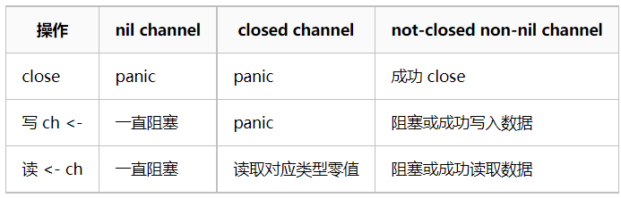

# GoLang

## 1. 基础语法

### 1.1 defer 

`在return调用之后才执行，用来释放函数内部变量`

1. 当defer被声明时，其参数就会被实时解析
2. defer执行顺序为先进后出
3. defer可以读取有名返回值

### 1.2 channel

`channel 可以看成一个 FIFO 队列，对 FIFO 队列的读写都是原子的操作，不需要加锁。`

<div align="center"></div>


#### 1.2.1 说说go语言的channel特性？
A. 给一个 nil channel 发送数据，造成永远阻塞
B. 从一个 nil channel 接收数据，造成永远阻塞
C. 给一个已经关闭的 channel 发送数据，引起 panic
D. 从一个已经关闭的 channel 接收数据，如果缓冲区中为空，则返回一个零值
E. 无缓冲的channel是同步的，而有缓冲的channel是非同步的

#### 1.2.2 说说go语言的select机制？
A. select机制用来处理异步IO问题
B. select机制最大的一条限制就是每个case语句里必须是一个IO操作
C. golang在语言级别支持select关键字

### 1.3 反射

#### 1.3.1 需要反射的 2 个常见场景

- 有时你需要编写一个函数，但是并不知道传给你的参数类型是什么，可能是没约定好；也可能是传入的类型很多，这些类型并不能统一表示。这时反射就会用的上了。
- 有时候需要根据某些条件决定调用哪个函数，比如根据用户的输入来决定。这时就需要对函数和函数的参数进行反射，在运行期间动态地执行函数。

#### 1.3.2 几点不使用反射的理由：

与反射相关的代码，经常是难以阅读的。在软件工程中，代码可读性也是一个非常重要的指标。
Go 语言作为一门静态语言，编码过程中，编译器能提前发现一些类型错误，但是对于反射代码是无能为力的。所以包含反射相关的代码，很可能会运行很久，才会出错，这时候经常是直接 panic，可能会造成严重的后果。
反射对性能影响还是比较大的，比正常代码运行速度慢一到两个数量级。所以，对于一个项目中处于运行效率关键位置的代码，尽量避免使用反射特性。

### 1.4 在go语言中，new和make的区别？
`new` 的作用是初始化一个指向类型的指针(T) new函数是内建函数，函数定义: func new(Type) *Type使用new函数来分配空间。传递给new 函数的是一个类型，不是一个值。返回值是 指向这个新分配的零值的指针。
`make` 的作用是为 `slice，map 或 chan` 初始化并返回引用(T)。make函数是内建函数，函数定义: func make(Type, size IntegerType) Type 第一个参数是一个类型，第二个参数是长度，返回值是一个类型。
make(T, args)函数的目的与new(T)不同。它仅仅用于创建 Slice, Map 和 Channel，并且返回类型是 T（不是T\）的一个初始化的（不是零值）的实例。

### 1.5 Printf()、Sprintf()、Fprintf()函数的区别用法是什么？

都是把格式好的字符串输出，只是输出的目标不一样: 
- Printf()，是把格式字符串输出到标准输出（一般是屏幕，可以重定向）。Printf() 是和标准输出文件(stdout)关联的,Fprintf 则没有这个限制.
- Sprintf()，是把格式字符串输出到指定字符串中，所以参数比printf多一个char。那就是目标字符串地址。
- Fprintf()， 是把格式字符串输出到指定文件设备中，所以参数笔printf多一个文件指针FILE。主要用于文件操作。Fprintf()是格式化输出到一个stream，通常是到文件。

### 1.6 数组与切片的区别？

- 数组 

    - 数组是具有固定长度且拥有零个或者多个相同数据类型元素的序列。 数组的长度是数组类型的一部分，所以[3]int 和 [4]int 是两种不同的数组类型。
    - 数组需要指定大小，不指定也会根据初始化的自动推算出大小，不可改变 ;
    - 数组是值传递;
    - 数组是内置(build-in)类型,是一组同类型数据的集合，它是值类型，通过从0开始的下标索引访问元素值。在初始化后长度是固定的，无法修改其长度。当作为方法的参数传入时将复制一份数组而不是引用同一指针。数组的长度也是其类型的一部分，通过内置函数len(array)获取其长度。

`数组定义: `
```go
var array [10]int
var array = [5]int{1,2,3,4,5}
```

- 切片 
    - 切片表示一个拥有相同类型元素的可变长度的序列。 切片是一种轻量级的数据结构，它有三个属性: 指针、长度和容量。
    - 切片不需要指定大小;
    - 切片是地址传递;
    - 切片可以通过数组来初始化，也可以通过内置函数make()初始化 .初始化时len=cap,在追加元素时如果容量cap不足时将按len的2倍扩容；

`切片定义: `
```go
var slice []type = make([]type, len)
```

## 2. 基本概念
### 2.1 解释以下命令的作用？

```go
go env, go run, go build, go get, go install, go clean, go version
go env: #用于查看go的环境变量
go run: #用于编译并运行go源码文件
go build: #用于编译源码文件、代码包、依赖包
go get: #用于动态获取远程代码包
go install: #用于编译go文件，并将编译结构安装到bin、pkg目录
go clean: #用于清理工作目录，删除编译和安装遗留的目标文件
go version: #用于查看go的版本信息
```

### 2.2 go语言中的引用类型包含哪些？
数组切片、字典(map)、通道（channel）、接口（interface）


### 2.3 说说go语言的同步锁？
(1) 当一个goroutine获得了Mutex后，其他goroutine就只能乖乖的等待，除非该goroutine释放这个Mutex
(2) RWMutex在读锁占用的情况下，会阻止写，但不阻止读
(3) RWMutex在写锁占用情况下，会阻止任何其他goroutine（无论读和写）进来，整个锁相当于由该goroutine独占


### 2.3 说说进程、线程、协程之间的区别？

- `进程` 是资源的分配和调度的一个独立单元，`线程` 是CPU调度的基本单元；
- 同一个进程中可以包括多个线程；
- 进程结束后它拥有的所有线程都将销毁，而线程的结束不会影响同个进程中的其他线程的结束；
- 线程共享整个进程的资源（寄存器、堆栈、上下文），一个进程至少包括一个线程；
- 进程的创建调用fork或者vfork，而线程的创建调用pthread_create；
- 线程中执行时一般都要进行同步和互斥，因为他们共享同一进程的所有资源；
- 进程是`资源分配的单位`
- 线程是`操作系统调度的单位`
- 进程切换需要的资源很最大，效率很低 
- 线程切换需要的资源一般，效率一般 协程切换任务资源很小，效率高。 多进程、多线程根据cpu核数不一样，可能是并行的 也可能是并发的。协程的本质就是使用当前进程在不同的函数代码中切换执行，可以理解为并行。 协程是一个用户层面的概念，不同协程的模型实现可能是单线程，也可能是多线程。
- 进程拥有自己独立的堆和栈，既不共享堆，亦不共享栈，进程由操作系统调度。（全局变量保存在堆中，局部变量及函数保存在栈中）
线程拥有自己独立的栈和共享的堆，共享堆，不共享栈，线程亦由操作系统调度(标准线程是这样的)。
- 协程和线程一样共享堆，不共享栈，协程由程序员在协程的代码里显示调度。
一个应用程序一般对应一个进程，一个进程一般有一个主线程，还有若干个辅助线程，线程之间是平行运行的，在线程里面可以开启协程，让程序在特定的时间内运行。
- 协程和线程的区别是: 协程避免了无意义的调度，由此可以提高性能，但也因此，程序员必须自己承担调度的责任，同时，协程也失去了标准线程使用多CPU的能力。

## 3. 编程题
### 3.1 golang 两个协成交替打印1-100的奇数偶数

```go
package main
import (
    "fmt"
    "time"
)
var POOL = 100
func groutine1(p chan int) {
    for i := 1; i <= POOL; i++ {
        p <- i
        if i%2 == 1 {
            fmt.Println("groutine-1:", i)
        }
    }
}
func groutine2(p chan int) {
    for i := 1; i <= POOL; i++ {
        <-p
        if i%2 == 0 {
            fmt.Println("groutine-2:", i)
        }
    }
}
func main() {
    msg := make(chan int)
    go groutine1(msg)
    go groutine2(msg)
    time.Sleep(time.Second * 1)
}
```
### 3.2 golang互斥锁的两种实现

```go
package main
import (
    "fmt"
    "sync"
)
var num int
var mtx sync.Mutex
var wg sync.WaitGroup
func add() {
    mtx.Lock()
    defer mtx.Unlock()
    defer wg.Done()
    num += 1
}
func main() {
    for i := 0; i < 100; i++ {
        wg.Add(1)
        go add()
    }
    wg.Wait()
    fmt.Println("num:", num)
}
```

## 4. Golang的并行机制

### 4.1 GPM

- `Goroutine: `就是咱们常用的用go关键字创建的执行体，它对应一个结构体g，结构体里保存了goroutine的堆栈信息
- `Machine: `表示操作系统的线程
- `Processor: `表示处理器，有了它才能建立G、M的联系

### 4.2 RPC有哪几种


