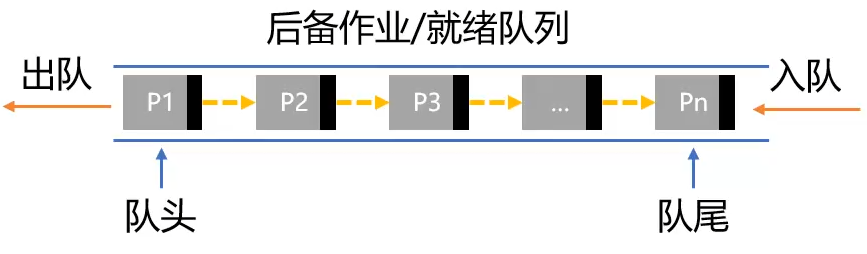
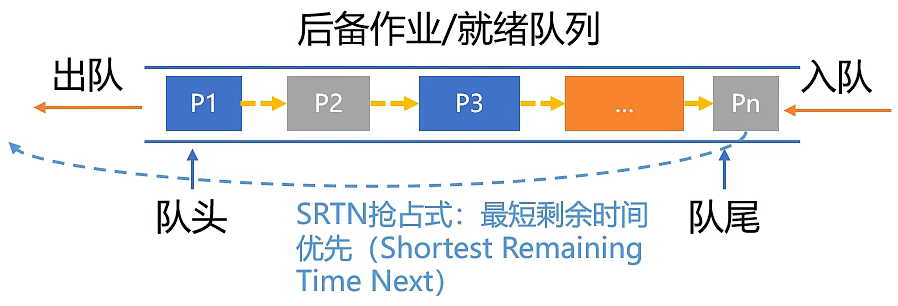
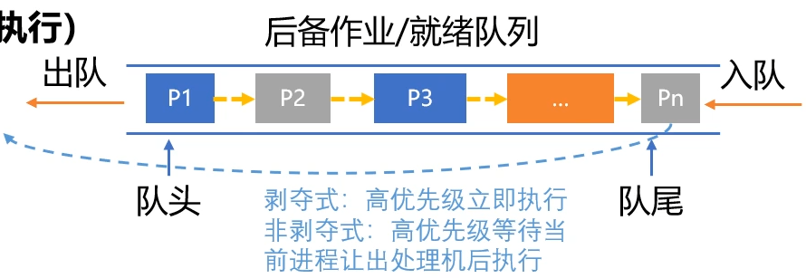
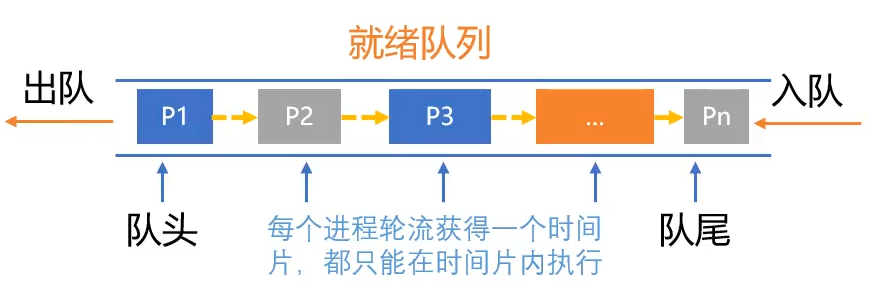
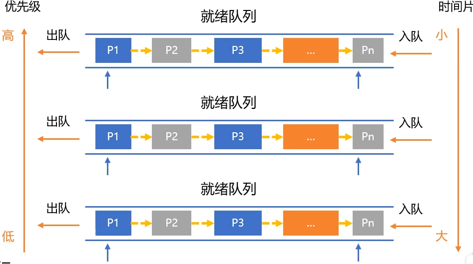

# 操作系统

## 1. 进程调度算法

### 1.1 先来先服务(FCFS, First Come First Served)

- **算法内容:** 调度作业/就绪队列中最先入队者，等待操作完成或阻塞
- **算法原则:** 按作业/进程到达顺序服务（执行）
- **调度方式:** 非抢占式调度
- **适用场景:** 作业/进程调度
- **优缺点**
    - 有利于CPU繁忙型作业，充分利用CPU资源
    - 不利于I/O繁忙型作业，操作耗时，其它饥饿

### 1.2 短作业优先(SJF, Shortest Job First)

- **算法内容:** 所需服务时间最短的作业/就绪优先服务（执行）
- **算法原则:** 追求最少的平均（带权）周转时间
- **调度方式:** SJF/SPF非抢占式调度
- **适用场景:** 作业/进程调度
- **优缺点**
    - 平均等待/周转时间最少
    - 长时间周转时间会增加或饥饿
    - 估计时间不准确，不能保证紧迫任务及时处理

### 1.3 高响应比优先(HRRN, Highest Response Ratio Next)

- **算法内容:** 所需服务时间最短的作业/就绪优先服务（执行）
- **算法原则:** 综合考虑作业/进程的等待时间和服务时间
- **调度方式:** 非抢占式
- **适用场景:** 作业/进程调度
- **优缺点**
    - 响应比 = (等待时间+服务时间) / 服务时间, `>=1`
    - 只有当前进程放弃执行权（完成/阻塞）时，重新计算所有进程响应比
    - 长作业等待越久响应比越高，更容易获得处理机

### 1.4 优先级调度(PSA, Priority-Scheduling Algorithm)

- **算法内容:** 又叫优先权调度，按作业/进程的优先级（紧迫程度）进行调度
- **算法原则:** 优先级最高（最紧迫）的作业/进程先调度
- **调度方式:** 抢占/非抢占式（并不能获得及时执行）
- **适用场景:** 作业/进程调度
- **优缺点**
    - 静态/动态优先级
    - 系统 > 用户; 交互型 > 非交互型; I/O型 > 计算型
    - 低优先级进程可能会产生"饥饿"

### 1.5 时间片轮转调度(RR, Round-Robin)

- **算法内容:** 按进程到达就绪队列的顺序，轮流分配一个时间片去执行，时间用完则剥夺
- **算法原则:** 公平、轮流为每个进程服务，进程在一定时间内都能得到响应
- **调度方式:** 抢占式，由时钟中断确定时间到
- **适用场景:** 进程调度
- **优缺点**
    - 公平，响应快，适用于分时系统
    - 时间片决定因素: 系统相应时间、就绪队列进程数量、系统处理能力
    - 时间片太大，相当于FCFS；太小，处理机切换频繁，开销增大

### 1.6 多级反馈队列调度(MFQ, Multileveled Feedback Queue)

- **算法内容:**
    - 设置多个按优先级排序的就绪队列
    - 优先级从高到低，时间片从小到大
    - 新进程采用队列降级法
        - 进入第一级队列，按FCFS分时间片
        - 没有执行完，移到第二级，第三级...
    - 前面队列不为空不执行后续队列进程
- **算法原则:** 集前几中算法优点，相当于PSA+RR
- **调度方式:** 抢占式
- **适用场景:** 进程调度
- **优缺点**
    - 对各类型相对公平；快速响应
    - 终端型作业用户: 短作业优先
    -批处理作业用户: 周转时间短
    - 长批处理作业用户: 在前几个队列部分执行

## 2. 进程协作

### 2.1 进程通信

- 概念: 进程通信即进程间的信息交换
    - 进程是资源分配的基本单位，各进程内存空间彼此独立
    - 一个进程不能随意访问其他进程的地址空间
- 特点: 
    - 共享存储 (Shared-Memory)
    - 消息传递 (Message-Passing)
    - 管道通信 (Pipe)

#### 2.1.1  共享存储 (Shared-Memory)

- 基于共享数据结构的通信方式
    - 多个进程共用某个数据结构（OS提供并控制）
    - 由用户（程序员）负责同步处理
    - 低级通信: 可以传递少量数据，效率低

- 基于共享存储区的通信方式
    - 多个进程共用内存中的一块存储区域
    - 由进程控制数据的形式和方式

### 2.2 进程同步

---
手动分割线

---
## 操作系统对于内存怎么管理的

- 程序重定位
- 分段
- 分页
- 虚拟内存
- 按需分页虚拟内存

为了在多进程环境下，使得进程之间的内存地址不受影响，相互隔离，于是操作系统就为每个进程独立分配一套的 `虚拟地址空间`。操作系统会通过 `内存交换技术`，把不常使用的内存暂时存放到硬盘（换出），在需要的时候再装载回物理内存（换入）。对于虚拟地址与物理地址的映射关系，可以有 分段和 分页的方式，同时两者结合都是可以的。

## 进程、线程、协程
1. 操作系统会以`进程`为单位，分配系统资源（CPU时间片、内存等资源），进程是资源分配的最小单位。
- `进程间通信（IPC）: `管道(Pipe)、命名管道(FIFO)、消息队列(Message Queue) 、信号量(Semaphore) 、共享内存（Shared Memory）；套接字（Socket）。

2. `线程，`有时被称为轻量级进程(Lightweight Process，LWP），是操作系统调度（CPU调度）执行的最小单位。

- `【区别】: `

    - `调度: `线程作为调度和分配的基本单位，进程作为拥有资源的基本单位

    - `层级: ` 进程包含线程，线程是进程的子任务，一个线程只属于一个进程，但一个进程包含多个线程

    - `内存资源: `不同的进程有各自独立的内存空间。而一个进程的线程间共享进程的内存资源。虽然多个线程共享 代码段、数据段、堆，但是每个线程有自己独立的栈用于存放局部变量和临时变量。

    - `系统开销: `在创建或撤消进程时，由于系统都要为之分配和回收资源，导致系统的开销明显大于创建或撤消线程时的开销。但是进程有独立的地址空间，一个进程崩溃后，在保护模式下不会对其它进程产生影响，而线程只是一个进程中的不同执行路径。线程有自己的堆栈和局部变量，但线程之间没有单独的地址空间，一个进程死掉就等于所有的线程死掉，所以多进程的程序要比多线程的程序健壮，但在进程切换时，耗费资源较大，效率要差一些。

- `【联系】: `

    - 一个线程只能属于一个进程，而一个进程可以有多个线程，但至少有一个线程；
    - 资源分配给进程，同一进程的所有线程共享该进程的所有资源；
    - 处理机分给线程，即真正在处理机上运行的是线程；
    - 线程在执行过程中，需要协作同步。不同进程的线程间要利用消息通信的办法实现同步。

3. `协程`，是一种比线程更加轻量级的存在，协程不是被操作系统内核所管理，而完全是由程序所控制（也就是在用户态执行）。这样带来的好处就是性能得到了很大的提升，不会像线程切换那样消耗资源。

- `极高的执行效率: `因为子程序切换不是线程切换，而是由程序自身控制，因此，没有线程切换的开销，和多线程比，线程数量越多，协程的性能优势就越明显；

- `不需要多线程的锁机制: `因为只有一个线程，也不存在同时写变量冲突，在协程中控制共享资源不加锁，只需要判断状态就好了，所以执行效率比多线程高很多。
## 线程可以共享进程的哪些资源

`所属线程的栈区`、`程序计数器`、`栈指针` 以及 `函数运行使用的寄存器` 是线程私有的

- 地址空间
    - 栈区
    - 堆区
    - 代码区
    - 数据区

## 操作系统的特点

- 并发
    - 并发和并行的区别。并发是在一段时间内，多个操作均有进行。并行是在同一时刻，多个操作同时进行。并行需要物理系统的支持，如多核处理器、分布式计算系统等。操作系统通过进程和线程的概念实现了并发。
- 共享
    - 系统中的资源可以被多个进程共同使用。
    - 互斥共享与同步共享。 互斥资源也被称作是临界资源，同一时刻只能有一个进程访问，需要使用同步机制来实现互斥访问。
- 虚拟
    - 把物理实体转换为逻辑实体。
    - 计算资源和存储空间的虚拟。 在单核CPU上做到了时分复用，多个进/线程并发执行。在内存上，实现了空分复用，通过逻辑地址和换页算法实现了虚拟内存。
- 异步
    - 程序并不是一次性执行完毕，走走停停，以不可知的速度前进。