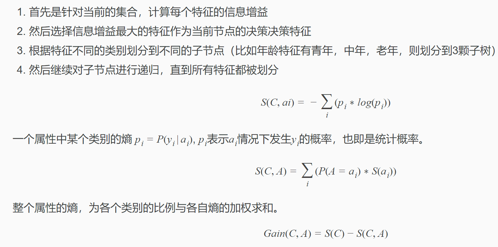
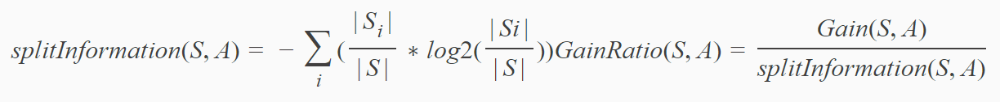

#### 评价指标

`精确率:` 指分类正确的正样本个数占分类器判定为正样本个数的比例
`召回率:` 分类正确的正样本个数占真正的正样本个数的比例

#### 决策树

- **ID3** 
    增益表示分类目标的熵减去当前属性的熵，增益越大，分类能力越强

 

- **C4.5**
    ID3的改进算法，使用信息增益率来进行属性的选择

 

#### 随机森林算法

- **原理:** 由很多随机决策树构成，它们之间没有关联。得到RF以后，在预测时分别对每一个决策树进行判断，最后使用Bagging的思想进行结果的输出（也就是投票的思想）
    - 现有N个训练样本，每个样本的特征为M个，需要建K颗树
    - 从N个训练样本中有放回（Bagging算法）的取N个样本作为一组训练集（其余未取到的样本作为预测分类，评估其误差）
    - 从M个特征中取m个特征左右子集特征(m<<M)
    - 对采样的数据使用完全分裂的方式来建立决策树，这样的决策树每个节点要么无法分裂，要么所有的样本都指向同一个分类
    - 重复2的过程K次，即可建立森林
- **优缺点**
    - 能够处理大量特征的分类，不用做特征选择
    - 在训练完成之后能给出哪些feature的比较重要
    - 训练速度很快，容易并行
