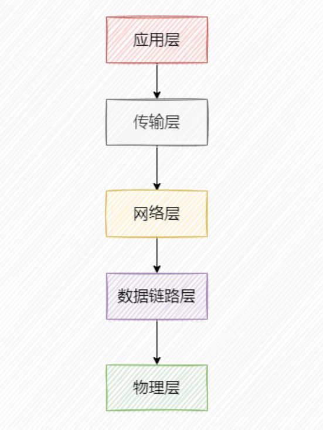
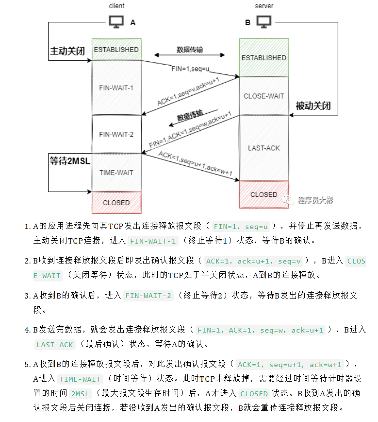

# 计算机网络

## 1. 网络分层结构
计算机网络体系大致分为三种，OSI七层模型 (`应用层，表示层，会话层，传输层，网络层，数据链路层，物理层`)、TCP/IP四层模型和五层模型。一般面试的时候考察比较多的是五层模型。

- `应用层: `为应用程序提供交互服务。在互联网中的应用层协议很多，如域名系统`DNS、HTTP协议、SMTP协议`等。
- `传输层: `负责向两台主机进程之间的通信提供数据传输服务。传输层的协议主要有`传输控制协议TCP和用户数据协议UDP`。
- `网络层: `选择合适的路由和交换结点，确保数据及时传送。主要包括IP协议。`(ICMP,IP,ARP,RARP)`
- `数据链路层: `在两个相邻节点之间传送数据时，数据链路层将网络层交下来的 IP 数据报组装成帧，在两个相邻节点间的链路上传送帧。`(MAC)`
- `物理层: `实现相邻节点间比特流的透明传输，尽可能屏蔽传输介质和物理设备的差异。

## 2. 三次握手和四次挥手

### 2.1 三次握手
假设发送端为客户端，接收端为服务端。开始时客户端和服务端的状态都是CLOSED。

1.` 第一次握手: `客户端向服务端发起建立连接请求，客户端会随机生成一个起始序列号x，客户端向服务端发送的字段中包含标志位SYN=1，序列号seq=x。第一次握手前客户端的状态为CLOSE，第一次握手后客户端的状态为SYN-SENT。此时服务端的状态为LISTEN。
2. `第二次握手: `服务端在收到客户端发来的报文后，会随机生成一个服务端的起始序列号y，然后给客户端回复一段报文，其中包括标志位SYN=1，ACK=1，序列号seq=y，确认号ack=x+1。第二次握手前服务端的状态为LISTEN，第二次握手后服务端的状态为SYN-RCVD，此时客户端的状态为SYN-SENT。（其中SYN=1表示要和客户端建立一个连接，ACK=1表示确认序号有效）
3. `第三次握手: `客户端收到服务端发来的报文后，会再向服务端发送报文，其中包含标志位ACK=1，序列号seq=x+1，确认号ack=y+1。第三次握手前客户端的状态为SYN-SENT，第三次握手后客户端和服务端的状态都为ESTABLISHED。此时连接建立完成。

`两次握手可以吗？`
- 第三次握手主要为了防止已失效的连接请求报文段突然又传输到了服务端，导致产生问题。

### 2.2 四次挥手

#### 第四次挥手为什么要等待2MSL？
1. 保证A发送的最后一个ACK报文段能够到达B。这个ACK报文段有可能丢失，B收不到这个确认报文，就会超时重传连接释放报文段，然后A可以在2MSL时间内收到这个重传的连接释放报文段，接着A重传一次确认，重新启动2MSL计时器，最后A和B都进入到CLOSED状态，若A在TIME-WAIT状态不等待一段时间，而是发送完ACK报文段后立即释放连接，则无法收到B重传的连接释放报文段，所以不会再发送一次确认报文段，B就无法正常进入到CLOSED状态。
2. 防止已失效的连接请求报文段出现在本连接中。A在发送完最后一个ACK报文段后，再经过2MSL，就可以使这个连接所产生的所有报文段都从网络中消失，使下一个新的连接中不会出现旧的连接请求报文段。

#### 为什么是四次挥手？
因为当Server端收到Client端的SYN连接请求报文后，可以直接发送SYN+ACK报文。**但是在关闭连接时，当Server端收到Client端发出的连接释放报文时，很可能并不会立即关闭SOCKET**，所以Server端先回复一个ACK报文，告诉Client端我收到你的连接释放报文了。只有等到Server端所有的报文都发送完了，这时Server端才能发送连接释放报文，之后两边才会真正的断开连接。故需要四次挥手。

## 3. TCP/IP

### 3.1 TCP有哪些特点？
1. TCP是面向连接的传输层协议。
2. 点对点，每一条TCP连接只能有两个端点。
3. TCP提供可靠交付的服务。
4. TCP提供全双工通信。
5. 面向字节流。

### 3.2 TCP和UDP的区别？
1. TCP面向连接；UDP是无连接的，即发送数据之前不需要建立连接。
2. TCP提供可靠的服务；UDP不保证可靠交付。
3. TCP面向字节流，把数据看成一连串无结构的字节流；UDP是面向报文的。
4. TCP有拥塞控制；UDP没有拥塞控制，因此网络出现拥塞不会使源主机的发送速率降低（对实时应用很有用，如实时视频会议等）。
5. 每一条TCP连接只能是点到点的；UDP支持一对一、一对多、多对一和多对多的通信方式。
6. TCP首部开销20字节；UDP的首部开销小，只有8个字节。

`TCP 拥塞控制` 包含四部分内容：`慢启动、拥塞避免、快速重传、快速恢复。`

## 4. HTTP

### 4.1 HTTP协议的特点？
1. HTTP允许传输任意类型的数据。传输的类型由Content-Type加以标记。
2. 无状态。对于客户端每次发送的请求，服务器都认为是一个新的请求，上一次会话和下一次会话之间没有联系。
3. 支持客户端/服务器模式。

### 4.2 HTTP报文格式

1. HTTP请求由四个部分组成，分别是: `请求行、请求头部、空行和请求体。` 
2. HTTP响应由四个部分组成，分别是: `状态行、响应头、空行和响应体。`

### 4.3 HTTP1.0、HTTP1.1、HTTP2.0

- HTTP1.0 和 HTTP1.1的区别: `长连接、断点续传、错误状态响应码、Host头处理`
- HTTP1.1 和 HTTP2.0的区别？
    - 新的二进制格式：HTTP1.1 基于文本格式传输数据；HTTP2.0采用二进制格式传输数据，解析更高效。

    - 多路复用：在一个连接里，允许同时发送多个请求或响应，并且这些请求或响应能够并行的传输而不被阻塞，避免 HTTP1.1 出现的”队头堵塞”问题。

    - 头部压缩，HTTP1.1的header带有大量信息，而且每次都要重复发送；HTTP2.0 把header从数据中分离，并封装成头帧和数据帧，使用特定算法压缩头帧，有效减少头信息大小。并且HTTP2.0在客户端和服务器端记录了之前发送的键值对，对于相同的数据，不会重复发送。比如请求a发送了所有的头信息字段，请求b则只需要发送差异数据，这样可以减少冗余数据，降低开销。

    - 服务端推送：HTTP2.0允许服务器向客户端推送资源，无需客户端发送请求到服务器获取。

### 4.4 HTTPS与HTTP的区别？
1. HTTP是超文本传输协议，信息是明文传输；HTTPS则是具有安全性的ssl加密传输协议。
2. HTTP和HTTPS用的端口不一样，HTTP端口是80，HTTPS是443。
3. HTTPS协议需要到CA机构申请证书，一般需要一定的费用。
4. HTTP运行在TCP协议之上；HTTPS运行在SSL协议之上，SSL运行在TCP协议之上。

### 4.5 DNS 的解析过程？
1. 浏览器搜索`自己的DNS缓存`
2. 若没有，则搜索`操作系统中的DNS缓存和hosts文件`
3. 若没有，则操作系统将域名发送至`本地域名服务器`，本地域名服务器查询自己的DNS缓存，查找成功则返回结果，否则依次向`根域名服务器、顶级域名服务器、权限域名服务器`发起查询请求，最终返回IP地址给本地域名服务器
4. 本地域名服务器将得到的IP地址返回给操作系统，同时自己也将IP地址缓存起来
5. 操作系统将 IP 地址返回给浏览器，同时自己也将IP地址缓存起来
6. 浏览器得到域名对应的IP地址

### 4.6 Cookie和Session的区别？
1. `作用范围不同`，Cookie 保存在客户端，Session 保存在服务器端。
2. `有效期不同`，Cookie 可设置为长时间保持，比如我们经常使用的默认登录功能，Session 一般失效时间较短，客户端关闭或者 Session 超时都会失效。
3. `隐私策略不同`，Cookie 存储在客户端，容易被窃取；Session 存储在服务端，安全性相对 Cookie 要好一些。
4. `存储大小不同`， 单个 Cookie 保存的数据不能超过 4K；对于 Session 来说存储没有上限，但出于对服务器的性能考虑，Session 内不要存放过多的数据，并且需要设置 Session 删除机制。

### 4.7 浏览器中输入URL返回页面过程？
1. 解析域名，找到主机 IP。
2. 浏览器利用 IP 直接与网站主机通信，三次握手，建立 TCP 连接。浏览器会以一个随机端口向服务端的 web 程序 80 端口发起 TCP 的连接。
3. 建立 TCP 连接后，浏览器向主机发起一个HTTP请求。
服务器响应请求，返回响应数据。
4. 浏览器解析响应内容，进行渲染，呈现给用户。

### 4.8 HTTP缓存

http缓存指的是: 当客户端向服务器请求资源时，会先抵达浏览器缓存，如果浏览器有“要请求资源”的副本，就可以直接从浏览器缓存中提取而不是从原始服务器中提取这个资源。

## 5. 加密
### 什么是对称加密和非对称加密？
对称加密：通信双方使用`相同的密钥`进行加密。特点是加密速度快，但是缺点是密钥泄露会导致密文数据被破解。常见的对称加密有AES和DES算法。

非对称加密：它需要生成两个密钥，`公钥和私钥`。公钥是公开的，任何人都可以获得，而私钥是私人保管的。公钥负责加密，私钥负责解密；或者私钥负责加密，公钥负责解密。这种加密算法安全性更高，但是计算量相比对称加密大很多，加密和解密都很慢。常见的非对称算法有RSA和DSA。